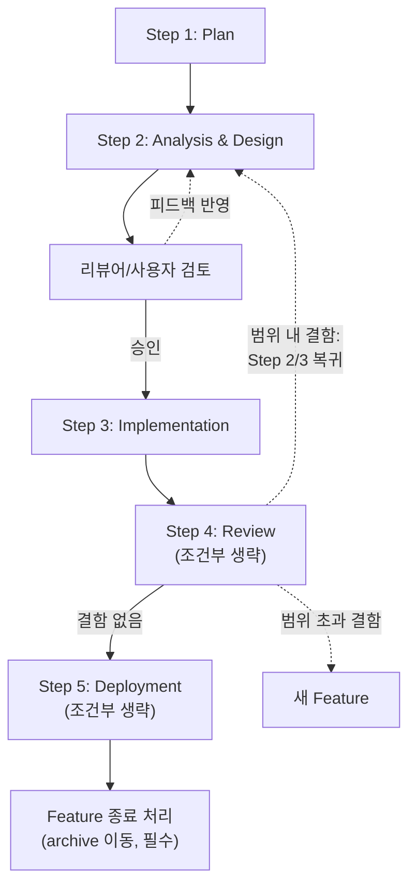

# Meta-Instructions for AI Agents (System Maintainer Guide) v0.1.0

이 파일은 `WikiHub` 시스템 자체를 **설계, 개발, 배포**하는 시스템 메인테이너(Maintainer)가 작업 전 반드시 참고해야 할 최상위 거버넌스 지침입니다.

> WikiHub는 v0.2.6에서 안정화된 `WikiCurate`(macOS 로컬 단일 vault)의 server-first 후속입니다.
> 운영 타깃: **OCI ARM Ubuntu + systemd + Hermes(Telegram) + 외부 vault(Google Drive API, NAS 등)**
> 메인테이너의 개발 환경(macOS)과 배포 환경(Linux/OCI)을 분리해 관리합니다.

## 1. 시스템 아키텍처 원칙 (Separation of Concerns)

- **Development Zone (Root):** 시스템을 만드는 공장입니다. `features/`, `docs/`, `releases/`, `deploy.sh` 및 이 가이드가 포함됩니다.
- **Operations Zone (`_system/`):** 시스템이 돌아가는 엔진입니다. 정본 룰과 명령어 플레이북만 포함하며, 에이전트 운영 모드에서만 활성화됩니다.
- **물리적 격리:** 모든 신규 개발은 루트의 `features/`에서 격리되어 진행되며, 검증 완료 후 `deploy.sh`를 통해서만 `_system/`을 운영 대상으로 주입합니다.
- **Vault 외부화:** 소스 데이터(raw 역할)는 `wikihub/` 디렉토리 외부에 둡니다. wikihub 자체는 `_system/`(정본)과 `wiki/`(통합 위키)만 보유합니다.
- **개발 산출물 분류 (라이프사이클 기준):** Development Zone 내부에서 산출물을 라이프사이클로 분리합니다.
  - `docs/` — **영속 기록**. 메인테이너 가이드, 개념 문서, ADR(결정 기록). 한 번 쓰고 영구 참조되며, 변경 시 supersede로 추적.
  - `features/` — **워크스페이스**. feature 단위 작업 산출물(plan, analysis_and_design, reviews). 활성 → archive 라이프사이클을 가짐.

## 2. 코딩 행동 원칙 (Coding Behavior)

모든 구현 작업은 아래 4원칙을 따릅니다. 상세 가이드·예시는 [docs/karpathy-guidelines.md](docs/karpathy-guidelines.md) 참조 (스킬 형식으로 등록되어 있어 별도 invoke 가능).

| Karpathy 원칙 | 요지 | wikihub 메소드론 대응 |
|---|---|---|
| **1. Think Before Coding** | 가정을 명시. 여러 해석이 있으면 둘 다 surface. 단순 대안이 있으면 push back. 불명확하면 멈추고 물어본다 | §3 Step 1 Plan + Step 2 미결 사항 명시 |
| **2. Simplicity First** | 요청 외 기능·추상화·flexibility 금지. 200줄을 50줄로 줄일 수 있으면 다시 짠다 | §8 Atomic Change ("하나의 Feature는 하나의 목적만") |
| **3. Surgical Changes** | 인접 코드 자발적 개선 금지. 변경 라인은 사용자 요청에 직결되어야 함 | §3 Step 3 "설계서에 없는 추가 변경은 하지 말 것" |
| **4. Goal-Driven Execution** | 검증 가능한 성공 기준으로 작업을 변환. 약한 기준("make it work") 회피 | §3 Step 2의 DoD 필수 포함 항목 |

원칙 충돌 시 우선순위: **wikihub 메소드론 > Karpathy**. 메소드론의 §3 Step 1~3 절차가 본 원칙들을 구체화하는 정본입니다. Karpathy는 코딩 행동 어휘 측면에서의 보조 가이드.

---

## 3. 기능 기반 개발 플로우 (Feature-based Workflow)

모든 시스템 변경은 아래의 5단계를 거칩니다. **Step 4(검토)와 Step 5(배포)는 조건부로 생략 가능**합니다. 상세 방법론은 `docs/agent_dev_guide.md`를 참조한다.

### 플로우 개요



### Step 1: Plan (계획)

**도구**: 사용자와의 대화 (가벼움 — 한 페이지 미만)
**산출물**: `features/[YYYYMMDD]_[feat_id]/plan.md`
**목적**: 메타 결정. 이 작업을 어떻게 접근할지 미리 정한다.

**실행**:
```
"[기능 추가 / 수정] 계획부터 잡자"
→ 에이전트가 plan.md 작성
→ "바로 진행": Step 2 자동 시작 / "확정할게요": 사용자 확정 후 진행
```

필수 포함 항목:
- [ ] 작업 분류 (기능 / 리팩토링 / 버그 / 문서 / 운영)
- [ ] 적용 단계 선언 — Step 4(검토)와 Step 5(배포)의 수행 여부 + 사유
- [ ] 예상 영향 범위 (대상 파일 또는 디렉토리 수준)
- [ ] 메소드론 적용 여부 (오타·1줄 수정 등 trivial 변경은 본 절차 자체를 생략 가능 — plan.md조차 만들지 않음)

### Step 2: Analysis & Design (분석및설계)

**도구**: Claude Code CLI / Superpowers (선택)
**산출물**:
- `features/[YYYYMMDD]_[feat_id]/analysis_and_design.md` — 분석과 설계를 통합 작성
- `features/[YYYYMMDD]_[feat_id]/design_review_N.md` — 설계 검토 피드백 (선택, 리뷰어별)
- `docs/adr/NNNN-{slug}.md` — 본 단계에서 결정된 미결 사항을 ADR로 추출 (해당 항목이 있을 때만)

분석과 설계를 하나의 단계에서 통합한다. 큰 feature에서 분석 결과를 먼저 확정하고 설계 방향을 가이드받고 싶으면, 파일 내 `## 분석`과 `## 설계` 섹션을 분리하고 도중에 사용자 중간 검토를 선언할 수 있다.

필수 포함 항목:
- [ ] 배경 및 목적
- [ ] 현행 진단 (결함 목록 및 근거)
- [ ] 개정 범위 (대상 파일, 변경 성격)
- [ ] 개정 전/후 비교 (Before → After)
- [ ] 연계 룰/스킬 정합성 검토
- [ ] 미결 사항 — 없으면 "없음" 명시
- [ ] Definition of Done (성공 기준)

**ADR 추출 (결정의 정본)**: 미결 사항이 결정되면 `docs/adr/NNNN-{slug}.md`로 추출한다.
- 결정의 정본(source of truth)은 ADR 파일이며, analysis_and_design.md의 미결 표는 **옵션 탐색 과정**을 보존하고 결정 자체는 `ADR-NNNN` 식별자로만 참조한다.
- 결정 = 1 ADR 원칙. 미결이 N개면 ADR도 N개.
- 자세한 ADR 컨벤션·템플릿·인덱스는 `docs/adr/README.md` 참조.

**버전 관리**: 피드백 반영 시 파일 내 섹션으로 이력 관리 (`## v1`, `## v2` …)
**승인 마커**: 사용자 승인 시 파일 상단에 `approved: YYYY-MM-DD` 추가
**종료 조건**: 사용자의 명시적 승인 (필수, 생략 불가)
- `"승인. Step 3 진행해줘"` 또는 `"구현 시작해줘"` → Step 3 진행

### Step 3: Implementation (구현)

**도구**: Claude Code CLI
**진입 조건**: analysis_and_design.md에 `approved:` 마커가 있는 상태
**활동**: 설계서를 기준으로 `_system/commands/`의 개별 명령어, `_system/wiki-schema.md`, 또는 인프라 스크립트(`scripts/`, `deploy.sh`)를 직접 수정하거나 신규 작성합니다.
**산출물**: `_system/commands/*.md`, `_system/wiki-schema.md`, `scripts/*`, `deploy.sh` 등
**종료 조건**: 설계서의 모든 변경 항목이 정본 파일에 반영된 상태

**실행**:
```
"analysis_and_design.md를 참조해서 명시된 항목 구현해줘.
설계서에 없는 추가 변경은 하지 말 것"
```

자가 검증:
- [ ] `wiki-schema.md`와의 정합성 (지식 모델 정의 준수)
- [ ] `commands/` 내 명령어 간 논리적 충돌 없음
- [ ] 수정 사항이 `_system/` 전체 구조를 해치지 않는지 확인
- [ ] 인프라 스크립트는 운영 타깃(Linux/systemd)에서 동작 가능한지 확인

### Step 4: Review (검토) — 조건부 생략 가능

**원칙**: 멀티모델 리뷰
**산출물**: `features/[YYYYMMDD]_[feat_id]/code_review_N.md` (리뷰어별)

**생략 가능 조건** (모두 충족 시):

| 항목 | 조건 |
|---|---|
| 변경 크기 | 단일 파일 또는 50줄 이하 |
| 변경 성격 | 오타 · 문서 · 코드 정리 · 테스트 추가만 |
| 영향 범위 | 외부 인터페이스(스키마/명령어 의미론/공개 API) 미변경 |

생략 결정은 Step 1 `plan.md`에 미리 선언하고 사유를 기록한다. 사후 누락이 아니라 계획상의 결정으로 추적 가능하게 한다.

**수행 시 DoD 체크리스트**:
- [ ] analysis_and_design.md의 모든 변경 항목이 반영됨
- [ ] `_system/` 내 기존 파일과 충돌(중복 정의)이 없음
- [ ] 새 명령이 참조하는 파일이 실제로 존재함
- [ ] `wiki/index.md` 등 내비게이션 갱신 여부 확인
- [ ] 결함 처리 완료 (→ 리뷰 공통 규칙의 '결과 처리' 참조)
- [ ] 연계 룰/스킬과의 정합성 확인

### Step 5: Deployment (배포) — 조건부 생략 가능

**진입 조건**: Step 4 DoD 전항목 충족 (Step 4 생략 시 Step 3 자가 검증 + 사용자 승인으로 대체) + 사용자 최종 승인 (`"배포 진행해줘"`)

**생략 가능 조건** (어느 하나라도 해당):

| 항목 | 조건 |
|---|---|
| 변경 대상 | `_system/` + 인프라 스크립트(`scripts/`, `deploy.sh`) 둘 다 미변경 |
| 변경 성격 | 메인테이너 가이드(`AGENTS.md`, `docs/`)만 변경 |
| 운영 환경 | 운영 시스템에 미반영해도 무방한 변경 (개발 단계 문서 등) |

생략 결정은 Step 1 `plan.md`에 미리 선언한다. 생략 시 HISTORY.md 항목 추가도 함께 생략한다 (배포가 없으므로 배포 이력 없음).

**수행 시 활동**: `deploy.sh` 스크립트를 통해 정본을 운영 대상에 동기화합니다. 운영 환경은 Linux 서버이므로, 메인테이너의 macOS 개발 환경에서 git push → 서버에서 git pull + `deploy.sh` 실행 흐름을 기본으로 합니다.

**수행 시 산출물**: `features/HISTORY.md` — 배포 후 에이전트가 자동으로 항목 append

**HISTORY.md 항목 형식**:
```markdown
## [YYYY-MM-DD] feat_id

- **목적**: 무엇을 해결/추가했는가
- **로직**: 어떤 방식으로 구현했는가
- **생성 ADR**: ADR-NNNN, ADR-NNNN (해당 항목이 있을 때)
- **트레이드오프**: 이 결정으로 포기한 것, 생긴 제약 (없으면 "없음")
- **결론**: 최종 상태 및 후속 과제
- **참조**: features/archive/[YYYYMMDD]_[feat_id]/
```

> 결정 이유의 상세는 ADR로 옮겨갔으므로 HISTORY 항목은 "생성 ADR" 한 줄로 참조한다. ADR이 없는 단순 운영성 feature는 이 줄을 생략한다.

**에스컬레이션**: 배포 실패 시 운영 서버의 systemd 상태(`systemctl --user status …`)와 `wikihub.yaml` 설정을 점검합니다.

### Feature 종료 처리 (필수)

feature가 최종 단계까지 완료되면 (Step 5 수행 또는 생략 결정 후), 다음을 수행한다.

1. **ADR 검증**: 본 feature가 생성하기로 한 ADR이 모두 `docs/adr/`에 존재하고 Status가 `Accepted`인지 확인.
2. **HISTORY.md 항목 검증** (Step 5 수행한 경우): 항목이 추가됐고 참조 경로가 `features/archive/...`로 갱신됐는지 확인.
3. **Archive 이동**: `git mv features/[YYYYMMDD]_[feat_id] features/archive/[YYYYMMDD]_[feat_id]`
   - features/ 루트에는 **진행 중 feature만** 남는다.
   - archive 위치 자체가 "완료" 표시 — 별도 종료 마커는 두지 않는다.

종료 처리는 사용자 선언 (`"feature 종료해줘"` 또는 `"archive로 이동해줘"`)으로 트리거한다.

---

## 4. 리뷰 공통 규칙

Step 2(설계 검토 — 선택)와 Step 4(구현 검토 — 조건부)에 동일하게 적용한다.

| 단계 | 파일명 | 리뷰어 예시 |
|---|---|---|
| Step 2 Design Review (선택) | `design_review_N.md` | `design_review_1.md` (Claude), `design_review_2.md` (Gemini) … |
| Step 4 Code Review (조건부) | `code_review_N.md` | `code_review_1.md` (Claude), `code_review_2.md` (Gemini) … |

**리뷰어 구성**: 2개 이상 권장 (독립성 + 다양성이 핵심)

| 리뷰어 | 실행 방법 |
|---|---|
| Claude (컨텍스트 초기화) | 새 터미널 탭에서 `claude` 실행 |
| Gemini | `gemini` CLI 또는 웹에서 별도 세션 |
| Codex | `codex` CLI 또는 웹에서 별도 세션 |
| 서브에이전트 | `"서브에이전트로 리뷰해서 code_review_N.md에 기록해줘"` |

**컨텍스트 전달**:
```bash
git diff $(git merge-base HEAD main) > review_context.md
```

**결과 취합**:
```
리뷰 파일 1개: "[prefix]_review_1.md를 참조해서 지적 항목 우선순위 정리해줘"
리뷰 파일 2개 이상: "공통으로 지적한 항목만 추려서 우선순위 정리해줘"
```

**결과 처리**:
- 설계 결함 → Step 2(Design)으로 복귀 후 재검토
- 구현 버그/로직 오류 → Step 3(Implementation)으로 복귀 후 재검토
- 범위 초과 결함 → 해당 리뷰 파일에 사유 기록 후 새 Feature ID 발급

---

## 5. 멀티에이전트 접근법

- **수동 오케스트레이션**: [cmux](https://cmux.com/ko)로 패널 분리 → 패널별로 다른 에이전트 실행
- **자동 오케스트레이션**: Claude Agent tool — `"두 에이전트가 병렬로 A는 성능, B는 보안 리뷰해줘"`

---

## 6. Git Worktree 활용

> 아래 조건에서 **필수** 적용:
> - 개발자·리뷰어를 동시에 별도 패널로 운용할 때
> - 서브에이전트 리뷰를 자동화할 때 (Claude Agent tool 활용 시)

```bash
# feature worktree 생성
git worktree add ../wikihub-feat/[YYYYMMDD]_[feat_id] feature/[feat_id]

# 작업 완료 후 제거
git worktree remove ../wikihub-feat/[YYYYMMDD]_[feat_id]
```

Agent tool의 `isolation: "worktree"` 옵션으로 서브에이전트가 자동으로 임시 worktree를 생성해 작업 후 결과만 반환한다.

---

## 7. Feature 디렉토리 및 결정 기록

> 두 디렉토리는 라이프사이클로 구분됩니다 (§1 참조). `features/`는 active → archive 라이프사이클을 가진 워크스페이스이고, `docs/adr/`는 supersede로만 변경되는 영속 기록입니다.

### Features 구조

```
features/
├── HISTORY.md                                       # 배포 이력 누적 (append-only, Step 5 수행 시에만 추가)
├── [YYYYMMDD]_[feat_id]/                            # 진행 중 feature (루트에 가시화)
│   ├── plan.md                                      # Step 1 산출물 (가벼움)
│   ├── analysis_and_design.md                       # Step 2 산출물 (분석 + 설계 통합)
│   ├── design_review_N.md                           # Step 2 리뷰 (선택)
│   └── code_review_N.md                             # Step 4 리뷰 (조건부)
└── archive/
    └── [YYYYMMDD]_[feat_id]/                        # 완료 feature (Feature 종료 처리에서 이동)
        └── (위와 동일 구조)
```

- **루트 = 진행 중**: features/ 직속의 [feat_id]/ 디렉토리는 모두 작업 중인 feature.
- **archive/ = 완료**: 종료 처리된 feature는 `features/archive/[feat_id]/`로 이동. archive 위치 자체가 완료 표시.

### 결정 기록 (ADR)

```
docs/adr/
├── README.md                                        # ADR 컨벤션 + 인덱스
├── template.md                                      # 신규 ADR 작성 템플릿
└── NNNN-{kebab-case-title}.md                       # 결정 1건 = 파일 1개
```

- 결정의 **정본(source of truth)** 은 ADR 파일. 다른 문서(analysis_and_design.md, HISTORY.md)는 `ADR-NNNN` 식별자로 참조만.
- archive로 이동돼도 ADR은 `docs/adr/` 그대로 유지 (feature와 분리된 영속 기록).
- 결정 변경 시 기존 ADR Status를 `Superseded`로 바꾸고 신규 ADR에 `Supersedes: ADR-NNNN` 명시. 기존 ADR은 **삭제하지 않는다.**

---

## 8. 버전 관리 및 패치 정책

- **Major/Minor/Patch:** 기능의 크기에 따라 버전을 승격합니다. WikiHub는 v0.1.0에서 시작합니다.
- **Atomic Change:** 하나의 Feature는 반드시 하나의 목적만 달성해야 합니다.
- **Traceability:** 모든 정본의 변경 사항은 `features/` 내의 분석 문서를 통해 근거를 추적할 수 있어야 합니다.

### 버전 명명 표준

| 용도 | 형식 | 예시 |
|------|------|------|
| 파일시스템 (사용중) | `_system/` 경로 고정 유지 | `_system/` |
| 문서·표기용 | `v{MAJOR}.{MINOR}.{PATCH}` | `v0.1.0` |
| 배포 도구 인자 | `{MAJOR}_{MINOR}_{PATCH}` 패턴 준수 | `0_1_0` |

### Feature 디렉토리 명명

```
features/[YYYYMMDD]_[feat_id]/
```

- `YYYYMMDD`: 작업 시작일 (KST)
- `feat_id`: 소문자 + 언더스코어, 기능을 간결히 표현 (예: `v030_initial_architecture`)

---
*일상적인 지식 관리(KMS) 운영 시에는 `_system/wiki-schema.md` (Operator Guide)로 전환하십시오.*
