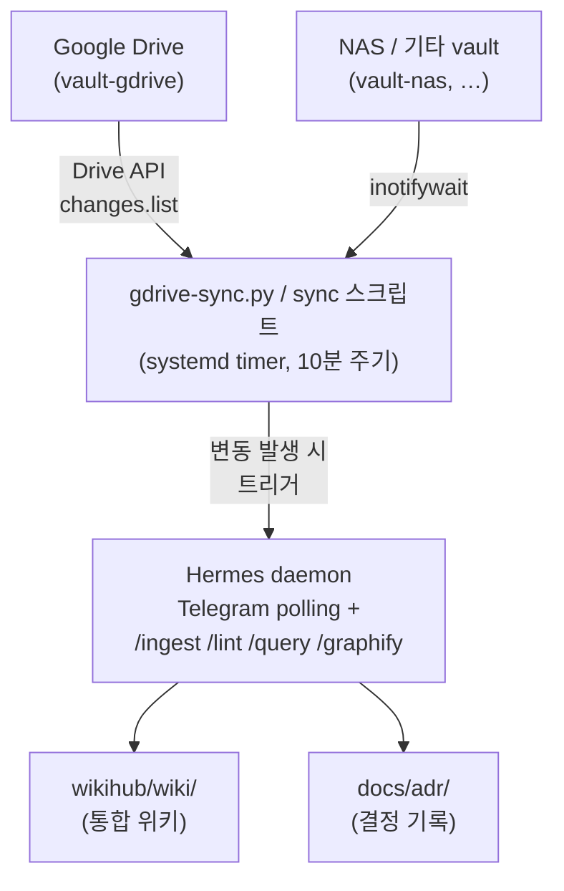
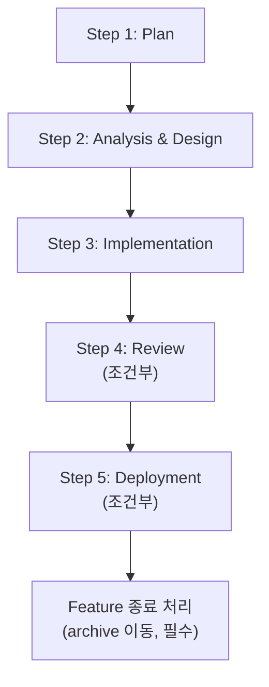

<!-- Thanks to: Andrej Karpathy, Louis Wang -->

<div align="center">

# WikiHub v0.1.0

서버에서 다중 소스를 통합 관리하는 LLM 위키 허브

**Server-first LLM wiki hub aggregating multiple source backends.**

[](features/20260513_v030_initial_architecture/analysis_and_design.md)
[](AGENTS.md)
[](LICENSE)

</div>

---

> **개발 상태**: 본 리포는 설계 단계입니다. 메소드론과 첫 feature의 분석·설계가 진행 중이며, 운영 가능한 구현체는 아직 없습니다. 운영 사용은 [WikiCurate v0.2.6](https://github.com/im-dongseon/wikicurate)을 참조하십시오.

---

## 목차

- [WikiHub란?](#wikihub란)
- [타깃 아키텍처](#타깃-아키텍처)
- [개발 방법론](#개발-방법론)
- [디렉토리 구조](#디렉토리-구조)
- [로드맵](#로드맵)
- [참고 자료](#참고-자료)
- [라이선스](#라이선스)

---

## WikiHub란?

`WikiHub`는 여러 외부 소스 백엔드(Google Drive, NAS 등)를 단일 LLM 위키로 통합 관리하는 server-first 시스템입니다.

### 왜 필요한가?

- 지식의 원본이 여러 곳에 흩어져 있는 환경(개인 클라우드, NAS, 메모 앱)에서 **단일 위키로 종합 분석**이 어려운 문제 해결
- 서버에서 24/7 동작하면서 **Telegram 같은 대화형 인터페이스로 자연어 질의·관리**
- 사용자는 평소대로 Google Drive 등에 파일을 떨구기만 하고, 위키는 자동으로 갱신·정리됨

---

## 타깃 아키텍처



상세 설계는 [`features/20260513_v030_initial_architecture/analysis_and_design.md`](features/20260513_v030_initial_architecture/analysis_and_design.md) 참조.

---

## 개발 방법론

WikiHub는 5단계 Feature-based Workflow를 따릅니다. 상세 가이드: [`AGENTS.md`](AGENTS.md), [`docs/agent_dev_guide.md`](docs/agent_dev_guide.md).



### 핵심 컨벤션

- **결정 정본은 ADR**: 모든 아키텍처 결정은 [`docs/adr/NNNN-{slug}.md`](docs/adr/) 단일 파일에. 다른 문서는 `ADR-NNNN` 식별자로 참조.
- **라이프사이클 분리**: `docs/`는 영속 기록(가이드·개념·ADR), `features/`는 워크스페이스(active → archive).
- **조건부 단계**: 검토와 배포는 plan.md에서 미리 생략 선언 가능(기준: 변경 크기·성격·영향 범위).
- **코딩 행동 원칙**: [Karpathy Guidelines](docs/karpathy-guidelines.md) 4원칙(Think Before Coding / Simplicity First / Surgical Changes / Goal-Driven Execution)을 메소드론과 매핑해 적용. 자세히는 `AGENTS.md §2`.

---

## 디렉토리 구조

현재 상태 (v0.1.0 부트스트랩):

```
wikihub/
├── AGENTS.md                  # 메인테이너 가이드 (CLAUDE.md / GEMINI.md 심볼릭)
├── docs/                      # 영속 기록 (영구 보존, supersede로만 변경)
│   ├── adr/                   #   결정 기록 (Architecture Decision Records)
│   ├── agent_dev_guide.md     #   개발 방법론 상세
│   ├── karpathy-guidelines.md #   코딩 행동 가이드
│   └── llm_wiki.md            #   LLM 위키 패턴 개념 설명
└── features/                  # 워크스페이스 (라이프사이클 있음)
    ├── HISTORY.md             #   배포 이력 (append-only)
    ├── [active feat_id]/      #   진행 중 feature
    └── archive/               #   완료 feature (종료 처리 시 이동)
```

향후 추가될 디렉토리 (구현 단계에서):

```
wikihub/
├── _system/                   # 정본 룰 + 명령어 플레이북 (deploy.sh로만 주입)
├── scripts/                   # gdrive-sync.py, watcher 등 인프라
├── deploy.sh                  # systemd 배포
└── wikihub.yaml.example       # vault 등록 설정 예시

별도 위치 (운영 시):
/opt/vault-gdrive/             # Drive API로 미러링되는 외부 vault
/opt/vault-nas/                # 향후 추가 가능
```

---

## 로드맵

본 feature `20260513_v030_initial_architecture`의 설계가 확정되면 후속 feature로 분기:

| Feature | 범위 |
|---|---|
| **F2: `wikihub_schema_v1`** | `_system/wiki-schema.md` + `_system/commands/*` 구현 |
| **F3: `vault_gdrive_api`** | `scripts/gdrive-sync.py` + Drive API + 헤드리스 OAuth + cursor/file_map 영속화 |
| **F4: `systemd_orchestrator`** | `deploy.sh` + systemd user units + `wikihub.yaml` 스키마 |
| **F5: `hermes_adapter`** | Hermes 호출 어댑터 + 자동 트리거 + 수동 명령 처리 |
| **F6: `vault_directory`** (선택) | NAS / 로컬 디렉토리 vault type, inotifywait 통합 |

---

## 참고 자료

### 핵심 개념
- **[LLM Wiki Pattern (Karpathy)](https://gist.github.com/karpathy/442a6bf555914893e9891c11519de94f)** — AI 에이전트가 지식을 축적·구조화하는 설계 패턴 (`docs/llm_wiki.md`에 사본)
- **[Karpathy Coding Guidelines](https://x.com/karpathy/status/2015883857489522876)** — LLM 코딩 행동 원칙 (`docs/karpathy-guidelines.md`에 사본)
- **[Architecture Decision Records (Nygard)](https://cognitect.com/blog/2011/11/15/documenting-architecture-decisions)** — 본 리포의 ADR 컨벤션 출처

### 선행 시스템
- **[WikiCurate v0.2.6](https://github.com/im-dongseon/wikicurate)** — macOS 로컬 단일 vault 모델의 안정화 구현

### 예정 도구
- **[graphify](https://github.com/safishamsi/graphify)** — 위키 페이지 간 지식 그래프
- **[Hermes](#)** — Telegram 연동 에이전트 (외부 컴포넌트)

---

## 라이선스

[MIT License](LICENSE)

---

<div align="center">

Developed by **WikiHub Team**.

</div>
