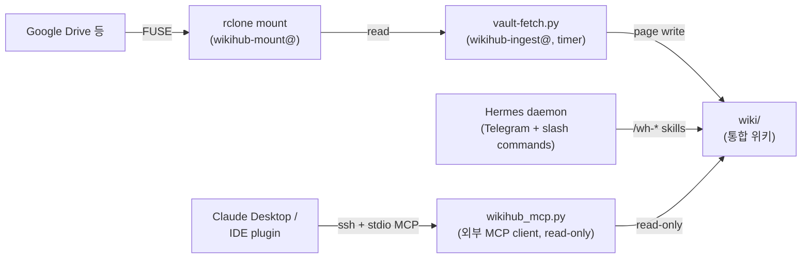

<!-- Thanks to: Andrej Karpathy, Louis Wang -->

<div align="center">

# WikiHub

여러 클라우드 소스를 단일 LLM 위키로 묶어주는 server-first 시스템

**Server-first LLM wiki hub aggregating multiple source backends.**

[](docs/changelog.md)
[](_system/VERSION)
[](LICENSE)

</div>

---

## 목차

- [무엇을 해결하나요?](#무엇을-해결하나요)
- [주요 기능](#주요-기능)
- [빠른 시작](#빠른-시작)
- [사용법](#사용법)
- [아키텍처 요약](#아키텍처-요약)
- [더 깊이 들어가기](#더-깊이-들어가기)
- [참고 자료](#참고-자료)
- [라이선스](#라이선스)

---

## 무엇을 해결하나요?

지식의 원본이 여러 곳에 흩어져 있는 환경(개인 클라우드, NAS, 메모 앱)에서는 **단일 위키로 종합 분석**이 어렵습니다. WikiHub 는:

- 평소처럼 **Google Drive 등에 파일을 떨구기만 하면**,
- 서버가 24/7 동작하면서 **자동으로 ingest → LLM 정리 → 위키 갱신**.
- **Telegram 같은 채팅 인터페이스로 자연어 질의** ("작년 Q1 OKR 회의록 요약해줘") 가능.
- **외부 IDE / Claude Desktop** 에서도 표준 MCP 프로토콜로 wiki 데이터를 query.

원본은 손대지 않고, wiki 페이지는 LLM 이 derivative 로 자동 생성·정리합니다.

---

## 주요 기능

### 📥 다중 소스 통합 (vault)
- Google Drive (rclone mount + OAuth, 1 vault per Drive)
- 향후 NAS / 로컬 디렉토리 vault type 확장 예정 ([roadmap](docs/roadmap.md))

### 🔄 자동 ingest + LLM 정리
- systemd timer (10분 주기 default) 가 vault 변경 감지 → wiki 의 `sources/` 에 source page 자동 생성.
- LLM 이 source 본문에서 **entity** (인물·조직·제품) 와 **concept** (방법론·용어) 추출 → `wiki/entities/` · `wiki/concepts/` 자동 갱신 (alias 셋 보존, 무한 loop 방지).
- 주기 lint 가 dangling link 정리 · index 재구성 · graph 그래프 갱신.

### 💬 자연어 질의 (Hermes via Telegram)
- Hermes daemon 이 Telegram polling → `/wh-ingest`, `/wh-lint`, `/wh-query` 같은 slash command 호출.
- 예: *"`[[gdrive/meetings/2026-Q1.pptx]]` 의 핵심 결정 사항만 표로 정리해줘"*.
- LLM 이 wiki 본문 + cross-ref 추론 → `wiki/analyses/<slug>.md` 에 분석 결과 자동 저장.

### 🔌 외부 MCP client (Claude Desktop / Cline / IDE plugin) — v0.1.10
- 표준 MCP 프로토콜 (stdio + SSH spawn) 로 wiki 데이터에 **read-only query**.
- 5 tool: `list_entities`, `list_concepts`, `read_page`, `grep_wiki`, `search_by_alias`.
- `[[mini-max]]` 같은 alias form 도 canonical 페이지로 자동 resolve (frontmatter `aliases` 기반).
- 외부 client 에 LLM 추론을 위임 — wikihub 서버는 deterministic primitive 만 제공 (recursive LLM 호출 0).
- 셋업 가이드: [`docs/mcp-setup.md`](docs/mcp-setup.md) (회사 망 outbound 22 / 443 / proxy 케이스 모두 다룸).

### 🕸️ 지식 그래프 (graphify, 외부 CLI 통합)
- `wiki/` 의 페이지 간 link 를 graph 로 시각화 (graphify PyPI 패키지 + ollama / OpenAI 등 backend 선택 가능).
- wh-lint 가 변경 시에만 graphify 재호출 (cost gate).

---

## 빠른 시작

### Prerequisites

| 항목 | 버전 / 비고 |
|---|---|
| OS | Ubuntu 24.04 LTS (OCI ARM 권장. macOS 는 dev box 만, 운영 미지원) |
| **Hermes CLI** | wikihub 가 직접 설치하지 않음. `command -v hermes` 가 absolute path 반환 필요 (alias 미지원) |
| Google Drive | rclone OAuth (vault 1개당 1 Drive — 폴더 단위 공유) |
| LLM provider | Anthropic / OpenAI / DeepSeek / ollama 중 선택 (`wikihub.yaml.agent.models` 로 skill 별 override 가능) |

### 설치

```bash
curl -fsSL --proto '=https' --tlsv1.2 \
  https://raw.githubusercontent.com/im-dongseon/wikihub/latest/install.sh | bash
```

같은 명령이 **install + update 공용**. install.sh 가 `$WIKIHUB_SRC/_system/VERSION` + `.git` 존재 여부로 자동 분기.

### 배포 채널 (tag)

| Tag | 성격 | 사용 시점 |
|---|---|---|
| `latest` | force-move | **production default** — 검증된 stable 만 promote |
| `canary` | force-move | pre-production 검증 — OCI 사전 검증용 (`--branch canary`) |
| `vX.Y.Z` | annotated, immutable | release 영구 record · rollback target (`--version v0.1.0`) |

### 검증 후 정식 호출

```bash
# 검증 채널 (canary)
curl -fsSL ... | bash -s -- --branch canary

# 특정 버전 (rollback 포함)
curl -fsSL ... | bash -s -- --version v0.1.0

# 명시적 destructive 재설치 (5초 confirm — WIKIHUB_SRC 만 wipe, WIKIHUB_HOME 안전)
curl -fsSL ... | bash -s -- --force-fresh
```

자세한 디렉토리 layout · env 변수 · 운영 흐름: [`AGENTS.md`](AGENTS.md) + [ADR-0030 update workflow](docs/adr/0030-update-workflow-orchestration.md) + [ADR-0034 data-first layout](docs/adr/0034-data-first-layout.md).

---

## 사용법

### 1) wikihub.yaml 작성 (1회)
설치 직후 `~/wikihub/wikihub.yaml` template 이 materialize 됩니다. vault 1개 등록 + OAuth flow:

```bash
rclone config         # remote name = wikihub.yaml.vaults.<id>.options.rclone_remote_name
chmod 0600 ~/.config/rclone/rclone.conf
```

자세한 vault 등록 절차: `_system/commands/setup.md` + `wikihub.yaml.example`.

### 2) Hermes 채팅 또는 systemd timer 가 자동 ingest

systemd timer (default 10분 주기) 가 알아서 ingest. 수동 호출도 가능:

```
/wh-ingest --vault gdrive    # vault 변경 사항 → wiki/sources/gdrive/*.md
/wh-lint                     # entities/concepts 정리 + dangling link 보고 + index 재구성
/wh-query "Q1 OKR 회의 결정 사항 정리해줘"   # → wiki/analyses/<slug>.md 자동 저장
```

### 3) 외부 client 에서 wiki query (v0.1.10 신기능)

회사 노트북 · 개인 IDE 의 MCP-호환 client (Claude Desktop / Cline 등) 에서 wikihub VM 의 wiki 를 read-only 로 query.

Claude Desktop `claude_desktop_config.json`:
```json
{
  "mcpServers": {
    "wikihub": {
      "command": "ssh",
      "args": [
        "wikihub-oci",
        "/home/ubuntu/.local/share/wikihub/venv/bin/python",
        "/home/ubuntu/.local/share/wikihub/src/scripts/wikihub_mcp.py"
      ]
    }
  }
}
```

자세한 셋업 (SSH config + OCI 측 포트 4 layer + 회사 망 proxy fallback 등): [`docs/mcp-setup.md`](docs/mcp-setup.md).

---

## 아키텍처 요약



- **rclone mount** = Drive ↔ vault 실시간 동기화 + 파일 read 패스 (vfs cache 영속).
- **vault-fetch.py** = 사이클마다 변경 감지 + source page 작성 (자세: ADR-0035).
- **Hermes** = LLM-mediated playbook entry (`/wh-query` 같은 의미 검색 + analyses 저장 mutation).
- **MCP server** = deterministic primitive entry (외부 client 의 LLM 이 추론 — 서버측 LLM 호출 0, ADR-0043).

두 entry (Hermes / MCP) 는 같은 `wiki/` 를 read 하되 **layer 분리** — mutation 책임은 Hermes 의 `/wh-lint` · `/wh-ingest` 만.

상세 아키텍처: [`features/archive/20260513_v030_initial_architecture/analysis_and_design.md`](features/archive/20260513_v030_initial_architecture/analysis_and_design.md) + [`docs/adr/`](docs/adr/).

---

## 더 깊이 들어가기

| 주제 | 문서 |
|---|---|
| 외부 client (MCP) 셋업 | [`docs/mcp-setup.md`](docs/mcp-setup.md) |
| version 별 누적 변경 | [`docs/changelog.md`](docs/changelog.md) |
| 향후 계획 (Phase 2 / v0.2.x) | [`docs/roadmap.md`](docs/roadmap.md) |
| 메인테이너 / 기여 가이드 | [`AGENTS.md`](AGENTS.md) + [`docs/agent_dev_guide.md`](docs/agent_dev_guide.md) |
| 모든 아키텍처 결정 | [`docs/adr/`](docs/adr/) (ADR-NNNN 식별자 정본) |
| LLM wiki 패턴 (배경) | [`docs/llm_wiki.md`](docs/llm_wiki.md) |

---

## 참고 자료

- **[LLM Wiki Pattern (Karpathy)](https://gist.github.com/karpathy/442a6bf555914893e9891c11519de94f)** — AI 에이전트가 지식을 축적·구조화하는 설계 패턴 (사본: [`docs/llm_wiki.md`](docs/llm_wiki.md))
- **[Karpathy Coding Guidelines](https://x.com/karpathy/status/2015883857489522876)** — LLM 코딩 행동 원칙 (사본: [`docs/karpathy-guidelines.md`](docs/karpathy-guidelines.md))
- **[Architecture Decision Records (Nygard)](https://cognitect.com/blog/2011/11/15/documenting-architecture-decisions)** — 본 repo 의 ADR 컨벤션 출처
- **[MCP spec](https://modelcontextprotocol.io)** — v0.1.10 의 MCP integration 표준
- **[WikiCurate v0.2.6](https://github.com/im-dongseon/wikicurate)** — macOS 로컬 단일 vault 모델의 선행 시스템
- **[graphify](https://github.com/safishamsi/graphify)** — 위키 페이지 간 지식 그래프
- **Hermes** — Telegram 연동 에이전트 (외부 컴포넌트)

---

## 라이선스

[MIT License](LICENSE)

---

<div align="center">

Developed by **WikiHub Team**.

</div>
