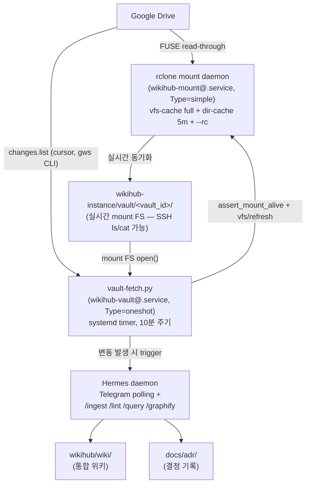
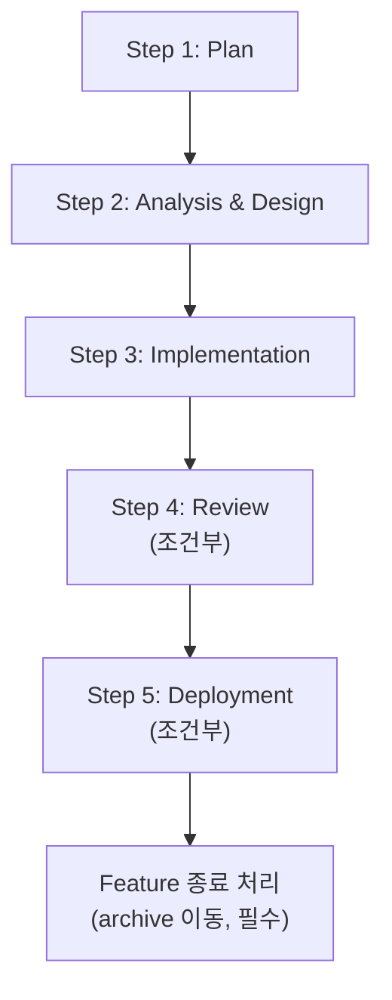

<!-- Thanks to: Andrej Karpathy, Louis Wang -->

<div align="center">

# WikiHub v0.1.7

서버에서 다중 소스를 통합 관리하는 LLM 위키 허브

**Server-first LLM wiki hub aggregating multiple source backends.**

[](features/archive/)
[](AGENTS.md)
[](LICENSE)

</div>

---

> **개발 상태** (2026-05-22 기준): v0.1.0 acceptance 달성 (2026-05-18) 후 v0.1.x 운영 정본화 진행 중. v0.1.1~v0.1.7 누적: rclone unify (ADR-0035 — gws CLI · SA JSON 폐기), graphify CLI 통합 (ADR-0036 + backend flexibility), alert pipeline overhaul (ADR-0037 — Telegram + pending-monitor), per-skill model override (`agent.models`), 운영 정본 default align (v0.1.6 — wh-lint deepseek-v4-flash · sync_interval 1h · hermes delegation.model 권장), **yaml schema drift auto-migration (v0.1.7 — install.sh 가 신설 field 자동 추가 + ADR-0035 폐기 field cleanup, PTY-safe + idempotent)**. v0.2.x 후속은 [`features/backlog.md`](features/backlog.md) 참조. macOS 로컬 환경의 선행 시스템은 [WikiCurate v0.2.6](https://github.com/im-dongseon/wikicurate).

---

## 목차

- [WikiHub란?](#wikihub란)
- [타깃 아키텍처](#타깃-아키텍처)
- [개발 방법론](#개발-방법론)
- [디렉토리 구조](#디렉토리-구조)
- [로드맵](#로드맵)
- [참고 자료](#참고-자료)
- [라이선스](#라이선스)

---

## WikiHub란?

`WikiHub`는 여러 외부 소스 백엔드(Google Drive, NAS 등)를 단일 LLM 위키로 통합 관리하는 server-first 시스템입니다.

### 왜 필요한가?

- 지식의 원본이 여러 곳에 흩어져 있는 환경(개인 클라우드, NAS, 메모 앱)에서 **단일 위키로 종합 분석**이 어려운 문제 해결
- 서버에서 24/7 동작하면서 **Telegram 같은 대화형 인터페이스로 자연어 질의·관리**
- 사용자는 평소대로 Google Drive 등에 파일을 떨구기만 하고, 위키는 자동으로 갱신·정리됨

---

## 타깃 아키텍처



**v9 (ADR-0025·0026·0027 — Path C+ 책임 분리)**:
- **rclone mount** = Drive ↔ vault 실시간 동기화 + 파일 read 패스 (vfs cache 영속). SSH 에서 `ls/cat` 으로 Drive 파일 즉시 접근
- **gws CLI** = `drive changes list` 로 cursor 기반 변경 감지 (정확한 삭제·rename·권한 이벤트)
- **vault-fetch.py 사이클**: 시작 시 `assert_mount_alive` (stat) + `vfs/refresh recursive=true` 로 race window 차단 → `gws changes list` → mount FS `open()` → extraction → wiki page write

**rclone OAuth 1회성 발급** (vault 별, install.sh 후 setup.md §Step 5.5):
```
rclone config        # 안내 따라 OAuth flow + remote name = wikihub.yaml.vaults.<id>.options.rclone_remote_name
chmod 0600 ~/.config/rclone/rclone.conf
```
gws OAuth (macOS dev box 의 `scripts/auth_gdrive.py`) 와 token 분리 — 같은 Google 계정 권장.

상세 설계는 [`features/20260513_v030_initial_architecture/analysis_and_design.md`](features/20260513_v030_initial_architecture/analysis_and_design.md) + Path C+ 결정은 [`docs/adr/0025-rclone-mount-adoption.md`](docs/adr/0025-rclone-mount-adoption.md) · [`docs/adr/0027-rclone-gws-responsibility-split.md`](docs/adr/0027-rclone-gws-responsibility-split.md) 참조.

---

## 설치 / 업데이트 (ADR-0010 + ADR-0030 + ADR-0032 + ADR-0034)

운영 시 install 과 update 는 **동일 명령**. install.sh 가 `$WIKIHUB_SRC/_system/VERSION` + `.git` 존재 여부로 자동 분기.

### 디렉토리 layout (ADR-0034 — data-first)

```
~/wikihub/                          ★ 운영 자산 (WIKIHUB_HOME — 사용자 일상 자산)
├── wikihub.yaml                    # 운영 정본 (/wh-setup materialize)
├── wiki/                           # wiki 콘텐츠 — index·sources·entities·concepts·analyses
├── vault/<vault_id>/               # FUSE mount (rclone)
└── _state/<vault_id>/              # cursor·file_map·last_sync

~/.local/share/wikihub/             XDG data root (ADR-0020·0034)
├── src/                            # 시스템 코드 (WIKIHUB_SRC — git clone target, install.sh)
└── venv/                           # Python venv (ADR-0020)

~/.credentials/wikihub/             # SA credentials 외부 격리 (ADR-0029)
~/.config/systemd/user/             # systemd user units
~/.hermes/                          # Hermes config (외부 도구, ADR-0032 external_dirs)
```

### Prerequisites

- **Hermes CLI** 사전 설치 필수 — wikihub 가 직접 설치하지 않음. `command -v hermes` 가 absolute path 반환 가능해야 함 (alias/wrapper 미지원).
- install.sh 가 `~/.hermes/config.yaml` 의 `skills.external_dirs` 에 wikihub skill path 추가. 변경 시 backup 자동 생성 (`~/.hermes/config.yaml.wikihub-bak.<ts>`, 7일 retention).
- `WIKIHUB_NONINTERACTIVE=1` 모드 사용 시 외부 자산 (~/.hermes/config.yaml) mutate 도 자동 동의 포함. 의도 안 하면 unset 후 호출.
- Hermes 미설치 시 install.sh 는 success exit 하되 systemd unit render/enable skip (운영자가 Hermes 설치 후 재호출 권장).

### env 변수 (ADR-0034)

| env | 의미 | default |
|---|---|---|
| `WIKIHUB_HOME` | 운영 자산 dir | `~/wikihub` |
| `WIKIHUB_SRC` | 시스템 코드 dir | `~/.local/share/wikihub/src` |

multi-instance: 두 env 모두 override 가능 (`WIKIHUB_HOME=/var/wikihub-prod WIKIHUB_SRC=/var/wikihub-src/prod`).

### 호출

```bash
# 표준 — install / update 공용
curl -fsSL --proto '=https' --tlsv1.2 \
  https://raw.githubusercontent.com/im-dongseon/wikihub/latest/install.sh | bash

# 특정 tag 명시 (rollback 포함)
curl -fsSL ... | bash -s -- --version v0.1.0

# 명시적 destructive 재설치 (5초 confirm + safety guard 4중) — WIKIHUB_SRC 만 wipe, WIKIHUB_HOME 안전
curl -fsSL ... | bash -s -- --force-fresh
```

### 동작

- **fresh install** (`$WIKIHUB_SRC/_system/VERSION` 부재): `git clone` → `$WIKIHUB_SRC` + venv + skill materialize + `~/.hermes/config.yaml` 패치 + systemd render + 운영자 안내.
- **update** (`$WIKIHUB_SRC/_system/VERSION` 존재): unstaged guard → systemd stop (15min in-flight grace) → fetch + reset → skill 재materialize + schema migration (필요시) → render → daemon-reload → systemd start → verify. 실패 시 직전 ref 자동 rollback.
- 현재 버전 조회: `cat $WIKIHUB_SRC/_system/VERSION`.
- Hermes skill 5건 (`wh-ingest`·`wh-lint`·`wh-query`·`wh-graphify`·`wh-setup`) 자동 등록 — 인식 확인: `hermes skills list`.

### Migration (pre-ADR-0034 layout 운영자 — v0.1.0 미배포 시점은 영향 0)

이전 layout (`~/wikihub` = repo + `~/wikihub-instance` = 운영 데이터) 운영자는 install.sh `_step0_legacy_detect` 가 자동 detect → `scripts/migrate_layout.sh` 호출 prompt. 9-phase state machine + 부분 실패 시 resume.

상세는 [`docs/adr/0030-update-workflow-orchestration.md`](docs/adr/0030-update-workflow-orchestration.md) + [`docs/adr/0032-hermes-skill-registration-policy.md`](docs/adr/0032-hermes-skill-registration-policy.md) + [`docs/adr/0034-data-first-layout.md`](docs/adr/0034-data-first-layout.md).

---

## 개발 방법론

WikiHub는 5단계 Feature-based Workflow를 따릅니다. 상세 가이드: [`AGENTS.md`](AGENTS.md), [`docs/agent_dev_guide.md`](docs/agent_dev_guide.md).



### 핵심 컨벤션

- **결정 정본은 ADR**: 모든 아키텍처 결정은 [`docs/adr/NNNN-{slug}.md`](docs/adr/) 단일 파일에. 다른 문서는 `ADR-NNNN` 식별자로 참조.
- **라이프사이클 분리**: `docs/`는 영속 기록(가이드·개념·ADR), `features/`는 워크스페이스(active → archive).
- **조건부 단계**: 검토와 배포는 plan.md에서 미리 생략 선언 가능(기준: 변경 크기·성격·영향 범위).
- **코딩 행동 원칙**: [Karpathy Guidelines](docs/karpathy-guidelines.md) 4원칙(Think Before Coding / Simplicity First / Surgical Changes / Goal-Driven Execution)을 메소드론과 매핑해 적용. 자세히는 `AGENTS.md §2`.

---

## 디렉토리 구조

현재 상태 (v0.1.0 부트스트랩):

```
wikihub/
├── AGENTS.md                  # 메인테이너 가이드 (CLAUDE.md / GEMINI.md 심볼릭)
├── docs/                      # 영속 기록 (영구 보존, supersede로만 변경)
│   ├── adr/                   #   결정 기록 (Architecture Decision Records)
│   ├── agent_dev_guide.md     #   개발 방법론 상세
│   ├── karpathy-guidelines.md #   코딩 행동 가이드
│   └── llm_wiki.md            #   LLM 위키 패턴 개념 설명
└── features/                  # 워크스페이스 (라이프사이클 있음)
    ├── HISTORY.md             #   배포 이력 (append-only)
    ├── [active feat_id]/      #   진행 중 feature
    └── archive/               #   완료 feature (종료 처리 시 이동)
```

향후 추가될 디렉토리 (구현 단계에서):

```
wikihub/
├── _system/                   # 정본 룰 + 명령어 플레이북 (deploy.sh로만 주입)
├── scripts/                   # gdrive-sync.py, watcher 등 인프라
├── deploy.sh                  # systemd 배포
└── wikihub.yaml.example       # vault 등록 설정 예시

별도 위치 (운영 시):
/opt/vault-gdrive/             # Drive API로 미러링되는 외부 vault
/opt/vault-nas/                # 향후 추가 가능
```

---

## 로드맵

v0.1.0 feature 진행 상황 (2026-05-18 기준 — **acceptance 달성**):

| Feature | 범위 | 상태 |
|---|---|---|
| **F1: `v030_initial_architecture`** | 메소드론 + 초기 architecture 정본화 | ✅ archive |
| **F2: `wikihub_schema_v1`** | `_system/wiki-schema.md` + `_system/commands/*` 구현 | ✅ archive |
| **F3: `vault_gdrive_api`** | `scripts/sync.py` + Drive API + cursor/file_map 영속화 | ✅ archive |
| **F4: `install_runtime`** | `install.sh` + systemd unit (mount@/vault@/timer/ops-alert/lint) + rclone mount + vfs/refresh + SA 인증 (ADR-0029) | ✅ archive (2026-05-17) |
| **`update_mode`** | `install.sh` dual-mode (fresh / update) + `_system/VERSION` detect + tag `latest` ref + rollback trap + systemd orchestration + log rotation. F4 결함 #A·#B·#C·#D + R16-L2 일괄 fix. ADR-0030 신설 | ✅ archive (2026-05-17) |
| **`install_scope_reduction`** | sparse-checkout 6필드 lock + install.sh yaml 미관여 + `/wh-setup` Step 0 yaml writer 단독 책임 + ruamel.yaml round-trip. F4 결함 #E·#F closure. ADR-0031 신설 | ✅ archive (2026-05-18) |
| **F5: `hermes_adapter`** | Hermes 호출 어댑터 — wikihub `wh-*` skill ↔ Hermes skill 시스템 정합화 (`hermes chat --skills <name> --quiet --query "/<name> ..."`). install-time materialized SKILL.md (frontmatter + commands body) + external_dirs + flock·backup·sha256 + Hermes detect gate. F4 결함 #12 closure. ADR-0032 (skill registration policy) + ADR-0033 (`wh-` prefix lock, supersedes ADR-0011) 신설 | ✅ archive (2026-05-18) |
| **`dir_layout_refactor`** | Data-first layout invert — `~/wikihub/` = 운영 자산 (WIKIHUB_HOME), `~/.local/share/wikihub/src/` = 시스템 코드 (WIKIHUB_SRC, XDG). env swap + 폐기 + WIKIHUB_INSTANCE_ROOT 폐기. migration helper (`scripts/migrate_layout.sh`, 9-phase state machine + flock + rollback trap + rclone FUSE unmount retry). ADR-0034 신설 + 7 ADR Note (0010·0020·0023·0029·0030·0031·0032). e2e PASS (wikihub-test VM Ubuntu 24.04 ARM + Hermes v0.14.0 + deepseek-v4-pro) | ✅ archive (2026-05-19) |
| **v0.1.x 운영 정본화 (2026-05-19 ~ 2026-05-22)** | rclone unify (ADR-0035) · graphify CLI (ADR-0036 + backend flexibility) · alert pipeline overhaul (ADR-0037 — Telegram + pending-monitor) · per-skill model override (`agent.models`) · 운영 정본 default align (v0.1.6 — wh-lint=deepseek-v4-flash · sync_interval=1h · hermes `delegation.model` 권장) · yaml schema drift auto-migration (v0.1.7 — `_migrate_agent_schema` 확장: 신설 field 자동 추가 + ADR-0035 폐기 field cleanup) | ✅ archive (`features/archive/` 다수) |
| **F6: `vault_directory`** (v0.2.x) | NAS / 로컬 디렉토리 vault type, inotifywait 통합 | 후속 |

**v0.1.0 acceptance 달성** = F1·F2·F3·F4 + update_mode + install_scope_reduction + F5 + dir_layout_refactor (모두 archive). install + update + skill registration + sync→ingest 자동화 사슬 + data-first layout end-to-end 검증 (multipass VM Ubuntu 24.04 ARM + Hermes v0.14.0 + LLM provider 환경에서 V1·V2·V3·V5a·V6·V7·V8·V9 PASS). v0.1.x patch 누적 (2026-05-22 v0.1.6 시점) — OCI 운영 정본 align 완료.

자세한 backlog (R15·R16 Could 8건 + F5 surface 의 #G mount@ root_folder_id 전파 등) 는 [`features/backlog.md`](features/backlog.md) 참조.

---

## 참고 자료

### 핵심 개념
- **[LLM Wiki Pattern (Karpathy)](https://gist.github.com/karpathy/442a6bf555914893e9891c11519de94f)** — AI 에이전트가 지식을 축적·구조화하는 설계 패턴 (`docs/llm_wiki.md`에 사본)
- **[Karpathy Coding Guidelines](https://x.com/karpathy/status/2015883857489522876)** — LLM 코딩 행동 원칙 (`docs/karpathy-guidelines.md`에 사본)
- **[Architecture Decision Records (Nygard)](https://cognitect.com/blog/2011/11/15/documenting-architecture-decisions)** — 본 리포의 ADR 컨벤션 출처

### 선행 시스템
- **[WikiCurate v0.2.6](https://github.com/im-dongseon/wikicurate)** — macOS 로컬 단일 vault 모델의 안정화 구현

### 예정 도구
- **[graphify](https://github.com/safishamsi/graphify)** — 위키 페이지 간 지식 그래프
- **[Hermes](#)** — Telegram 연동 에이전트 (외부 컴포넌트)

---

## 라이선스

[MIT License](LICENSE)

---

<div align="center">

Developed by **WikiHub Team**.

</div>
