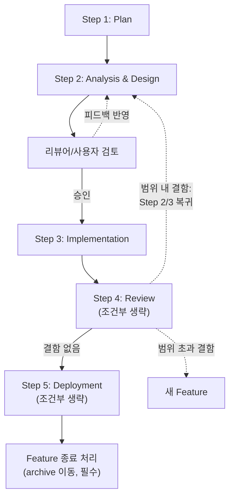

# AI 에이전트 개발 방법론

## 개요

LLM 기반 AI 에이전트(Claude Code 등)를 활용한 소프트웨어 개발 워크플로우. 퀄리티와 가성비를 동시에 확보하기 위해 단계별로 도구를 분리해 사용한다.

> **이 문서는 가이드다.** 오타 수정·단순 변경처럼 범위가 명확하고 영향이 작은 작업에는 이 방법론을 적용하지 않아도 된다. 설계 판단이 필요하거나 여러 파일에 영향을 미치는 변경부터 적용을 권장한다.

---

## 사용 가능한 에이전트

| 에이전트 | 설치 | 특이사항 |
|---|---|---|
| [Claude Code](https://claude.ai/code) | `npm i -g @anthropic-ai/claude-code` | Agent tool (서브에이전트 자동화) 지원 |
| [Gemini CLI](https://github.com/google-gemini/gemini-cli) | `npm i -g @google/gemini-cli` | Google 모델, 리뷰 다양성 확보에 활용 |
| [Codex](https://github.com/openai/codex) | `npm i -g @openai/codex` | OpenAI 모델, 리뷰 다양성 확보에 활용 |
| [GitHub Copilot](https://github.com/features/copilot) | IDE 익스텐션 | IDE 통합형, 구현 보조에 주로 활용 |
| [Superpowers](https://github.com/obra/superpowers) | Claude Code 플러그인으로 설치 | Analysis 단계 brainstorming에 선택 사용 |

> Step 1~3(분석·설계·구현)은 어느 에이전트든 사용 가능하다. Step 2 design review와 Step 4 code review에서 여러 에이전트를 혼용하면 맹점을 줄일 수 있다.

---

## 핵심 원칙

- **단계별 도구 매칭**: 인지 요구사항에 맞는 도구를 선택한다. 고비용 도구는 발산적 사고가 필요한 단계에만 투입한다.
- **독립성 + 다양성**: 리뷰는 컨텍스트를 격리하고 여러 모델을 사용해 맹점을 줄인다.
- **맥락 연속성**: Analysis → Design은 원칙적으로 같은 세션에서 이어서 진행한다. 복잡도는 사용자가 판단하며, 에이전트가 작업 전 확인할 수 있다.
- **Atomic Change**: 하나의 Feature는 하나의 목적만 달성한다.
- **코딩 행동 원칙**: 구현 시 [Karpathy Guidelines](karpathy-guidelines.md) 4원칙(Think Before Coding / Simplicity First / Surgical Changes / Goal-Driven Execution)을 적용한다. 메소드론과의 매핑은 `AGENTS.md §2` 참조.

---

## 5단계 Feature-based Workflow



> Worktree 사용 시 Step 3~4는 feature 브랜치 worktree에서, Step 5는 main에서 머지·배포.

> **Step 4(검토)와 Step 5(배포)는 조건부 생략 가능**합니다. 생략 결정은 Step 1 `plan.md`에 미리 선언하고 사유를 기록합니다 — 사후 누락이 아니라 계획상의 결정으로 추적합니다.

### Step 1: Plan (계획)

**도구**: 사용자와의 대화 (가벼움)
**목적**: 메타 결정 — 이 작업을 어떻게 접근할지, 어느 단계까지 진행할지 미리 정한다
**산출물**: `features/[YYYYMMDD]_[기능개발주제명]/plan.md` (한 페이지 미만 권장)

**선행 조건**: Feature 디렉토리 생성
```bash
mkdir -p features/[YYYYMMDD]_[기능개발주제명]
```

**실행 방법**:
```
"[기능 추가 / 수정] 계획부터 잡자"
→ 에이전트가 plan.md 작성
→ "바로 진행": Step 2 자동 시작 / "확정할게요": 사용자 확정 후 진행
```

필수 포함 항목:
- 작업 분류 (기능 / 리팩토링 / 버그 / 문서 / 운영)
- 적용 단계 선언 (Step 4 검토, Step 5 배포의 수행 여부 + 사유)
- 예상 영향 범위 (대상 파일 또는 디렉토리 수준)
- 메소드론 적용 여부 (오타·1줄 수정 등 trivial 변경은 본 절차 자체를 생략 — plan.md조차 만들지 않음)

### Step 2: Analysis & Design (분석및설계)

**도구**: Claude Code CLI / [Superpowers](https://github.com/obra/superpowers) (선택 — 발산적 탐색 또는 설계 옵션 비교가 필요할 때)
**목적**: 요구사항 분석과 그에 따른 설계를 통합 작성
**산출물**:
- `features/[YYYYMMDD]_[기능개발주제명]/analysis_and_design.md` — 분석 + 설계 통합 결과물
- `features/[YYYYMMDD]_[기능개발주제명]/design_review_N.md` — 리뷰어/사용자의 설계 검토 피드백 (선택, N = 리뷰어 순번)

> 분석과 설계를 하나의 단계에서 통합한다. 큰 feature에서 분석 결과를 먼저 확정하고 설계 방향을 가이드받고 싶으면, 파일 내 `## 분석`과 `## 설계` 섹션을 분리하고 사용자가 중간 검토를 선언할 수 있다.

**Superpowers 사용 여부** (기본값: 사용 안 함):
- 사용자가 명시적으로 요청할 때만 사용한다 (`"Superpowers로 분석해줘"`)
- 아이디어가 복잡하거나 설계 옵션이 다수일 때 선택 사용
- 사용 시: Superpowers brainstorm 스킬로 작업 후 결과를 analysis_and_design.md로 정리
- 미요청 또는 미설치 시: 에이전트가 직접 작성

**리뷰**: prefix `design_review` 적용 → 하단 '리뷰 공통 규칙' 섹션 참조
- 복잡도가 낮으면 생략 가능 (사용자 검토만으로 진행)
- 피드백 반영 후 재승인 → Step 3 진행

**ADR 추출 (결정의 정본)**: 미결 사항이 결정되면 `docs/adr/NNNN-{slug}.md`로 추출한다.
- 결정의 정본(source of truth)은 ADR 파일. analysis_and_design.md의 미결 표는 옵션 탐색 과정을 보존하고 결정 자체는 `ADR-NNNN` 식별자로만 참조.
- 결정 = 1 ADR 원칙. 미결이 N개면 ADR도 N개.
- 컨벤션·템플릿·인덱스는 `docs/adr/README.md` 참조.

필수 포함 항목:
- 배경 및 목적
- 현행 진단 (결함 목록 및 근거)
- 개정 범위 (대상 파일, 변경 성격)
- 개정 전/후 비교 (Before → After)
- 연계 룰/스킬 정합성 검토
- 미결 사항 (없으면 "없음" 명시) — 결정된 항목은 ADR-NNNN으로 추출
- Definition of Done (성공 기준)

**버전 관리**: 피드백으로 수정될 때마다 파일 내 섹션으로 이력 관리

```markdown
## v1 - YYYY-MM-DD
[최초 내용]

## v2 - YYYY-MM-DD
[피드백 반영 후 수정 내용]
```

승인 시 에이전트가 파일 상단에 `approved: YYYY-MM-DD` 마커 추가

**종료 조건**: 사용자의 명시적 승인 (필수)
- AI 에이전트 설계 리뷰 (`design_review_N.md`): 선택 — 복잡도가 낮으면 생략 가능
- 사용자 검토 및 승인: 필수 — 생략 불가, 반드시 Step 3 진입 전 확인
- 피드백 있음 → Step 2로 복귀해 수정 후 재검토
- 승인 시 → `"승인. Step 3 진행해줘"` 또는 `"구현 시작해줘"` 입력 → Step 3 진행


### Step 3: Implementation (구현)

**도구**: Claude Code CLI
**목적**: analysis_and_design.md 기준으로 정확한 실행
**산출물**: 설계서에 명시된 변경 파일들 (git diff로 확인)
**종료 조건**: 설계서의 모든 변경 항목 반영

**실행 방법**:
```
"analysis_and_design.md를 참조해서 명시된 항목 구현해줘.
설계서에 없는 추가 변경은 하지 말 것"
```

자가 검증:
- [ ] 스키마/정의와의 정합성 확인
- [ ] 파일 간 논리적 충돌 없음
- [ ] 전체 구조를 해치지 않는지 확인

> 자가 검증 완료 후 Step 4(검토) 또는 plan.md에서 검토를 생략하기로 했다면 Step 5(배포)로 진행

### Step 4: Review (검토) — 조건부 생략 가능

**도구**: 멀티모델 리뷰
**검토 대상**: 구현 결과물 (코드 변경사항, 테스트 포함)
**검토 주체**: 멀티모델 (Claude, Gemini, Codex 등 AI 리뷰어)
**산출물**: `features/[YYYYMMDD]_[기능개발주제명]/code_review_N.md`

**생략 가능 조건** (모두 충족 시):

| 항목 | 조건 |
|---|---|
| 변경 크기 | 단일 파일 또는 50줄 이하 |
| 변경 성격 | 오타 · 문서 · 코드 정리 · 테스트 추가만 |
| 영향 범위 | 외부 인터페이스(스키마/명령어 의미론/공개 API) 미변경 |

생략 결정은 Step 1 plan.md에 미리 선언하고 사유를 기록한다.

**수행 시 리뷰**: prefix `code_review` 적용 → 하단 '리뷰 공통 규칙' 섹션 참조

**수행 시 DoD 체크리스트**:
- [ ] analysis_and_design.md의 모든 변경 항목이 반영됨
- [ ] 기존 파일과 충돌(중복 정의)이 없음
- [ ] 새 명령이 참조하는 파일이 실제로 존재함
- [ ] 내비게이션/인덱스 갱신 여부 확인
- [ ] 결함 처리 완료 (→ 리뷰 공통 규칙의 '결과 처리' 참조)
- [ ] 연계 룰/스킬과의 정합성 확인

### Step 5: Deployment (배포) — 조건부 생략 가능

**도구**: 배포 스크립트
**진입 조건**: Step 4 DoD 전항목 충족 (Step 4 생략 시 Step 3 자가 검증 + 사용자 승인으로 대체) + 사용자 최종 승인 (`"배포 진행해줘"` 또는 `"Step 5 시작해줘"`)
**산출물**: `features/HISTORY.md` — 배포 후 에이전트가 자동으로 항목 append (파일 없으면 생성)

**생략 가능 조건** (어느 하나라도 해당):

| 항목 | 조건 |
|---|---|
| 변경 대상 | `_system/` + 인프라 스크립트(`scripts/`, `deploy.sh`) 둘 다 미변경 |
| 변경 성격 | 메인테이너 가이드(`AGENTS.md`, `docs/`)만 변경 |
| 운영 환경 | 운영 시스템에 미반영해도 무방한 변경 (개발 단계 문서 등) |

생략 결정은 Step 1 plan.md에 미리 선언한다. 생략 시 HISTORY.md 항목 추가도 함께 생략한다.

**수행 시 HISTORY.md 항목 형식**:
```markdown
## [YYYY-MM-DD] 기능개발주제명

- **목적**: 무엇을 해결/추가했는가
- **로직**: 어떤 방식으로 구현했는가
- **생성 ADR**: ADR-NNNN, ADR-NNNN (해당 항목이 있을 때)
- **트레이드오프**: 이 결정으로 포기한 것, 생긴 제약 (없으면 "없음")
- **결론**: 최종 상태 및 후속 과제
- **참조**: features/archive/[YYYYMMDD]_[기능개발주제명]/
```

> 결정 이유의 상세는 ADR로 옮겨갔으므로 HISTORY 항목은 "생성 ADR" 한 줄로 참조한다. ADR이 없는 단순 운영성 feature는 이 줄을 생략한다.

### Feature 종료 처리 (필수)

feature가 최종 단계까지 완료되면 (Step 5 수행 또는 생략 결정 후), 다음을 수행한다.

1. **ADR 검증**: 본 feature가 생성하기로 한 ADR이 모두 `docs/adr/`에 존재하고 Status가 `Accepted`인지 확인.
2. **HISTORY.md 항목 검증** (Step 5 수행한 경우): 항목이 추가됐고 참조 경로가 `features/archive/...`로 갱신됐는지 확인.
3. **Archive 이동**: `git mv features/[YYYYMMDD]_[기능개발주제명] features/archive/[YYYYMMDD]_[기능개발주제명]`
   - features/ 루트에는 **진행 중 feature만** 남는다.
   - archive 위치 자체가 "완료" 표시 — 별도 종료 마커는 두지 않는다.

종료 처리는 사용자 선언 (`"feature 종료해줘"` 또는 `"archive로 이동해줘"`)으로 트리거한다.

---

## 리뷰 공통 규칙

Step 2(설계 검토 — 선택)와 Step 4(구현 검토 — 조건부)에 동일하게 적용한다. 단계에 맞는 prefix를 파일명에 붙인다.

| 단계 | 파일명 | 리뷰어 예시 |
|---|---|---|
| Step 2 Design Review (선택) | `design_review_N.md` | `design_review_1.md` (Claude Opus), `design_review_2.md` (Gemini), `design_review_3.md` (Codex) … |
| Step 4 Code Review (조건부) | `code_review_N.md` | `code_review_1.md` (Claude Opus), `code_review_2.md` (Gemini), `code_review_3.md` (Codex) … |

**리뷰어 구성**: 아래 중 선택해서 조합 (2개 이상 권장)

| 리뷰어 | 역할 | 실행 방법 |
|---|---|---|
| Claude (다른 모델) | 동일 회사 모델, 다른 추론 방식 | Claude Code 설정에서 모델 변경 후 실행 |
| Claude (컨텍스트 초기화) | 개발 맥락 없이 코드 자체만 평가 | 새 터미널 탭에서 `claude` 실행 (이전 대화 없음) |
| Gemini | 다른 학습 데이터, 다른 판단 기준 | `gemini` CLI 또는 웹에서 별도 세션으로 실행 |
| Codex | OpenAI 모델, 다른 판단 기준 | `codex` CLI 또는 웹에서 별도 세션으로 실행 |

**독립성 + 다양성**이 핵심. 각 리뷰어는 다른 리뷰어의 결과를 모르는 상태로 진행한다.

**파일 내 버전 히스토리**: 동일 리뷰어가 반복 검토할 때 파일 내에서 버전으로 구분한다.
```markdown
## v1 - YYYY-MM-DD
[리뷰 내용]

## v2 - YYYY-MM-DD
[수정 후 재검토 내용]
```

**컨텍스트 전달 (Code Review 시)**:
```bash
# 변경 내용을 파일로 추출 (base 브랜치명이 다르면 main 부분 수정)
git diff $(git merge-base HEAD main) > review_context.md
```
리뷰어에게: `"review_context.md를 참조해서 code_review_N.md 작성해줘"`

**실행 방식** (택일):

- **수동**: 각 리뷰어 세션에서 직접 지시 후 결과를 파일에 기록

- **Claude Code에서 CLI 직접 호출**: Gemini·Codex·Copilot CLI가 설치된 경우 Claude Code가 Bash tool로 직접 실행 가능
```bash
# Gemini
cat review_context.md | gemini -p "코드 리뷰해줘" > code_review_2.md

# Codex
cat review_context.md | codex -p "코드 리뷰해줘" > code_review_3.md

# GitHub Copilot CLI
gh copilot suggest -t shell "review_context.md 기반으로 코드 리뷰해줘" > code_review_4.md
```
> CLI 플래그(`-p` 등)는 버전마다 다를 수 있으므로 각 CLI 공식 문서 확인 후 사용
> diff가 너무 크면 잘릴 수 있으므로 변경 범위가 큰 경우 파일 단위로 분할 전달

- **서브에이전트 (Claude Agent tool)**: `"서브에이전트로 리뷰해서 code_review_N.md에 기록해줘"` → Agent tool이 worktree 격리 후 결과 파일 생성

**결과 취합**:
```
리뷰 파일이 1개일 때:
"[prefix]_review_1.md를 참조해서 지적 항목 우선순위 정리해줘"

리뷰 파일이 2개 이상일 때:
"[prefix]_review_N.md 파일들을 참조해서
2개 이상 공통으로 지적한 항목만 추려서 우선순위 정리해줘"
```

**결과 처리**:
- 설계 결함 발견 → Step 2(Design)으로 복귀해 설계 수정 후 재검토
- 구현 버그/로직 오류 → Step 3(Implementation)으로 복귀해 수정 후 재검토
- 범위 초과 결함 → 해당 리뷰 파일에 사유 기록 후 새 Feature ID 발급
- 결함 없음 → 다음 단계 진행

---

## 멀티에이전트 접근법

### 수동 오케스트레이션
- [cmux](https://cmux.com/ko)로 패널 분리 → 패널별로 다른 에이전트 실행 — AI 에이전트 멀티태스킹용 macOS 네이티브 터미널
- 예: 패널 1(Claude Code 개발자), 패널 2(Gemini 리뷰어), 패널 3(Codex 리뷰어)
- 에이전트 간 결과 전달은 사람이 직접
- 각 에이전트의 진행 상황을 시각적으로 확인 가능

### 자동 오케스트레이션 (Claude Agent tool)
- Claude Code 내부에서 서브에이전트를 자동 생성·조율
- 자연어로 지시: "두 에이전트가 병렬로 A는 성능, B는 보안 리뷰해줘"
- 병렬 처리, 코드베이스 탐색 등에 유효
- 현재 Claude Code에서만 지원

---

## Git Worktree 활용

> **기본값: 권장(선택).** 일반 feature 브랜치만으로도 순차 작업은 충분하다.
> 아래 조건에 해당하면 **필수** 적용한다:
> - 개발자·리뷰어를 동시에 별도 패널로 운용할 때 (cmux 멀티에이전트)
> - 리뷰를 main 기준 diff로 격리해서 진행할 때
> - 서브에이전트 리뷰를 자동화할 때 (Claude Agent tool 활용 시)

### 기본 개념
feature 브랜치를 별도 디렉토리로 체크아웃해 브랜치 전환 없이 여러 작업을 동시에 진행한다.

```bash
# feature worktree 생성 (레포 루트 기준 상대경로)
git worktree add ../[repo]-feat/[YYYYMMDD]_[기능개발주제명] feature/[기능개발주제명]

# 작업 완료 후 제거
git worktree remove ../[repo]-feat/[YYYYMMDD]_[기능개발주제명]
```

### cmux 패널 구성
```
패널 1 (개발자): ../[repo]-feat/[YYYYMMDD]_[기능개발주제명]  ← feature worktree
패널 2 (리뷰어): ../[repo]                                    ← main, diff 확인
```

### Workflow 단계별 매핑

| 단계 | Worktree | 목적 |
|---|---|---|
| Implementation | feature worktree | 격리된 환경에서 개발 |
| Review | main worktree | main 기준 diff로 변경사항 검토 |
| Deployment | main worktree | merge 후 deploy.sh 실행 |

### Claude Code Agent tool 연동
Agent tool의 `isolation: "worktree"` 옵션을 사용하면 서브에이전트가 자동으로 임시 worktree를 생성해 작업 후 결과만 반환한다.

```
"worktree 격리해서 리뷰해줘"
→ Agent tool이 임시 worktree 생성 → 리뷰 → 메인 컨텍스트로 결과 반환
```

수동(cmux) 방식과 자동(Agent tool) 방식 모두 worktree와 자연스럽게 연결된다.

### Worktree 미사용 기본 경로

Worktree 없이 진행할 때는 feature 브랜치에서 Step 1~4를 진행하고 Step 5에서 PR 생성 후 main으로 머지한다.

```bash
git checkout -b feature/[기능개발주제명]
# Step 1~4 진행
git push origin feature/[기능개발주제명]
# PR 생성 → 머지
```

---

## 단계별 도구 요약

| 단계 | 도구 | 비용 | 이유 |
|---|---|---|---|
| Plan | 사용자와의 대화 | 최저 | 메타 결정만 — 가벼움 |
| Analysis & Design | 에이전트 (기본) / Superpowers (선택) | 저~고 | 발산적 사고 필요 시 Superpowers 추가 |
| Implementation | 에이전트 | 저 | 정밀 실행 |
| Review (조건부) | 멀티 에이전트 (Claude / Gemini / Codex 등) | 중 | 독립성 + 다양성 |
| Deployment (조건부) | 스크립트 | 최저 | 기계적 실행 |

---

## Feature 디렉토리 및 결정 기록

> **라이프사이클 기준 분리**: `features/`는 active → archive 라이프사이클을 가진 워크스페이스, `docs/adr/`는 supersede로만 변경되는 영속 기록. 같은 "개발 관련"이지만 행동이 다르므로 디렉토리를 분리한다.

### Features 구조

`features/[YYYYMMDD]_[기능개발주제명]/` 디렉토리를 Step 1 시작 전에 생성하고, Step 1~5 전 과정의 산출물을 여기에 기록한다. 종료 처리 시 `features/archive/`로 이동한다.

```
features/
├── HISTORY.md                                       # 배포 이력 누적 (append-only, Step 5 수행 시에만 추가)
├── [YYYYMMDD]_[기능개발주제명]/                     # 진행 중 feature (루트에 가시화)
│   ├── plan.md                                      # Step 1 산출물 (가벼움)
│   ├── analysis_and_design.md                       # Step 2 산출물 (분석 + 설계 통합)
│   ├── design_review_N.md                           # Step 2 리뷰 (선택, N=1,2,3...)
│   └── code_review_N.md                             # Step 4 리뷰 (조건부, N=1,2,3...)
└── archive/
    └── [YYYYMMDD]_[기능개발주제명]/                 # 완료 feature
        └── (위와 동일 구조)
```

- **루트 = 진행 중**: features/ 직속의 [기능개발주제명]/ 디렉토리는 모두 작업 중.
- **archive/ = 완료**: 종료 처리된 feature는 이쪽으로 이동. 위치 자체가 완료 표시.

### 결정 기록 (ADR)

```
docs/adr/
├── README.md                                        # ADR 컨벤션 + 인덱스
├── template.md                                      # 신규 ADR 작성 템플릿
└── NNNN-{kebab-case-title}.md                       # 결정 1건 = 파일 1개
```

- 결정의 **정본(source of truth)** 은 ADR 파일. 다른 문서(analysis_and_design.md, HISTORY.md)는 `ADR-NNNN` 식별자로 참조만.
- archive로 이동돼도 ADR은 `docs/adr/` 그대로 유지 (feature와 분리된 영속 기록).
- 결정 변경 시 기존 ADR Status를 `Superseded`로 바꾸고 신규 ADR에 `Supersedes: ADR-NNNN` 명시. 기존 ADR은 **삭제하지 않는다.**

**Worktree 사용 시**: Step 3~4는 feature 브랜치 worktree에서 진행하고, Step 5에서 main으로 머지한다.
**git 관리**: `features/` 전체를 커밋해 히스토리를 보존한다.

- `[YYYYMMDD]`: 작업 시작일 (KST)
- `[기능개발주제명]`: 소문자 + 언더스코어, 기능을 간결히 표현 (예: `user_auth_refactor`)
- git 브랜치명도 동일한 슬러그 사용: `feature/[기능개발주제명]`
