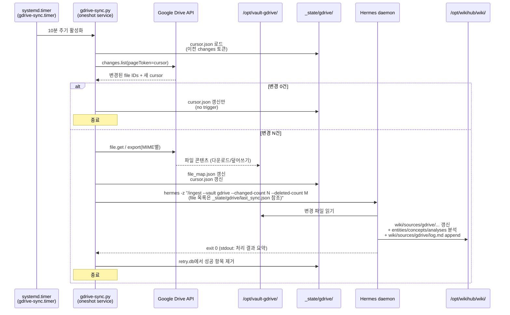
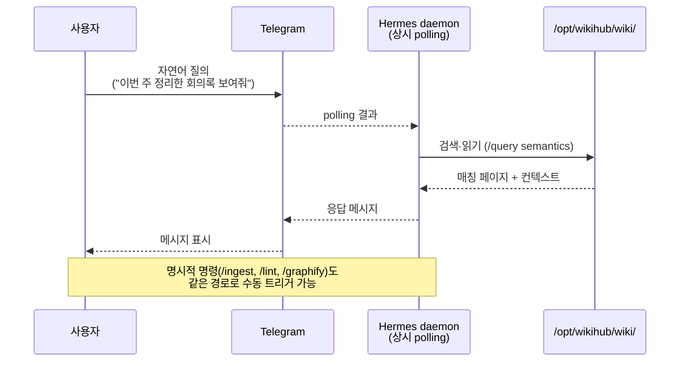
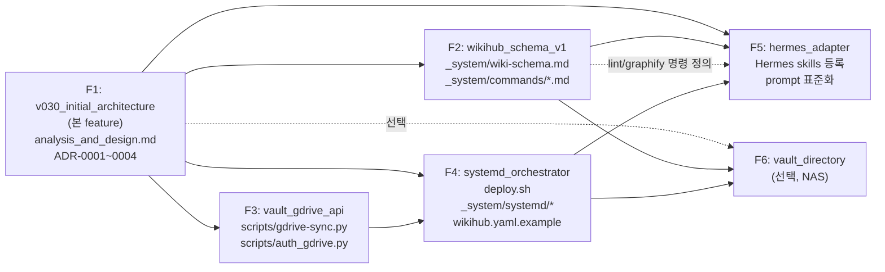

# Analysis & Design: WikiHub v0.1.0 초기 아키텍처

- **Feature ID**: `20260513_v030_initial_architecture`
- **작성일**: 2026-05-13 (KST)
- **목적 범위**: 본 feature는 **계획 + 분석및설계** 단계만 다룬다. 구현은 본 문서를 기준으로 후속 feature로 분리한다.
- **approved**: 2026-05-13

### Revision Log

| Version | Date | 변경 요지 |
|---|---|---|
| v1 | 2026-05-13 | 분석 섹션(§1~3) 초안. 미결 1·2·3 식별 |
| v2 | 2026-05-13 | 미결 1·2·3 결정 + 설계 섹션(§4) 추가 + ADR-0001~0003 추출. 설계 중 ADR-0004(Drive 접근 메커니즘) 추가 발의·결정 |
| v3 | 2026-05-13 | 멀티모델 design review 2건(`design_review_1.md` 코드 정합성, `design_review_2.md` SRE 관점) 결과 17건 전수 반영. R1 high·med·low(H1~4, M1~2, L1) + R2 critical·significant(C1~4, S1~6). 추가 도입: `pending_ingest.json`(C1), Hermes-독립 알림 경로 `ops-alert.service`(C2), 디스크 워터마크 + `disk-watch.timer`(C3), bootstrap 가드(C4), Drive 403 분기 매트릭스(S1), SQLite integrity_check(S2), UTC/KST timestamp 정책(S3), prompt injection 신뢰 경계(S4), runbook 검증 체크리스트(S5), deploy.sh 롤백 인터페이스(S6) |

---

## 1. 배경 및 목적

### 1.1 출발점

`WikiCurate` v0.2.6은 macOS 로컬 단일 vault 모델로 안정화된 LLM 기반 자율 지식 관리 시스템이다. 핵심 구성:

- 단일 vault: `_system/` + `wiki/` + `raw/` + `wiki-inbox/`
- 자동화: launchd + fswatch + `wiki-inbox → raw` 이동 + 10분 주기 `/ingest` + `/lint` + graphify
- 에이전트: codex / claude / gemini CLI fallback chain
- 지원 포맷: MD/PDF/Office/CSV/TSV/Google 스텁(.gdoc/.gsheet/.gslides)

### 1.2 새 운영 요구사항

- **운영 환경**: OCI ARM Ubuntu 서버 (24/7 daemon 운영)
- **인터페이스**: Telegram 연동된 `Hermes` 에이전트 (자연어 질의·관리)
- **소스 백엔드**: Google Drive (1차), 향후 개인 NAS, Notion 등 확장 가능성
- **사용자 경험**: 사용자는 Google Drive에 파일을 떨구기만 하고, 위키 검색·관리는 Telegram에서 자연어로 처리

### 1.3 본 feature의 목적

WikiCurate v0.2.6은 macOS 로컬 단일 vault 가정 위에 설계되어 새 요구사항(서버 운영, 다중 소스, daemon 에이전트)과 인프라 레이어가 부적합하다. 따라서:

- v0.2.6 리포지토리는 **reference로 보존**하고
- 신규 리포지토리 `wikihub`에서 **server-first + multi-vault** 모델로 v0.1.0을 출범한다
- 본 feature는 그 v0.1.0의 **초기 아키텍처를 정의**하는 것을 목적으로 한다

지식 모델(위키 페이지 형식, 4-카테고리, `[[link]]` 컨벤션, 명령어 의미론)과 메인테이너 방법론(features/ 워크플로우)은 v0.2.6에서 그대로 이식한다.

---

## 2. 현행 진단 (v0.2.6의 부적합 항목)

### 2.1 토폴로지

| 항목 | 진단 | 근거 |
|---|---|---|
| 단일 vault 모델 | 다중 소스 백엔드 통합 불가 | "1 vault = 1 wiki + 1 raw + 1 wiki-inbox" 가정. Google Drive와 NAS를 하나의 위키로 합치려면 각각 독립 vault가 되거나, raw/가 다중 출처 디렉토리를 가리켜야 함 |
| `raw/` 내부 위치 | vault 외부 마운트와 충돌 | `raw/`는 `_system/`/`wiki/`와 같은 vault 디렉토리 안에 있어, raw 자체를 NAS 마운트 / Drive 미러로 두기 어려움 |
| `wiki-inbox/` mv 흐름 | Drive에는 mv 의미가 약함 | inbox→raw 이동은 사용자가 macOS Finder로 파일을 떨구는 워크플로우에 최적화. Drive에서는 파일이 "이미 정착"되어 있고 이동 개념이 부정합 |

### 2.2 인프라

| 항목 | 진단 | 근거 |
|---|---|---|
| launchd 의존 | Linux 서버 부적합 | macOS 전용 스케줄러 |
| fswatch 의존 | Linux는 inotify가 표준 | macOS 친화 도구. Google Drive 마운트 이벤트는 그조차도 불안정해서 v0.2.6에서 wiki-inbox로 감시 대상을 옮긴 이력 있음 |
| `/opt/homebrew/bin/*` 경로 | Linux에는 존재하지 않음 | Apple Silicon Homebrew 경로 의존 |
| 시스템 Python 사용 | Ubuntu 22.04+ PEP 668 차단 | `pip3 install ...` 직접 호출이 externally-managed-environment로 거부됨 |
| OAuth `run_local_server()` | 헤드리스 서버 부적합 | v0.2.5 도입한 흐름이 브라우저를 띄움. OCI 서버에는 GUI 없음 |

### 2.3 소스 흡수

| 항목 | 진단 | 근거 |
|---|---|---|
| Google 스텁 다단 fallback | 임시방편 | `.gdoc`/`.gsheet`/`.gslides`에 대해 OAuth helper → 인증 실패 시 URL만 기록. Drive API를 직접 호출하면 export로 정상 콘텐츠 획득 가능 |
| daily-rescan Pass 1 | redundant 가능 | 스텁 파일의 콘텐츠 변경을 감지하지 못해 6회/일 강제 재ingest. Drive API `changes.list`가 권위 있는 변경 소스 |
| `wiki-schema.md`의 GSHEET/GDOC/GSLIDES + DOC/XLS/PPT 섹션 | 비대화 | 약 250줄 분량. API 기반 동기화로 통합 시 사라질 수 있는 분량 |

### 2.4 에이전트 호출

| 항목 | 진단 | 근거 |
|---|---|---|
| `watch-ingest.sh`의 CLI spawn 패턴 | Hermes(daemon) 결합 어려움 | codex/claude/gemini CLI를 매번 spawn하는 방식. Hermes는 Telegram을 polling하는 long-running daemon이므로 RPC/IPC로 트리거 받는 모델이 자연스러움 |
| 에이전트 fallback chain 하드코딩 | 단일 에이전트 운영 모델에 부적합 | 서버 운영에서는 Hermes 하나만 띄우는 게 일반적 |

---

## 3. 개정 범위

### 3.1 본 feature가 결정하는 것

본 feature는 다음을 **정의**한다 (구현 X):

1. **토폴로지**: wikihub 인스턴스(`_system/` + `wiki/` + `_state/`) + 외부 vault 디렉토리 N개
2. **Vault 추상**: vault type(`gdrive_api`, `directory`, 향후 추가)별 sync 인터페이스 명세
3. **소스 흡수 메커니즘**:
   - 결정론적 sync 스크립트가 vault에 변경 콘텐츠를 떨어뜨림
   - 변경 감지 시 Hermes에 `/ingest` 트리거
   - inbox 개념 폐기 (Drive에서 사용자가 직접 떨굼)
4. **에이전트 호출 모델**:
   - Hermes daemon이 `/ingest`, `/lint`, `/query`, `/graphify` 수행
   - sync ↔ Hermes 분리 (sync 실패와 agent 실패가 격리됨)
   - Hermes 호출 인터페이스(CLI/HTTP/IPC)는 본 단계에서 결정
5. **명령어 의미론** (v0.2.6 lift + multi-vault 변형):
   - `/ingest`: 등록 vault 목록 순회 → type별 sync 트리거 → vault-aware 처리
   - `/lint`, `/query`, `/graphify`: vault-aware
   - `/setup`: 신규 vault 등록 + 의존성 확인
6. **wiki 페이지 모델** (v0.2.6 lift + multi-vault 변형):
   - 4-카테고리 유지: `sources/`, `entities/`, `concepts/`, `analyses/`
   - `sources/` 하위 vault namespace 부여 (정책은 미결 1)
   - `sources:` frontmatter에 vault prefix
   - 파일명 = `title:` = `[[link]]` invariant 유지
   - `index.md` / `log.md` 컨벤션 유지 (log.md 포맷에 vault 식별자 포함)
7. **운영 환경**:
   - Linux/systemd (Ubuntu ARM, OCI 타깃)
   - macOS 미지원 (개발은 가능, 배포는 Linux 전용)
   - OAuth는 헤드리스 친화 방식 (구체 방식은 미결 3)

### 3.2 본 feature의 산출물

- `features/20260513_v030_initial_architecture/plan.md` (Step 1)
- `features/20260513_v030_initial_architecture/analysis_and_design.md` (본 문서, Step 2)
- `features/20260513_v030_initial_architecture/design_review_N.md` (Step 2 리뷰, 선택)

### 3.3 본 feature가 결정하지 않는 것 (후속 feature로 이관)

| 후속 Feature 후보 | 범위 |
|---|---|
| F2: `wikihub_schema_v1` | `_system/wiki-schema.md`(Operator Guide) + `_system/commands/*` 구현. 본 analysis_and_design.md의 명세를 정본으로 변환 |
| F3: `vault_gdrive_api` | `scripts/gdrive-sync.py` + Drive API + OAuth 헤드리스 + cursor/file_map 영속화 |
| F4: `systemd_orchestrator` | `deploy.sh` + systemd user units (`.service`/`.timer`) + `wikihub.yaml` 스키마 + 로깅 |
| F5: `hermes_adapter` | Hermes 호출 어댑터(설계서 미결 2 결정에 따라). 자동 트리거 흐름 및 수동 명령 처리 |
| F6: `vault_directory` (선택) | NAS / 로컬 디렉토리 vault type. inotifywait 통합. NAS 운영 시작 시점 |

본 문서의 설계 섹션은 위 후속 feature들이 참조할 인터페이스(파일 경로, 설정 키, 데이터 형식)를 정의한다.

### 3.4 미결 사항 (본 단계에서 결정)

본 문서의 설계 섹션에서 다음 3건을 명시적으로 결정한다.

#### 미결 1. 소스 페이지 충돌 정책

`vault-gdrive`에 `report.md`가 있고 `vault-nas`에도 `report.md`가 있을 때 wiki/sources/ 처리 방식.

| 옵션 | 설명 | 장점 | 단점 |
|---|---|---|---|
| (α) Vault namespace 분리 | `wiki/sources/gdrive/report.md`, `wiki/sources/nas/report.md` | 결정론적, 예측 가능 | 같은 문서가 두 vault에 있어도 두 페이지 |
| (β) Title 기반 merge | 한 페이지에 `sources: [gdrive/report.md, nas/report.md]` | 사용자에게 단일 페이지로 보임 | 동일성 판단을 에이전트에 위임 → 비결정적 |
| (γ) Hash dedup | 콘텐츠 해시 일치 시 자동 병합 | 정확한 동일성 | 편집 중 사본 등 거의 같은 문서를 강제 병합해 정보 손실 위험 |

**잠정 권장**: (α). 결정론과 예측 가능성을 우선. 추후 동일 문서 인지가 필요하면 별도 feature로 dedup 도입 가능.

#### 미결 2. Hermes 호출 인터페이스

sync 스크립트가 Hermes에 `/ingest` 트리거를 보내는 메커니즘.

| 옵션 | 설명 | 장점 | 단점 |
|---|---|---|---|
| CLI | `hermes invoke --command ingest` 같은 CLI 호출 | 간단, sync는 subprocess만 spawn | Hermes에 CLI 인터페이스 필요. 동시성 처리는 Hermes 책임 |
| HTTP | Hermes가 localhost HTTP 엔드포인트 노출 | 표준적, 도구 친화 | Hermes 측 HTTP 서버 구현 필요 |
| IPC (Unix socket / file flag / DBus) | OS-level 신호 | 의존성 적음 | 디버깅 어려움. Hermes 측 listener 필요 |

**결정에 필요한 정보**: Hermes 자체가 어떤 인터페이스를 제공/추가할 수 있는지. design 단계에서 Hermes 운영 모델을 같이 정한다.

#### 미결 3. OAuth 헤드리스 방식

Drive API 접근을 위한 OAuth 인증을 헤드리스 OCI 서버에서 처리하는 방법.

| 옵션 | 설명 | 장점 | 단점 |
|---|---|---|---|
| token-scp | 로컬 macOS에서 OAuth → 발급된 `token_{profile}.pickle`을 OCI로 scp 복사 | 즉시 구현 가능 | 토큰 만료 시 재발급 부담. refresh_token이 살아 있으면 자동 갱신되나 정책상 만료 가능 |
| device-code flow | 서버가 URL + 코드 출력 → 사용자가 폰으로 인증 | 자동화 친화, 만료 시 같은 절차로 재발급 | Google의 device-code 지원 스코프 확인 필요. drive.readonly는 일반적으로 지원 |

**잠정 권장**: device-code flow. 운영 자동화에 적합.

---

## 4. 설계 (Design)

본 절은 §3.1이 정의한 결정 사항을 실제 디렉토리 구조·데이터 형식·인터페이스 명세로 풀어낸다. 미결 3건은 §3.4에서 결정되어 ADR-0001~0003으로 추출 완료 — 본 절은 결정 결과를 전제로 한다.

### 4.1 토폴로지

#### 4.1.1 서버 디렉토리 구조

운영 대상 OCI ARM Ubuntu 서버의 디렉토리 레이아웃. WikiHub 인스턴스(`/opt/wikihub/`)와 외부 vault 디렉토리는 **물리적으로 분리**된다. vault는 sync 스크립트의 쓰기 대상이며, WikiHub 인스턴스는 vault를 입력으로만 읽는다.

```
/opt/wikihub/                            # WikiHub 인스턴스 (deploy.sh 동기화 대상)
├── _system/                             # 정본 룰 + 명령어 (deploy.sh로만 주입)
│   ├── commands/                        #   /ingest /lint /query /graphify /setup
│   │   └── *.md
│   └── wiki-schema.md                   #   지식 모델 정의
├── wiki/                                # 통합 위키 (Hermes 쓰기 대상)
│   ├── sources/                         #   ADR-0001: vault namespace 분리
│   │   ├── gdrive/                      #     vault-gdrive에서 온 페이지
│   │   │   ├── {path}/{file}.md
│   │   │   └── log.md                   #     vault별 ingest 이력
│   │   └── {다른 vault}/...
│   ├── entities/                        #   교차 vault 엔티티 페이지
│   ├── concepts/
│   └── analyses/
├── _state/                              # sync 영속 상태 (vault별, 4.4 참조)
│   └── {vault}/
│       ├── cursor.json
│       ├── file_map.json
│       └── retry.db
├── .credentials/                        # OAuth tokens (ADR-0003)
│   └── token_{profile}.pickle           #   chmod 600 강제
├── scripts/                             # sync 스크립트 (deploy.sh 동기화 대상)
│   └── gdrive-sync.py
├── wikihub.yaml                         # 운영 설정 (.gitignore, 환경별 분리)
└── logs/                                # 런타임 로그
    ├── sync.log
    └── hermes.log

/opt/vault-gdrive/                       # 외부 vault: Drive API 미러
└── ... gdrive-sync.py가 다운로드/갱신 ...

/opt/vault-nas/                          # 외부 vault: NAS 마운트 (F6, 향후)
└── ... NFS/SMB 마운트 ...
```

**디렉토리 책임 매트릭스**:

| 디렉토리 | 쓰기 주체 | 읽기 주체 | git 추적 |
|---|---|---|---|
| `_system/` | deploy.sh만 | Hermes, sync | 예 (정본 source) |
| `wiki/` | Hermes만 | Hermes, 사용자 | 예 (별도 wiki repo 검토 — F2) |
| `_state/{vault}/` | 해당 vault sync 스크립트만 | sync 스크립트 | 아니오 (.gitignore) |
| `.credentials/` | 메인테이너만 (1회 scp) | sync 스크립트 | 아니오 (.gitignore, 권한 600) |
| `scripts/` | deploy.sh만 | systemd | 예 |
| `wikihub.yaml` | 메인테이너만 | sync, Hermes | 아니오 (`.example`만 추적) |
| `/opt/vault-*/` | 해당 vault sync 스크립트만 (gdrive_api) / 외부 마운트(directory) | sync 스크립트, Hermes(read-only) | wikihub 외부 |

**격리 원칙**:
- vault 간 격리: sync-A의 실패가 sync-B와 wiki에 전이되지 않음 (각자 `_state/{vault}/`만 만짐)
- sync ↔ Hermes 격리 (ADR-0002): sync가 다운로드 완료 후 trigger를 보내는 시점 외에는 별개 프로세스
- 자격증명 격리: `.credentials/` 권한 600, OAuth pickle은 메인테이너 외 접근 불가

#### 4.1.2 데이터 흐름

평시(정기 sync) 동작 흐름:



대화형(사용자 Telegram) 흐름:



**핵심 흐름 포인트**:
- sync 스크립트는 **상태가 없는 cron-style 일회성 실행** — systemd timer가 lifecycle 책임
- Hermes는 **상시 동작 daemon** — Telegram polling + sync 트리거 둘 다 처리
- sync ↔ Hermes 간 유일한 결합은 `hermes -z` subprocess 호출 1지점 (ADR-0002)
- 변경 0건일 때는 Hermes 호출 자체 안 함 → 불필요한 ingest 사이클 회피
- 동시성: systemd timer가 `Unit=gdrive-sync.service` + `Type=oneshot`으로 overlap 방지. 다중 vault sync 동시 실행 시 Hermes 측 직렬화는 F5에서 결정

> 후속 §4.2~4.9에서 각 컴포넌트(sync 인터페이스, 설정 스키마, 상태 영속화, Hermes 호출 포맷, OAuth, systemd unit, F2~F6 분할)를 상세화한다.

#### 4.1.3 시간·타임존 정책 (S3)

다중 영속 파일(`cursor.json`, `file_map.json`, `last_sync.json`, `log.md`, journald, retry.db) 간 timestamp 정합성 확보.

| 항목 | 형식 | 근거 |
|---|---|---|
| **내부 영속 (cursor / file_map / last_sync / retry.db)** | **ISO 8601 with `+00:00` UTC** (예: `2026-05-13T01:30:00+00:00`) | sync 코드·SQL 비교가 단순. 서버 timezone 변경에 영향 받지 않음 |
| **사람 가시 (`log.md`, Hermes 알림 본문)** | `wikihub.yaml.instance.timezone`(기본 `Asia/Seoul`) 적용 후 표기. 항상 `KST` 같은 약자 명시 | 사용자 가독성 |
| **systemd journal** | systemd 기본(서버 로컬 timezone) — 변경하지 않음 | `journalctl --since` 호환성 보존 |

**예시 — last_sync.json**:
```json
{
  "started_at": "2026-05-13T01:29:30+00:00",   // 항상 UTC
  "finished_at": "2026-05-13T01:30:00+00:00"
}
```

**예시 — log.md**:
```markdown
## 2026-05-13 10:30:00 KST   ← instance.timezone 적용 (UTC+9)
```

**클럭 동기 보장**:
- sync 시작 시점에 NTP 동기 여부 점검: `timedatectl show -p NTPSynchronized --value` ≠ `yes`이면 경고 로그 + 계속
- 클럭 스큐 1초 이상이면 cursor 비교 무결성 위협 → 경고 로그(VaultSyncFatal로는 격상 안 함. NTP 서비스 단명 장애 흡수)
- 점검 helper는 F4 `scripts/_clock_check.py`로 분리 권장

### 4.2 Vault type 인터페이스 명세

본 절은 vault type이 갖춰야 할 추상 인터페이스를 정의한다. 구체 구현(`gdrive_api`, `directory`)은 후속 feature(F3, F6)의 책임이며, 본 절은 두 type이 동일한 진입점·반환 형식·에러 시맨틱을 공유하도록 강제하는 계약이다.

#### 4.2.1 진입점

각 vault type은 단일 entrypoint를 제공한다. 진입점은 호출 시점에 1회만 실행되고 종료하는 oneshot 함수다(systemd `Type=oneshot` 매칭).

```python
from typing import Protocol
from pathlib import Path

class VaultSync(Protocol):
    """모든 vault type이 구현해야 하는 sync 인터페이스."""
    vault_id: str          # wikihub.yaml의 vault name (예: 'gdrive', 'nas')
    vault_type: str        # 'gdrive_api' | 'directory' | ...
    vault_local_path: Path # /opt/vault-{vault_id}/

    def sync(self) -> SyncResult:
        """source → vault_local_path 동기화 1회 수행.

        Idempotent: 같은 cursor로 재호출해도 결과 일관(파일 다운로드는 멱등).
        State 영속화는 본 함수가 책임 — 호출자는 결과만 수신.

        Raises:
            VaultSyncRetryable: 일시적 실패 (네트워크, rate limit). retry_after_sec 권고.
            VaultSyncFatal: 비복구 실패 (자격증명 만료, 설정 오류). 사람 개입 필요.
        """
```

#### 4.2.2 반환 형식

```python
from dataclasses import dataclass
from datetime import datetime
from typing import Literal

@dataclass
class SyncResult:
    vault_id: str
    changed_files: list[ChangedFile]   # ingest 대상
    deleted_files: list[str]           # vault 내 상대경로 (wiki에서 제거 대상)
    cursor_before: str                 # sync 시작 시점 cursor
    cursor_after: str                  # sync 완료 후 cursor (영속화 완료 상태)
    duration_ms: int

    @property
    def has_changes(self) -> bool:
        return bool(self.changed_files or self.deleted_files)

@dataclass
class ChangedFile:
    source_relpath: str                # vault 내 상대 경로 (예: 'meetings/2026-Q1.md')
    operation: Literal['created', 'modified']
    source_mtime: datetime             # 원본 변경 시각 (UTC)
    source_id: str | None              # 소스의 안정 식별자 (Drive file ID 등). directory vault는 None
    bytes_written: int                 # 다운로드한 바이트 수 (로깅·메트릭용)
```

호출 측은 `result.has_changes`로 Hermes 트리거 여부를 결정한다(§4.1.2 평시 흐름의 분기).

#### 4.2.3 에러 시맨틱

```python
class VaultSyncRetryable(Exception):
    """일시적 실패. 다음 timer tick에서 자동 재시도 가능."""
    retry_after_sec: int
    reason: str

class VaultSyncFatal(Exception):
    """비복구 실패. 사람 개입 전까지 재시도 무의미."""
    vault_id: str       # 알림·로깅에서 vault 식별 (필수, keyword-only 권장)
    reason: str
    remediation: str    # 운영자가 해야 할 조치 (예: 'token 재발급 필요')
```

| 에러 분류 | 예시 | 처리 |
|---|---|---|
| Retryable | 429 rate limit, 5xx, 네트워크 timeout, 일시적 DNS 실패 | retry.db에 등록 → 다음 sync에서 우선 처리. 알림은 N회 연속 실패 시 |
| Fatal | 401 token 만료, 403 권한 박탈, 설정 파일 누락, vault_local_path 쓰기 권한 없음 | retry.db에 등록 안 함 → 즉시 systemd journal 에러 + (선택) Hermes를 통한 Telegram 알림 |

#### 4.2.4 Type별 책임 매트릭스

`gdrive_api`와 `directory` 두 type의 추상 인터페이스 매핑:

| 책임 항목 | `gdrive_api` (F3) | `directory` (F6) |
|---|---|---|
| 변경 감지 메커니즘 | `changes.list(pageToken=cursor)` | mtime watermark per file + walk |
| cursor 표현 | Drive changes API의 nextPageToken (불투명 string) | 마지막 스캔 시각 ISO8601 string |
| source_id | Drive file ID | None |
| 다운로드/복사 | `files.get` 또는 `files.export` (MIME별) | filesystem copy (`shutil.copy2`) 또는 hard link |
| 삭제 감지 | `changes` 응답의 `removed: true` | 이전 file_map과 현재 walk의 set diff |
| 인증 | OAuth pickle from `.credentials/` (ADR-0003) | 없음 (filesystem 권한) |
| 호출 빈도 | systemd timer 10분 (조정 가능, §4.3) | systemd timer 또는 inotify-driven (F6에서 결정) |

**공통 책임** (vault type 무관):
- `vault_local_path`에 파일 콘텐츠 쓰기
- `_state/{vault_id}/file_map.json` 갱신 (§4.4)
- `_state/{vault_id}/cursor.json` 갱신 (atomic write — tmpfile + rename)
- `SyncResult` 반환

#### 4.2.5 진입 스크립트의 책임

`scripts/{vault_id}-sync.py`는 위 `VaultSync` 구현을 thin wrapping하는 entry point다. 책임:

```python
def main(vault_id: str):
    config = load_wikihub_yaml()                    # §4.3
    vault = build_vault(config.vaults[vault_id])    # type별 factory
    try:
        result = vault.sync()
    except VaultSyncFatal as e:
        log_error(e); notify_via_hermes_optional(e, config)   # §4.6.6 시그니처
        notify_via_systemd_onfailure(e)                       # §4.6.6 Hermes-독립 경로
        sys.exit(2)
    except VaultSyncRetryable as e:
        log_warn(e); register_retry(e)
        sys.exit(75)   # EX_TEMPFAIL — systemd Restart=on-failure 호환
    if result.has_changes:
        invoke_hermes(vault_id, result, config)     # §4.6.3 시그니처
    log_summary(result)
    sys.exit(0)
```

위 패턴이 모든 vault type 공통이므로, F3 구현 시 본 entrypoint는 공통 모듈로 추출 가능(`scripts/_sync_runner.py`). 추출 여부는 F3 구현 단계에서 결정한다.

> 영속화 파일 포맷(cursor.json, file_map.json, retry.db)은 §4.4에서 구체화.

#### 4.2.6 Drive 접근 메커니즘 (ADR-0004)

`gdrive_api` type 구현은 **Google 공식 Python SDK(`google-api-python-client`) 직접 호출**을 사용한다. 대안으로 검토한 `googleworkspace/cli`(gws) subprocess 패턴(ADR-0002와 대칭)은 다음 이유로 기각: 알파(pre-v1.0, "expect breaking changes" 명문), 공식 Google 지원 없음, 5단계 exit code의 에러 세분도 부족(§4.2.3 Retryable/Fatal 분류 필요). 결정 상세와 재검토 트리거는 ADR-0004 참조.

### 4.3 wikihub.yaml 스키마

운영 설정의 단일 정본. `/opt/wikihub/wikihub.yaml`에 위치하고, sync 스크립트와 Hermes가 모두 읽는다. git에 추적되지 않으며(secrets 포함), `wikihub.yaml.example`만 추적한다(F4 산출물).

#### 4.3.1 스키마 (YAML)

```yaml
# wikihub v0.1.0 운영 설정

version: 1                     # 스키마 버전 (호환성 체크용)

# ─── 운영 환경 메타 ─────────────────────────────────────
instance:
  root: /opt/wikihub            # WikiHub 인스턴스 루트 (모든 상대경로 기준)
  timezone: Asia/Seoul          # cursor·log 표기 기준

# ─── Vault 목록 ─────────────────────────────────────────
vaults:
  - id: gdrive                  # vault_id (영문 소문자, 디렉토리·로그 키)
    type: gdrive_api            # vault type (구현체 선택)
    enabled: true
    sync_interval_sec: 600      # systemd timer 주기 (10분)
    local_path: /opt/vault-gdrive   # 4.1.1 외부 vault 경로

    # gdrive_api 전용 옵션
    options:
      credentials_path: /opt/wikihub/.credentials/token_gdrive.pickle  # ADR-0003
      root_folder_id: null       # null = My Drive 전체. 특정 폴더 ID 지정 시 그 하위만 미러
      export_mime_map:           # Google 네이티브 포맷 → export MIME (F3에서 확정 가능, 본 표가 default)
        application/vnd.google-apps.document: text/markdown
        application/vnd.google-apps.spreadsheet: text/csv
        application/vnd.google-apps.presentation: text/plain
      include_patterns: []       # 빈 배열 = 전부. glob 패턴 (예: ['**/*.md', '**/*.pdf'])
      exclude_patterns:          # 우선순위 높음 (include보다 강함)
        - '.DS_Store'
        - '**/~$*'               # Office 락 파일
      max_file_size_mb: 50       # 단일 파일 상한. 초과 시 skip + log (디스크 폭주 방지)
      bootstrap_allowed: false   # cursor 없는 첫 sync 시 전체 스캔 허용 여부 (C4 — 기본 거부)
      exclude_shared_with_me: true   # S4 — 외부 사용자가 공유한 파일 ingest 금지 (prompt injection 표면 축소)
      # root_folder_id가 null이면 위 옵션과 무관하게 My Drive 전체. S4 권장: root_folder_id를 명시적으로 지정해 trusted 디렉토리만 처리

  # F6에서 추가 예정 (placeholder, enabled=false로 비활성)
  # - id: nas
  #   type: directory
  #   enabled: false
  #   sync_interval_sec: 1800
  #   local_path: /opt/vault-nas
  #   options:
  #     source_path: /mnt/nas/notes   # NAS 마운트 포인트
  #     watch_mode: timer             # 'timer' | 'inotify' (F6에서 결정)

# ─── Agent (Hermes) ─────────────────────────────────────
agent:
  hermes:
    binary: /usr/local/bin/hermes  # `which hermes`. PATH에 있으면 'hermes'만으로도 가능
    mode: oneshot                  # 'oneshot' (= hermes -z) | 'chat-query' (= hermes chat -q)
    timeout_sec: 600               # subprocess 타임아웃 (10분). 초과 시 SIGTERM
    prompt_template: |             # ingest trigger 프롬프트 템플릿 (F5에서 최종 확정 가능)
      /ingest --vault {vault_id} --changed-count {changed_count} --deleted-count {deleted_count}
      변경 파일 목록은 _state/{vault_id}/last_sync.json 참조.
    notify_on_fatal: true          # vault sync VaultSyncFatal 발생 시 Hermes를 통해 Telegram 알림

# ─── 로깅 ───────────────────────────────────────────────
logging:
  dir: /opt/wikihub/logs
  level: INFO                      # DEBUG | INFO | WARNING | ERROR
  rotation:
    max_bytes: 10485760            # 10 MB
    backup_count: 5
  # systemd journal 병행 출력은 systemd unit 측 StandardOutput=journal에 위임

# ─── 운영 정책 ─────────────────────────────────────────
operations:
  retry:
    max_attempts: 5                # 초기 실패 이후 최대 재시도 횟수 (총 6회 시도 = 1 + 5 retries)
    backoff_base_sec: 60           # exponential backoff base (60s, 120s, 240s, ...)
  hermes_concurrency: serial       # 'serial' (= 1 sync 끝나면 다음 sync). 'parallel'은 F5에서 검토

  # 디스크 워터마크 (C3 — disk-watch.timer가 주기 점검)
  disk:
    watch_paths:                   # 빈 배열 = ['instance.root', 모든 vaults[*].local_path]
      - /opt/wikihub
      - /opt/vault-gdrive
    watermark_warn_pct: 80         # 사용률 ≥ N% → Hermes 알림 + 로그 경고
    watermark_fatal_pct: 95        # 사용률 ≥ N% → ops-alert.service 발동 (Hermes-독립)
    sync_min_free_mb: 500          # sync 시작 시 vault_local_path free space < N MB → VaultSyncFatal

  # Fatal 알림 webhook (C2 — Hermes 죽어도 동작)
  fatal_webhook_url: null          # 미설정 시 ops-alert.service는 no-op
  fatal_webhook_timeout_sec: 10
```

#### 4.3.2 스키마 검증

진입 스크립트(`scripts/{vault_id}-sync.py`)는 시작 시점에 다음을 검증한다.

| 항목 | 검증 내용 | 실패 시 |
|---|---|---|
| `version` | == 1 | VaultSyncFatal('스키마 버전 불일치') |
| `vaults[*].id` | 고유, 영문 소문자 + 숫자 + 언더스코어 | VaultSyncFatal('vault_id 형식 오류') |
| `vaults[*].type` | 등록된 type 중 하나 | VaultSyncFatal('지원하지 않는 vault type') |
| `vaults[*].local_path` | 쓰기 가능한 디렉토리 (또는 부모에 mkdir 권한) | VaultSyncFatal('local_path 접근 불가') |
| `vaults[*].options.credentials_path` (gdrive_api) | 파일 존재 + 권한 600 | VaultSyncFatal('credentials 파일 누락 또는 권한 오류') |
| `agent.hermes.binary` | 실행 가능한 파일 | VaultSyncFatal('hermes binary 없음') |

검증은 sync 시작 전 fail-fast. 부분 실행 후 실패하는 시나리오 차단.

#### 4.3.3 시크릿 처리

- `wikihub.yaml`은 **OAuth pickle 경로만** 담고, 토큰 자체는 별도 `.credentials/` 디렉토리에 위치(ADR-0003)
- API key·webhook 비밀 등이 향후 도입되면 별도 `.credentials/secrets.env`(권한 600) + YAML에 `${VAR_NAME}` 형식 참조로 분리
- 본 feature 시점에서는 secrets.env 도입 없음(필요 없음)

#### 4.3.4 환경별 분리

운영(OCI server)과 개발(macOS dev box)이 동일 스키마를 공유하되, 인스턴스별로 별도 `wikihub.yaml`. deploy.sh는 `wikihub.yaml.example`만 복사하며 실제 `wikihub.yaml`은 메인테이너가 수기 작성·관리(F4 산출물에 명문화).

### 4.4 `_state/` 구조

각 vault의 sync 영속 상태를 보관한다. **vault별 디렉토리로 격리**되며, 해당 vault의 sync 스크립트만 쓴다(§4.1.1 디렉토리 책임 매트릭스). git 미추적.

```
_state/
└── {vault_id}/
    ├── cursor.json          # 다음 sync의 시작점 (vault type별 의미)
    ├── file_map.json        # vault relpath ↔ wiki path ↔ source 메타
    ├── last_sync.json       # 직전 sync 결과 스냅샷 (Hermes 프롬프트가 참조)
    └── retry.db             # 재시도 큐 (SQLite)
```

#### 4.4.1 `cursor.json`

```json
{
  "vault_id": "gdrive",
  "vault_type": "gdrive_api",
  "cursor": "<opaque-string-per-type>",
  "cursor_updated_at": "2026-05-13T10:30:00+09:00"
}
```

- **`cursor`**: vault type이 정의하는 불투명 문자열
  - `gdrive_api`: Drive `changes.list`의 `nextPageToken`
  - `directory`: 마지막 walk 시각 ISO8601
- **쓰기 정책**: atomic write (tmpfile + `os.rename`). 쓰기 도중 SIGKILL 대비
- **read-only 모드**: cursor가 비어 있으면(첫 sync) 전체 스캔 → 새 cursor 발급

#### 4.4.2 `file_map.json`

vault에서 다운로드한 모든 파일과 그에 대응하는 wiki 경로의 1:1 매핑. 삭제 감지(§4.2.4 directory vault)와 wiki 페이지 정합성 검증에 사용.

```json
{
  "vault_id": "gdrive",
  "updated_at": "2026-05-13T10:30:00+09:00",
  "files": {
    "meetings/2026-Q1.md": {
      "source_id": "1A2B3C-DriveFileId",
      "source_mtime": "2026-05-13T09:55:12+09:00",
      "wiki_path": "wiki/sources/gdrive/meetings/2026-Q1.md",
      "bytes": 12453,
      "last_synced_at": "2026-05-13T10:30:00+09:00"
    },
    "notes/idea.md": { ... }
  }
}
```

- **key**: vault 내 상대경로 (`source_relpath`, §4.2.2). 결정론적 정렬 키
- **`wiki_path`**: vault prefix 포함 wiki 경로 (ADR-0001 α). vault_id가 wiki_path에 항상 포함되므로 일관성 검증 가능
- **`source_id`**: Drive file ID 등. 파일이 vault 내에서 이동(rename)되어도 동일 source_id로 추적 → wiki 페이지 단순 이동 처리
- **쓰기 정책**: atomic write. 단일 sync 사이클 내 한 번만 갱신

**크기 관리**: 100K 파일 수준까지 단일 JSON으로 운용 가능(~50 MB). 그 이상은 SQLite로 마이그레이션 검토(별도 ADR 필요).

#### 4.4.3 `last_sync.json`

직전 sync의 `SyncResult` 스냅샷. Hermes 프롬프트(§4.3.1 `prompt_template`)가 변경 파일 목록을 직접 임베딩하지 않고 본 파일을 참조한다.

```json
{
  "vault_id": "gdrive",
  "started_at": "2026-05-13T10:29:30+09:00",
  "finished_at": "2026-05-13T10:30:00+09:00",
  "duration_ms": 30421,
  "cursor_before": "<token-prev>",
  "cursor_after": "<token-new>",
  "changed_files": [
    {
      "source_relpath": "meetings/2026-Q1.md",
      "operation": "modified",
      "source_mtime": "2026-05-13T09:55:12+09:00",
      "source_id": "1A2B3C-DriveFileId",
      "bytes_written": 12453
    }
  ],
  "deleted_files": ["old/archive.md"]
}
```

- **수명**: 매 sync 사이클에서 덮어쓰기 (히스토리 보존 안 함 — 누적 이력은 `wiki/sources/{vault}/log.md` 책임, §4.5)
- **Hermes 활용**: prompt가 본 파일 경로를 명시 → Hermes가 파일 시스템 read tool로 직접 읽음. 프롬프트 토큰 절약 + 변경 100건 이상 케이스도 처리 가능

#### 4.4.4 `retry.db` (SQLite)

전송 실패한 파일의 재시도 큐. JSON 대비 SQLite 선택 이유: row-level 갱신 + 조건 쿼리 + 동시성 안전.

```sql
CREATE TABLE retry_queue (
    id            INTEGER PRIMARY KEY AUTOINCREMENT,
    source_relpath TEXT NOT NULL,
    source_id     TEXT,
    operation     TEXT NOT NULL,             -- 'created' | 'modified' | 'deleted'
    failure_reason TEXT NOT NULL,
    attempts      INTEGER NOT NULL DEFAULT 0,
    next_retry_at TIMESTAMP NOT NULL,
    first_failed_at TIMESTAMP NOT NULL,
    last_failed_at  TIMESTAMP NOT NULL
);
CREATE INDEX idx_next_retry ON retry_queue(next_retry_at);
CREATE UNIQUE INDEX uq_source ON retry_queue(source_relpath);
```

**처리 흐름**:
1. sync 시작 시점: `SELECT * FROM retry_queue WHERE next_retry_at <= now() ORDER BY next_retry_at`
2. 큐 항목 우선 재처리 → 성공 시 DELETE, 실패 시 `attempts += 1`, `next_retry_at = now() + backoff(attempts)`
3. `attempts >= max_attempts`(§4.3.1 `operations.retry.max_attempts`) 도달: 큐에서 제거 + Hermes를 통해 운영자 알림(`notify_on_fatal`)
4. 정상 sync flow의 신규 실패도 동일 테이블에 INSERT

**무결성 검증** (S2):
- sync 시작 시점에 `PRAGMA integrity_check` 1회 실행 → `'ok'` 응답 아니면 corruption 의심
- corruption 감지 시:
  - `retry.db.corrupt.<timestamp>`로 이동(증거 보존, 자동 삭제 금지)
  - 새 빈 `retry.db` 생성(스키마 재적용)
  - VaultSyncRetryable 발생(retry 큐 손실은 다음 sync 사이클에서 자연 회복) + 운영자 알림 (notify_on_fatal 채널)
- `PRAGMA integrity_check`는 ~100K row 기준 수십 ms — sync 사이클 비용에 영향 미미
- WAL 파일(`retry.db-wal`, `retry.db-shm`) corruption은 대개 자동 복구되나, `integrity_check`가 실패 시 동일 절차 적용

#### 4.4.5 상태 파일 일관성

| 시나리오 | 영향 | 대응 |
|---|---|---|
| sync 중 SIGKILL | 다운로드 도중 종료 → vault에 부분 파일, file_map 미갱신, cursor 미갱신 | 다음 sync에서 같은 cursor로 재시작 → 동일 변경 재다운로드(idempotent) → 부분 파일 덮어쓰기 |
| `_state/` 손실/삭제 | 모든 파일이 신규로 인식됨 → 첫 sync처럼 전체 스캔 + 전부 ingest | 운영상 비용은 크지만 데이터 손실 없음. backup 정책은 F4에서 결정 |
| `wiki/`와 `file_map` 불일치 | Hermes가 ingest를 누락했거나 사용자가 수동으로 수정 | `/lint` 명령으로 정합성 검사(F2 구현). 본 feature 범위 밖 |
| `_state/{vault}/` 디렉토리 통째 소실 | 백업 부재 또는 메인테이너 실수 | `bootstrap_allowed: true` + `--bootstrap` 플래그가 둘 다 있을 때만 전체 재스캔 허용(§4.4.6 C4). 기본 거부 → VaultSyncFatal('cursor 없음 + bootstrap 비활성') |
| 디스크 포화 (vault_local_path 또는 _state/) | 모니터링 부재 시 sync 부분 실패 또는 OS 차원 write 실패 | sync 시작 시 free space < `operations.disk.sync_min_free_mb` → VaultSyncFatal fail-fast. 백그라운드 `disk-watch.service`(§4.8)가 워터마크 초과 시 알림 |

> 상태 파일은 모두 atomic write(tmpfile + rename) 사용. SQLite는 WAL 모드(`PRAGMA journal_mode=WAL`)로 동시성·내구성 확보.

#### 4.4.6 부트스트랩 안전 가드 (C4)

`_state/{vault_id}/cursor.json`이 없는 상태(첫 sync 또는 `_state/` 소실)에서 sync.py는 다음 가드를 통과해야 전체 스캔을 수행한다.

```
cursor.json 없음 → wikihub.yaml의 vaults[vault_id].options.bootstrap_allowed 확인
   ├─ false (기본값) → VaultSyncFatal('cursor 없음 + bootstrap 비활성',
   │                                  remediation='bootstrap_allowed: true 설정 + --bootstrap 플래그로 실행')
   └─ true → 다시 sync.py에 --bootstrap CLI 플래그 확인
              ├─ 없음 → VaultSyncFatal('bootstrap 허용됐으나 명시 플래그 누락')
              └─ 있음 → 전체 스캔 허용 (1회성 의도 확인)
```

**근거**: Drive 10만 파일 환경에서 자동 전체 재스캔은 API quota·OAuth 토큰 노출·디스크 폭주의 동시 위험. 두 단계 가드(설정 + CLI 플래그)로 의도하지 않은 부트스트랩을 차단.

**운영 절차** (메인테이너):
```bash
# 1) wikihub.yaml에서 일시적으로 bootstrap_allowed: true 변경
# 2) 1회성 실행:
systemctl --user stop gdrive-sync.timer
/opt/wikihub/.venv/bin/python /opt/wikihub/scripts/gdrive-sync.py --bootstrap
# 3) wikihub.yaml에서 bootstrap_allowed: false로 되돌림 (defense-in-depth)
systemctl --user start gdrive-sync.timer
```

### 4.5 `wiki/sources/` 모델, frontmatter, log.md

ADR-0001 (α: vault namespace 분리 + `[[link]]` vault-prefix 단축형 금지) 채택의 구체화. F2(`wikihub_schema_v1`)가 본 절을 입력으로 받아 `_system/wiki-schema.md`를 정본화한다.

#### 4.5.1 wiki/ 전체 구조

WikiCurate v0.2.6의 4-카테고리는 그대로 유지하되, `sources/` 하위에만 vault namespace 적용:

```
wiki/
├── sources/                          # 외부 vault에서 ingest된 1차 자료
│   └── {vault_id}/                   #   ADR-0001 α
│       ├── log.md                    #     vault별 ingest 이력 (4.5.4)
│       ├── index.md                  #     자동 갱신 인덱스 (선택, F2에서 결정)
│       └── {source_relpath}.md       #     vault 내 경로 보존
├── entities/                         # 교차 vault 엔티티 (사람·조직·프로젝트)
│   └── {name}.md
├── concepts/                         # 개념·용어 정의
│   └── {name}.md
├── analyses/                         # 합성 분석 (Hermes 산출)
│   └── {name}.md
└── index.md                          # 전체 위키 진입점 (수동 작성)
```

**카테고리별 vault namespace 적용 여부**:

| 카테고리 | namespace | 근거 |
|---|---|---|
| `sources/` | 적용 (`sources/{vault}/...`) | 출처가 vault와 1:1 대응. 충돌 정책의 본질 |
| `entities/` | **미적용** | 동일 인물·조직이 여러 vault에서 언급 → 단일 페이지로 통합되어야 |
| `concepts/` | **미적용** | 개념은 vault와 무관 |
| `analyses/` | **미적용** | 합성 산출물. 원본 vault 표시는 `sources:` frontmatter로 처리 |

#### 4.5.2 `[[link]]` 규약 (ADR-0001 적용)

| 대상 카테고리 | 링크 형식 | 예 |
|---|---|---|
| `sources/{vault}/{path}` | `[[{vault}/{path}]]` 전체 경로 필수 | `[[gdrive/meetings/2026-Q1]]` |
| `entities/{name}` | `[[{name}]]` | `[[홍길동]]` |
| `concepts/{name}` | `[[{name}]]` | `[[OKR]]` |
| `analyses/{name}` | `[[{name}]]` | `[[2026-Q1-summary]]` |

**규칙**:
- 확장자(`.md`) 생략
- sources 카테고리 단축형 금지(ADR-0001). vault prefix 누락 링크는 `/lint` 명령(F2)이 오류로 보고
- 카테고리 prefix(`sources/`, `entities/` 등)는 sources 카테고리 외에는 생략 — entity·concept·analysis는 이름 자체로 유일성 보장 가정. 충돌 시 F2에서 카테고리 prefix 의무화 검토(별도 ADR 후보)

#### 4.5.3 Frontmatter

**`sources/{vault}/...` 페이지**:

```yaml
---
title: 2026 Q1 회의록                         # 사람이 읽는 제목
source:                                       # 단일 vault 경로 (ADR-0001 α)
  vault: gdrive
  relpath: meetings/2026-Q1.md
  source_id: 1A2B3C-DriveFileId               # Drive file ID (directory vault는 null 또는 생략)
  source_mtime: 2026-05-13T09:55:12+09:00
  last_synced_at: 2026-05-13T10:30:00+09:00
created: 2026-05-13                           # wiki 페이지 최초 생성일
updated: 2026-05-13                           # wiki 페이지 최종 갱신일
tags: []                                      # Hermes가 자동 부여 또는 사용자 수기
---

[[gdrive/meetings/2026-Q1]] 본문 …
```

- **`source:` (단수)**: ADR-0001 α 결정으로 항상 단일 vault 경로. WikiCurate v0.2.6의 `sources: [...]` (배열) 폐기. 본 invariant는 sync 스크립트가 강제(다중 vault에 같은 내용이 있어도 페이지 2개 생성)
- **`source_id`**: directory vault는 null. 파일 이동 추적은 file_map (§4.4.2)이 담당

**`entities/`, `concepts/`, `analyses/` 페이지**:

```yaml
---
title: 홍길동
type: entity                                  # 'entity' | 'concept' | 'analysis'
created: 2026-05-13
updated: 2026-05-13
referenced_by:                                # 자동 갱신 (Hermes /graphify)
  - sources/gdrive/meetings/2026-Q1
  - sources/gdrive/notes/idea
tags: [team-lead]
---

본문 …
```

- `source:` 블록 없음 (vault 종속 아님)
- `referenced_by`는 graphify 산출 — 수동 편집 금지(F2 명시)

#### 4.5.4 `log.md` 포맷

vault별 ingest 이력. `wiki/sources/{vault}/log.md`에 위치. **append-only**, 역시간순 아닌 **시간순**(아래로 갈수록 최신) — `cat`으로 끝부분 보면 최신 활동.

```markdown
# gdrive — ingest log

본 파일은 sync→ingest 사이클이 자동 append. 수동 편집 금지.

---

## 2026-05-13 10:30:00 KST

- **Trigger**: systemd timer (`gdrive-sync.timer`)
- **Cursor**: `<token-prev>` → `<token-new>`
- **Changed**: 3 files
  - `meetings/2026-Q1.md` (modified, 12453 B) → [[gdrive/meetings/2026-Q1]]
  - `notes/idea.md` (created, 5012 B) → [[gdrive/notes/idea]]
  - `analyses/2026-Q1-summary.md` (modified, 8941 B) → [[gdrive/analyses/2026-Q1-summary]]
- **Deleted**: 1 file
  - `old/archive.md` (wiki 페이지 archive 처리)
- **Sync duration**: 12.4s
- **Hermes duration**: 34.7s
- **Wiki pages affected**: 3 sources, 5 entities, 2 concepts
- **Status**: success

## 2026-05-13 10:40:00 KST

- **Trigger**: systemd timer
- **Cursor**: `<token-new>` → `<token-newer>`
- **Changed**: 0 files (no-op)
- **Status**: skipped (no changes, Hermes 미호출)

## 2026-05-13 10:50:00 KST

- **Trigger**: systemd timer
- **Cursor**: `<token-newer>` (변경 없음)
- **Changed**: 1 file
  - `notes/idea.md` (modified, 5234 B)
- **Status**: **failure** (VaultSyncRetryable: 429 rate limit, retry_after=120s)
- **Retry**: queued in `_state/gdrive/retry.db` (attempt 1/5)
```

**포맷 규칙**:
- 각 항목은 `## YYYY-MM-DD HH:MM:SS KST` 헤더로 시작 (timezone은 `wikihub.yaml.instance.timezone`)
- 상태(`Status`)는 `success` | `skipped` | `failure` 중 하나
- `failure`인 경우 `VaultSyncRetryable` 또는 `VaultSyncFatal` 구분 명시
- Hermes 미호출(변경 0건 또는 sync 실패) 시 "Hermes duration" 항목 생략
- 파일 변경 라인은 wiki 페이지로의 link(`→ [[vault/path]]`) 포함 — graphify가 본 log.md도 그래프에 편입 가능

**관리**:
- 본 파일은 wiki/ 일부지만 Hermes의 일반 분석 대상에서 제외 (`/ingest`·`/graphify`가 본 파일을 source로 다시 ingest하지 않도록 F2에서 가드)
- 무한 증가 방지를 위해 월별 분할(`log-2026-05.md`) 정책은 F2에서 결정. v0.1.0 초기에는 단일 파일로 충분

#### 4.5.5 신뢰 경계 (S4)

vault에서 ingest되는 파일 콘텐츠는 **untrusted**로 취급한다. 사용자 본인의 Drive 파일이라도 다음 경로로 적대적 콘텐츠가 유입 가능:

- 외부 사용자가 공유한 문서(`sharedWithMe`)가 자신의 Drive에 mount된 경우
- 손상된 외부 도구가 Drive에 자동 동기화한 파일
- 과거 작성한 파일에 무심코 적힌 prompt-like 패턴

**v0.1.0의 완화 정책**:

| 계층 | 메커니즘 | 책임 |
|---|---|---|
| 입력 필터 | `exclude_shared_with_me: true`(기본값) — `sharedWithMe`인 파일은 sync 대상 제외 | F3 (sync) |
| 입력 범위 | `root_folder_id`를 명시 설정해 신뢰 디렉토리만 처리(권장) | 메인테이너(`wikihub.yaml`) |
| Hermes prompt | 변경 파일 목록·콘텐츠를 **프롬프트에 직접 임베딩하지 않음** (§4.6.2) — Hermes가 별도 read tool로 파일 접근 | F1 설계, F5 enforce |
| 출력 sanitize | wiki/sources/*는 Hermes가 작성하므로 Hermes 측 출력 정책에 의존 | F5 |
| 다운스트림 | `/query` 응답에 vault content 직접 inclusion 시 출처 명시 | F5 |

**v0.1.0이 다루지 않는 위협**:
- 본문에 내장된 prompt injection이 Hermes의 system instruction을 우회하는 경우 — Hermes 측 방어에 의존
- 다른 user가 wikihub 자체를 직접 호출하는 경우(API gateway 부재 — wikihub는 메인테이너 1인 운영 가정)

**위협 모델 재검토 트리거**: 다중 사용자 운영, 외부 API 노출, sharedWithMe ingest 필요성 발생 시 본 신뢰 경계를 재정의하는 새 ADR 발의.

### 4.6 Hermes 호출 인터페이스 (ADR-0002 반영)

ADR-0002 결정에 따라 sync 스크립트 → Hermes 호출은 **`hermes -z` CLI subprocess** 패턴 단일. 본 절은 호출 시점, 프롬프트 포맷, 종료 처리, 동시성 책임을 구체화한다.

#### 4.6.1 호출 시점 및 분기

진입 스크립트(§4.2.5)의 `invoke_hermes(vault_id, result)` 호출 시점:

```
sync 종료
   ├─ Fatal → log + (notify_on_fatal 시 Hermes 알림 1회) → exit 2
   ├─ Retryable → log + retry.db 등록 → exit 75 (EX_TEMPFAIL)
   └─ Success
       ├─ has_changes = false → log "no-op" → exit 0 (Hermes 미호출)
       └─ has_changes = true  → invoke_hermes(...) → exit 0
```

**핵심**: 변경 0건일 때 Hermes 호출 자체를 생략(§4.1.2 데이터 흐름 분기). 이는 daily 1440회 timer 사이클 중 변경 발생 시점에만 Hermes 사이클을 돌려 리소스·로그 노이즈를 최소화한다.

#### 4.6.2 프롬프트 포맷

`agent.hermes.prompt_template`(§4.3.1)에서 정의한 템플릿을 변수 치환해 사용한다.

**Template**:
```
/ingest --vault {vault_id} --changed-count {changed_count} --deleted-count {deleted_count}
변경 파일 목록은 _state/{vault_id}/last_sync.json 참조.
```

**Substitution**:
| 변수 | 출처 |
|---|---|
| `{vault_id}` | `wikihub.yaml.vaults[*].id` |
| `{changed_count}` | `len(SyncResult.changed_files)` |
| `{deleted_count}` | `len(SyncResult.deleted_files)` |

**Rendered example**:
```
/ingest --vault gdrive --changed-count 3 --deleted-count 1
변경 파일 목록은 _state/gdrive/last_sync.json 참조.
```

**원칙**:
- **변경 파일 목록을 프롬프트에 직접 임베딩하지 않는다**. 100건 이상 시 토큰 폭주. Hermes가 `last_sync.json`을 파일 시스템 read tool로 직접 읽음
- 슬래시 명령(`/ingest`)의 실제 의미론은 Hermes skill로 등록되어 있어야 함 → **F5(hermes_adapter)에서 skill 등록 절차와 명령 시맨틱 정본화**
- `/lint`, `/query`, `/graphify`, `/setup`도 동일 패턴(별도 skill, 별도 trigger 시점)

#### 4.6.3 Subprocess 호출 명세

```python
import subprocess
from pathlib import Path

def invoke_hermes(vault_id: str, result: SyncResult, cfg: Config) -> HermesInvocationResult:
    prompt = cfg.agent.hermes.prompt_template.format(
        vault_id=vault_id,
        changed_count=len(result.changed_files),
        deleted_count=len(result.deleted_files),
    )
    cmd = _build_cmd(cfg.agent.hermes.binary, cfg.agent.hermes.mode, prompt)
    started = time.monotonic()
    try:
        proc = subprocess.run(
            cmd,
            capture_output=True,
            text=True,
            timeout=cfg.agent.hermes.timeout_sec,
            check=False,           # 종료 코드는 호출자가 판단
        )
    except subprocess.TimeoutExpired as exc:
        # subprocess.run 내부에서 proc.kill() 호출 후 본 예외를 다시 raise.
        # exc.process는 kill()된 상태이므로 communicate()로 zombie reap.
        if exc.process is not None:
            try:
                exc.process.communicate(timeout=5)
            except Exception:
                pass
        return HermesInvocationResult(status='timeout', duration_ms=int((time.monotonic()-started)*1000))
    return HermesInvocationResult(
        status='success' if proc.returncode == 0 else 'error',
        returncode=proc.returncode,
        stdout_tail=proc.stdout[-2048:],   # 로그용 마지막 2KB
        stderr_tail=proc.stderr[-2048:],
        duration_ms=int((time.monotonic()-started)*1000),
    )

def _build_cmd(binary: str, mode: str, prompt: str) -> list[str]:
    if mode == 'oneshot':
        return [binary, '-z', prompt]
    if mode == 'chat-query':
        return [binary, 'chat', '-q', prompt]
    raise ValueError(f'알 수 없는 hermes mode: {mode}')
```

**고정 사항**:
- `check=False` — 비-0 종료 코드도 예외 없이 수신해서 정책에 따라 처리
- `capture_output=True` — stdout/stderr은 sync 측에서 로깅 책임 (Hermes의 응답 텍스트가 운영 진단의 1차 단서)
- timeout 초과 시 `subprocess.run` 내부에서 `proc.kill()`로 **SIGKILL 직접 전송** (graceful SIGTERM 단계 없음). 본 예외 핸들러는 `communicate()`로 자원 정리(zombie reap)만 수행
- `last_sync.json`은 `invoke_hermes` 호출 **전**에 영속화되어 있어야 함 — 본 호출 코드는 그 가정 위에 동작

#### 4.6.4 Hermes 호출 결과 처리

**전제**: Drive `changes.list`는 일회성 페이지네이션 토큰이라 sync가 `cursor_after`로 영속화한 시점부터는 같은 변경을 재조회할 수 없다(§4.2.2). 따라서 Hermes 실패 시 "다음 sync에서 같은 changes 재처리"는 file_map만으로 재구성이 불가능 — **변경 파일 목록 자체를 sync가 별도 영속화**해야 한다.

**`pending_ingest.json` 도입** (`_state/{vault_id}/pending_ingest.json`):

```json
{
  "vault_id": "gdrive",
  "queued_at": "2026-05-13T10:30:00+09:00",
  "attempts": 1,
  "last_attempt_at": "2026-05-13T10:30:30+09:00",
  "last_failure_status": "error",          // 'error' | 'timeout' | null (성공 후 제거 전)
  "changed_files": [ ... SyncResult.changed_files와 동일 포맷 ... ],
  "deleted_files": [ ... ]
}
```

**라이프사이클**:

1. sync가 변경 감지 → `last_sync.json` + `pending_ingest.json` **둘 다 영속화** (Hermes 호출 **전**)
2. `invoke_hermes(...)` 호출 → 결과:
   - `success` → `pending_ingest.json` **삭제** + log.md append + exit 0
   - `error` / `timeout` → `pending_ingest.json` 유지(attempts +=1) + retry.db에는 등록 안 함(중복) + exit 0
3. **다음 sync 시작 시점**:
   - `pending_ingest.json` 존재 여부 확인
   - 존재 시 → 새 Drive sync 수행 전 **pending을 먼저 재처리** (`invoke_hermes`)
   - 재시도 attempts가 `operations.retry.max_attempts` 초과 시 → VaultSyncFatal 발생(notify_on_fatal + systemd OnFailure 경로) + `pending_ingest.json`을 `pending_ingest.dead.<timestamp>.json`으로 이동(증거 보존), 수동 개입 대기
4. pending 재처리 성공 시 → 그 후 새 Drive sync 진행

**개정 흐름**:

```
HermesInvocationResult.status
   ├─ success     → pending_ingest.json 삭제 + log.md append (§4.5.4) + exit 0
   ├─ error       → pending_ingest.json 유지(attempts+=1) + log error + exit 0
   │                다음 sync에서 새 cursor 진행 전에 재처리
   └─ timeout     → 동일 (pending 유지)
```

**부분 실패 처리**: Hermes가 50개 변경 중 30개만 처리하고 실패해도 본 v0.1.0은 **전부 재시도** 정책. Hermes가 멱등성을 갖는다(같은 파일 다시 ingest해도 wiki 페이지 덮어쓰기) 전제 — F5에서 명시적 보장 필요. 부분 진행 추적(skip already-ingested) 도입은 v0.2.x 후보 ADR.

**`retry.db` vs `pending_ingest.json` 책임 구분**:

| 구분 | retry.db (§4.4.4) | pending_ingest.json |
|---|---|---|
| 단위 | 개별 파일 | sync 사이클 1회분(다중 파일) |
| 트리거 | vault sync 자체의 실패(다운로드 실패) | Hermes 호출 실패 |
| 처리 주체 | 다음 sync 시 vault.sync()가 우선 처리 | 다음 sync 시 invoke_hermes()가 우선 처리 |
| 한계 도달 | max_attempts → 큐에서 제거 + 알림 | max_attempts → `.dead.<ts>.json` 이동 + 알림 |

#### 4.6.5 동시성 책임

| 충돌 시나리오 | 책임 주체 | 메커니즘 |
|---|---|---|
| 단일 vault 내 sync 중복 실행 | systemd | `Type=oneshot` + `RemainAfterExit=no` + timer `Persistent=true` (§4.8) — 이전 실행 종료 전까지 새 인스턴스 생성 금지 |
| 다중 vault sync 동시 → Hermes 동시 호출 | wikihub 측 | `operations.hermes_concurrency: serial`(§4.3.1) 실현 메커니즘은 F5에서 결정 — 옵션: (1) 공유 락 파일(`flock`), (2) systemd unit dependency, (3) Hermes 측 큐(`hermes cron`). v0.1.0 초기엔 단일 vault라 비활성 |
| Hermes 자체 내부 동시성 | Hermes 책임 (문서상 정책 없음) | sync 측은 관여 안 함. 운영 중 충돌 관측 시 별도 대응 |

#### 4.6.6 Fatal 알림 — 이중 경로

`VaultSyncFatal` 발생 시 알림은 **두 경로를 동시에** 작동시킨다 — 어느 한쪽이 죽어도 다른 쪽이 살아남도록.

| 경로 | 의존 | 강점 | 약점 |
|---|---|---|---|
| (1) Hermes 채널 (`notify_via_hermes_optional`) | Hermes daemon, Telegram, OAuth | 풍부한 컨텍스트(Hermes가 추가 정보 합성 가능) | Hermes 다운/OAuth revoke 동시 시 무력 |
| (2) Hermes-독립 채널 (systemd OnFailure → webhook) | systemd + 외부 webhook URL | Hermes·OAuth 무관, 시스템 자체가 살아 있으면 발동 | 컨텍스트 빈약(고정 텍스트) |

**왜 둘 다 필요한가**: `OAuth refresh 실패 + Hermes 다운` 같은 cascading failure 시점이 정확히 알림이 가장 필요한 시점인데 (1)만으로는 둘 다 끊김.

##### 경로 (1) — Hermes 채널

```python
def notify_via_hermes_optional(err: VaultSyncFatal, cfg: Config) -> None:
    if not cfg.agent.hermes.notify_on_fatal:
        return
    prompt = (
        f"/ops alert vault={err.vault_id} severity=fatal\n"
        f"이유: {err.reason}\n"
        f"조치: {err.remediation}"
    )
    # best-effort: 알림 실패해도 무시 (이미 sync 자체가 실패한 상태)
    try:
        subprocess.run(
            [cfg.agent.hermes.binary, '-z', prompt],
            timeout=60, check=False, capture_output=True,
        )
    except Exception:
        pass
```

**주의**: `/ops alert ...` 슬래시 명령도 F5에서 Hermes skill로 등록되어야 함. 본 feature는 contract만 정의.

##### 경로 (2) — Hermes-독립 채널 (systemd OnFailure + webhook)

sync 측 책임:
1. fatal 발생 시 `_state/{vault_id}/last_failure.json`에 구조화된 실패 정보 영속화
2. `sys.exit(2)` — systemd가 unit failure로 인지

```python
def notify_via_systemd_onfailure(err: VaultSyncFatal) -> None:
    """systemd OnFailure 트리거를 위한 마커 파일 영속화.
    실제 webhook 전송은 ops-alert.service가 담당."""
    state_dir = Path(f'/opt/wikihub/_state/{err.vault_id}')
    state_dir.mkdir(parents=True, exist_ok=True)
    payload = {
        'vault_id': err.vault_id,
        'severity': 'fatal',
        'reason': err.reason,
        'remediation': err.remediation,
        'occurred_at': datetime.now(tz=timezone.utc).isoformat(),
        'service': f'{err.vault_id}-sync.service',
    }
    # atomic write (§4.4.5 정책 일관)
    tmp = state_dir / 'last_failure.json.tmp'
    tmp.write_text(json.dumps(payload, ensure_ascii=False, indent=2))
    os.replace(tmp, state_dir / 'last_failure.json')
```

systemd 측 책임 (§4.8 unit 구조 참조):

```ini
# {vault_id}-sync.service
[Unit]
OnFailure=ops-alert.service     # 추가됨 — exit 코드가 SuccessExitStatus 밖일 때 발동
```

```ini
# ops-alert.service (신규 unit, §4.8)
[Unit]
Description=Hermes-독립 fatal 알림 (webhook 전송)

[Service]
Type=oneshot
ExecStart=/opt/wikihub/scripts/ops-alert.sh
TimeoutStartSec=30s
```

`scripts/ops-alert.sh` 시그니처 (F4 구현):
- 최근 변경된 `_state/*/last_failure.json` 수집
- `wikihub.yaml.operations.fatal_webhook_url` 로 POST (Telegram bot API · ntfy · healthchecks.io 등)
- 전송 결과를 `logs/ops-alert.log`에 append
- webhook URL 미설정 시 no-op (조용히 종료)

`wikihub.yaml`에 신규 키 추가 (§4.3.1 갱신 — 본 절은 참조):

```yaml
operations:
  fatal_webhook_url: 'https://api.telegram.org/bot{token}/sendMessage?chat_id={id}&text='
  # 또는 https://ntfy.sh/wikihub-alerts (auth 없음, public topic)
  # 또는 https://hc-ping.com/{uuid}/fail
  fatal_webhook_timeout_sec: 10
```

**보안 메모**: webhook URL은 secrets — `wikihub.yaml`이 git 미추적이므로 OK. 토큰을 별도 `.credentials/secrets.env`로 옮길지는 secret 항목 수가 늘어날 때 검토(현재 1건).

##### 동작 우선순위

```
VaultSyncFatal 발생
   │
   ├─ (1) notify_via_hermes_optional(err, cfg)   # best-effort, Hermes 살아 있어야 도달
   ├─ (2) notify_via_systemd_onfailure(err)       # 항상 영속화. systemd가 후속 발동
   └─ sys.exit(2)
                 │
                 ▼ (systemd가 인지)
           ops-alert.service 트리거 → webhook 전송
```

(1)·(2) 모두 best-effort. 둘 다 실패해도 sync는 종료. 메인테이너가 `systemctl --user status` 로 발견하는 것이 마지막 안전망.

### 4.7 OAuth 헤드리스 흐름 (ADR-0003 반영)

ADR-0003 결정에 따라 v0.1.0 운영 시작은 **Google Workspace 마이그레이션 선결 조건** 위에 성립한다. OAuth 토큰은 macOS dev box에서 1회 발급되어 OCI 서버로 scp 전송되며, 그 후 무제한 refresh로 운영된다.

#### 4.7.1 사전 준비 (메인테이너 1회 수기 작업)

본 feature 산출물 외부의 메인테이너 책임. 본 절은 체크리스트만 명문화.

| # | 단계 | 주체 / 위치 | 결과물 |
|---|---|---|---|
| 1 | Google Workspace 가입 (개인 또는 조직 플랜) | 메인테이너 | Workspace 도메인 |
| 2 | Personal Drive → Workspace Drive 데이터 이관 | 메인테이너 | Workspace Drive 내 콘텐츠 |
| 3 | Google Cloud Console에서 프로젝트 생성 | 메인테이너 / GCP Console | `project_id` |
| 4 | Drive API 활성화 (`drive.googleapis.com`) | 메인테이너 / GCP Console | API 사용 가능 상태 |
| 5 | OAuth 동의 화면 설정, **User Type = Internal** | 메인테이너 / GCP Console | 동의 화면 등록 |
| 6 | OAuth 2.0 클라이언트 ID 생성, 유형 = Desktop app | 메인테이너 / GCP Console | `client_secret.json` 다운로드 |
| 7 | `client_secret.json`을 macOS dev box로 안전 전달 | 메인테이너 | dev box 내 안전 위치 |

> **User Type = Internal**은 Workspace 한정 옵션이며, refresh token 만료 없음을 보장하는 핵심 변수. 본 단계가 누락되면 ADR-0003의 기대가 깨짐.

**검증 체크리스트** (각 단계 완료 시 메인테이너가 체크):

```
[ ] Step 5 완료 시: GCP Console → OAuth 동의 화면 → User Type 칸이 "Internal"로 표시되는가
[ ] Step 6 완료 시: OAuth 2.0 클라이언트 ID의 "애플리케이션 유형"이 "데스크톱 앱"인가
[ ] Step 6 완료 시: 다운로드한 client_secret JSON의 `installed.client_id`·`installed.client_secret`·`installed.redirect_uris`가 채워져 있는가
[ ] §4.7.2 실행 후: 발급된 pickle 파일 크기가 1~3 KB 범위인가 (빈 파일/이상 크기 시 인증 실패)
[ ] §4.7.3 scp 완료 후: 서버에서 `python -c "import pickle; print(pickle.loads(open('/opt/wikihub/.credentials/token_gdrive.pickle','rb').read()).valid)"` 가 True 또는 expired 가능
```

**운영 인계 (S5 — 단일 메인테이너 가정 보강)**:

본 절의 1회 수기 작업은 메인테이너 1인이 수행하는 가정이지만, 다음 항목을 별도로 기록하면 인계 가능:
- `client_secret.json` 보관 위치(예: 1Password vault `wikihub/oauth-client`)
- GCP 프로젝트 ID + 콘솔 접근 권한 보유자
- Workspace 관리자 계정
- pickle 재발급 절차 (본 §4.7.2~3 그대로 재실행)

상세 runbook 문서화는 F4 단계의 `docs/runbooks/handoff.md`에서 정식화(본 문서는 trigger만 등록).

#### 4.7.2 토큰 발급 (macOS dev box)

`scripts/auth_gdrive.py` (F3 산출물, 본 feature는 contract만 정의):

```python
# scripts/auth_gdrive.py — macOS dev box 전용 1회성 인증 스크립트
from google_auth_oauthlib.flow import InstalledAppFlow
from pathlib import Path
import pickle

SCOPES = ['https://www.googleapis.com/auth/drive.readonly']

def main(client_secret_path: Path, out_token_path: Path):
    flow = InstalledAppFlow.from_client_secrets_file(client_secret_path, SCOPES)
    creds = flow.run_local_server(port=0)   # macOS GUI 브라우저 OK
    out_token_path.write_bytes(pickle.dumps(creds))
    out_token_path.chmod(0o600)
    print(f'token written: {out_token_path}')
```

**실행**:
```bash
python scripts/auth_gdrive.py \
    --client-secret ~/secure/client_secret.json \
    --out ./token_gdrive.pickle
```

브라우저가 열림 → Workspace 계정 로그인 → 동의 → 토큰 저장. **이후 OCI 서버에서는 본 스크립트 실행 불가** (`run_local_server`가 GUI 의존).

#### 4.7.3 토큰 배포 (scp)

```bash
# macOS dev box → OCI 서버
scp token_gdrive.pickle \
    ubuntu@oci.host:/opt/wikihub/.credentials/token_gdrive.pickle

# 서버에서 권한 강제
ssh ubuntu@oci.host \
    'chmod 600 /opt/wikihub/.credentials/token_gdrive.pickle && \
     chown ubuntu:ubuntu /opt/wikihub/.credentials/token_gdrive.pickle'
```

- 전송 후 dev box의 pickle 파일은 즉시 삭제(`rm token_gdrive.pickle`) — 토큰 사본 최소화
- `.credentials/` 디렉토리 권한: `chmod 700`, 소유자만 접근

#### 4.7.4 토큰 로드 및 자동 갱신 (서버 측)

`scripts/gdrive-sync.py`의 초기화 단계에서:

```python
from google.oauth2.credentials import Credentials
from google.auth.transport.requests import Request
import pickle

def load_credentials(vault_id: str, token_path: Path) -> Credentials:
    if not token_path.exists():
        raise VaultSyncFatal(
            vault_id=vault_id,
            reason=f'token file 없음: {token_path}',
            remediation='메인테이너가 macOS에서 auth_gdrive.py 재실행 후 scp 재전송',
        )
    creds: Credentials = pickle.loads(token_path.read_bytes())
    if not creds.valid:
        if creds.expired and creds.refresh_token:
            creds.refresh(Request())              # access_token 자동 갱신 (refresh_token으로)
            _atomic_write_token(creds, token_path)  # 영속화 (atomic + 권한 600)
        else:
            raise VaultSyncFatal(
                vault_id=vault_id,
                reason='token expired and no refresh_token available',
                remediation='메인테이너가 macOS에서 auth_gdrive.py 재실행 + scp',
            )
    return creds


def _atomic_write_token(creds: Credentials, token_path: Path) -> None:
    """tmpfile + os.rename 패턴으로 atomic 영속화.
    §4.4 atomic write 정책의 credentials 적용."""
    import os as _os
    data = pickle.dumps(creds)
    tmp = token_path.with_suffix(token_path.suffix + '.tmp')
    tmp.write_bytes(data)
    tmp.chmod(0o600)              # rename 전에 권한 확정
    _os.replace(tmp, token_path)  # POSIX atomic rename (덮어쓰기 허용)
```

**핵심**:
- Workspace + Internal 가정에서 `refresh_token`은 만료 없음 → 평시에는 매 sync마다 access_token만 자동 갱신
- `creds.refresh()` 호출 시 새 access_token이 pickle에 다시 직렬화되어야 함 → 갱신된 pickle을 매번 atomic write로 덮어씀
- atomic write는 `pickle.dumps` 후 tmpfile + `os.rename` 패턴 사용

#### 4.7.5 토큰 비정상 만료 / 취소 대응

| 시나리오 | 감지 | 대응 |
|---|---|---|
| refresh_token이 revoked (Workspace 관리자 또는 사용자가 권한 회수) | `creds.refresh()` 시 `google.auth.exceptions.RefreshError` | VaultSyncFatal 발생 → notify_on_fatal 경로 (§4.6.6)로 Telegram 알림 → 메인테이너가 §4.7.2 재실행 |
| Workspace 계정 자체 삭제/정지 | 동일 RefreshError | 동일. 단 Telegram 알림도 못 받을 가능성 — systemd journal 모니터링 별도 필수 |
| `client_secret.json` 변경 (OAuth client rotation) | `creds.refresh()` 성공하지만 다음 API 호출에서 401 | 401 처리 시 VaultSyncFatal + auth 재발급 안내 |
| token pickle 파일 파손 | `pickle.loads` 예외 | VaultSyncFatal('credentials 파일 파손') |
| Drive 403 — auth/scope 회수 | `HttpError.status == 403` + `error.errors[0].reason in {'insufficientPermissions', 'forbidden'}` | VaultSyncFatal (auth/scope 회수로 분류). remediation = '권한 재부여 후 §4.7.2 재실행' |
| Drive 403 — quota / rate limit | `HttpError.status == 403` + `reason in {'userRateLimitExceeded', 'rateLimitExceeded', 'quotaExceeded'}` | VaultSyncRetryable(retry_after = Retry-After 헤더 또는 60s default). retry.db 등록 |
| Drive 401 | `HttpError.status == 401` | VaultSyncFatal — refresh 실패와 동일 처리(token 갱신 시도 후에도 401이면 client_secret rotation 의심) |

본 feature는 위 시나리오의 **검출과 알림**까지만 정의. 자동 복구는 도입하지 않음(요점: pickle 자체가 무결성 검증 없음, 자동 복구를 잘못하면 무한 인증 루프 위험).

**403 분류 책임**: HTTP status만으로 Retryable/Fatal을 결정하면 잘못된 분류 발생(quota를 권한 회수로 오판 시 알림 폭주). 반드시 `HttpError.error_details` 또는 `resp.body`의 `reason` 필드를 파싱해 위 표대로 분기. F3 구현에서 helper 함수로 추출 권장.

#### 4.7.6 보안 메모

- `.credentials/`는 git 미추적 (`.gitignore`로 강제, F4 산출물)
- pickle 파일 권한 600 — 그 외 권한 발견 시 sync 스크립트가 시작 시점에 fail-fast (§4.3.2 스키마 검증)
- OAuth 동의 화면 scope는 `drive.readonly` 단일 — write/admin scope 추가 금지(원본 vault 무결성 보장)
- `client_secret.json`은 서버에 배치하지 않음 (refresh에 불필요. `creds.refresh()`는 pickle 내 정보만으로 가능)

### 4.8 systemd unit 구조

운영 환경(OCI ARM Ubuntu)의 lifecycle은 **systemd user units**로 관리한다. 본 결정은 AGENTS.md의 에스컬레이션 절차(`systemctl --user status ...`)와 일관성을 갖는다.

#### 4.8.1 user 운영 모델

- 전용 OS 사용자 `wikihub` 생성 (전용 home `/opt/wikihub` 또는 `/home/wikihub`)
- `loginctl enable-linger wikihub` — 사용자가 로그인하지 않아도 user systemd 인스턴스가 부팅 시 기동
- unit 파일 위치: `~/.config/systemd/user/*.{service,timer}` (= `/home/wikihub/.config/systemd/user/`)
- 모든 systemd 명령은 `--user` 플래그 사용:
  ```bash
  systemctl --user daemon-reload
  systemctl --user enable --now gdrive-sync.timer hermes.service
  systemctl --user status hermes.service
  journalctl --user -u hermes.service -f
  ```

**system-level 미선택 사유**: dedicated user + linger 패턴이 root 권한 노출 없이 동등한 lifecycle을 제공하며, 메인테이너가 사용자 컨텍스트에서 직접 디버깅 가능. system-level은 root 권한 운영 표면을 늘리는 비용이 본 단일 daemon 운영의 장점을 초과함.

#### 4.8.2 Unit 구성

본 feature는 단일 vault(gdrive)만 다루므로 unit 3개를 정의. 다중 vault 확장 시 동일 패턴 복제.

```
~/.config/systemd/user/
├── hermes.service              # 상시 동작 Hermes daemon
├── gdrive-sync.service         # oneshot sync (timer에 의해 활성화)
└── gdrive-sync.timer           # 10분 주기 트리거
```

**`hermes.service`** (상시 daemon):

```ini
[Unit]
Description=Hermes agent (Telegram polling + ingest handler)
After=network-online.target
Wants=network-online.target

[Service]
Type=simple
WorkingDirectory=/opt/wikihub
ExecStart=/usr/local/bin/hermes daemon --config /opt/wikihub/.config/hermes.toml
Restart=on-failure
RestartSec=10s
StandardOutput=append:/opt/wikihub/logs/hermes.log
StandardError=append:/opt/wikihub/logs/hermes.log
# 또는 StandardOutput=journal — 둘 다 명세 가능. F4에서 결정

[Install]
WantedBy=default.target
```

- `Type=simple` — Hermes daemon은 fork 없이 foreground 실행 (Hermes 문서 가정. 실제 동작은 F5 검증)
- `Restart=on-failure` — 비정상 종료 시 자동 재시작. 정상 종료(exit 0)는 재시작 안 함
- 실제 `hermes daemon ...` 명령 시그니처는 F5에서 확정 — 본 unit은 placeholder

**`gdrive-sync.service`** (oneshot):

```ini
[Unit]
Description=WikiHub sync — gdrive vault
After=network-online.target hermes.service
Wants=network-online.target
# Hermes가 안 떠 있어도 sync 자체는 가능 (다운로드는 성공, hermes -z만 실패)
# → strict dependency 안 둠. After만으로 부팅 시 순서 힌트

[Service]
Type=oneshot
WorkingDirectory=/opt/wikihub
ExecStart=/opt/wikihub/.venv/bin/python /opt/wikihub/scripts/gdrive-sync.py
StandardOutput=append:/opt/wikihub/logs/sync.log
StandardError=append:/opt/wikihub/logs/sync.log
# 진입 스크립트의 sys.exit 코드 시맨틱 (§4.2.5):
# 0  = success (변경 있음 + Hermes 호출 성공) 또는 success no-op
# 2  = VaultSyncFatal — 자동 재시도 안 함 (다음 timer 사이클에서 다시 시도)
# 75 = VaultSyncRetryable (EX_TEMPFAIL) — 다음 timer 사이클에서 자동 재시도
SuccessExitStatus=0 75
# 75를 success로 인정 → systemd가 failure로 기록 안 함
# Fatal(2)만 systemctl status에서 'failed' 표시
TimeoutStartSec=15min
# sync.py 자체 timeout: 다운로드 + Hermes 포함 최대 15분
```

- `Type=oneshot` — 진입 스크립트가 종료될 때까지 systemd가 "active" 유지 → timer가 다음 활성화를 발사하지 못함 = **overlap 방지** (§4.6.5)
- `Restart=` 설정 안 함 — oneshot에 재시작 정책은 timer가 책임

**`gdrive-sync.timer`**:

```ini
[Unit]
Description=Trigger gdrive-sync every 10 minutes
# Requires=gdrive-sync.service  ← 생략. timer는 unit을 활성화하면 됨

[Timer]
Unit=gdrive-sync.service
OnBootSec=2min                  # 부팅 후 2분 뒤 첫 실행 (network-online 안정 대기)
OnUnitInactiveSec=10min         # 직전 서비스 inactive 후 10분 뒤 다음 실행
                                # → wikihub.yaml의 sync_interval_sec(§4.3.1)과 일치시킬 것
                                # → F4에서 yaml과 timer의 단일 source 정책 결정
Persistent=true                 # 부팅 중 놓친 트리거를 부팅 후 즉시 catch up
AccuracySec=1min                # 정확도 ±1분 허용 (전력 절감)

[Install]
WantedBy=timers.target
```

**`ops-alert.service`** (Hermes-독립 fatal 알림 — C2):

```ini
[Unit]
Description=WikiHub Hermes-independent fatal alert dispatcher

[Service]
Type=oneshot
WorkingDirectory=/opt/wikihub
ExecStart=/opt/wikihub/scripts/ops-alert.sh
TimeoutStartSec=30s
StandardOutput=append:/opt/wikihub/logs/ops-alert.log
StandardError=append:/opt/wikihub/logs/ops-alert.log
```

- 트리거: 각 sync 서비스의 `OnFailure=ops-alert.service` (sync 측 §4.6.6 참조)
- 단독 활성화하지 않음. enable 안 함. systemd가 `OnFailure` 경로로만 호출
- 스크립트 책임: `_state/*/last_failure.json` 수집 → `operations.fatal_webhook_url` POST
- webhook URL 미설정 시 no-op (sync 측 보조 알림이므로 fatal 아님)

> `gdrive-sync.service`의 `[Unit]` 섹션에 `OnFailure=ops-alert.service` 한 줄 추가 — 위 service 정의에는 표기 생략됨 (반복 회피). F4 unit template에서 반영.

**`disk-watch.service` + `disk-watch.timer`** (디스크 워터마크 — C3):

```ini
# disk-watch.service
[Unit]
Description=WikiHub disk watermark check

[Service]
Type=oneshot
WorkingDirectory=/opt/wikihub
ExecStart=/opt/wikihub/scripts/disk-watch.py
SuccessExitStatus=0 75       # 75 = 워터마크 경고 (alert 보냈으나 sync는 계속)
StandardOutput=append:/opt/wikihub/logs/disk-watch.log
StandardError=append:/opt/wikihub/logs/disk-watch.log
OnFailure=ops-alert.service  # 워터마크 fatal pct 초과 시 즉시 알림
```

```ini
# disk-watch.timer
[Unit]
Description=Run disk-watch every 30 minutes

[Timer]
Unit=disk-watch.service
OnBootSec=5min
OnUnitInactiveSec=30min
Persistent=true

[Install]
WantedBy=timers.target
```

- `scripts/disk-watch.py` (F4 구현): `operations.disk.watch_paths` 순회 → `shutil.disk_usage` → `watermark_warn_pct` 초과 시 Hermes 알림(`hermes -z "/ops alert disk=..."` 시도) + exit 75. `watermark_fatal_pct` 초과 시 `last_failure.json` 영속화 + exit 2 → `OnFailure`가 ops-alert.service 발동
- vault sync 자체와 별개 unit이라 sync가 진행 중일 때도 디스크 점검 가능
- 30분 주기는 sync 주기(10분)보다 길게 — 잦은 알림 회피

#### 4.8.3 Overlap 방지 검증

| 시나리오 | 동작 |
|---|---|
| sync.py가 5분 만에 종료 | timer가 OnUnitInactiveSec=10min 후 다음 활성화 → 다음 실행은 종료 +10분 시점 |
| sync.py가 15분(timeout) 초과 | systemd가 SIGTERM → sync.py 종료 → 다음 활성화는 종료 +10분 |
| sync.py 실행 중 timer 발사 시점 도래 | `Type=oneshot`이라 active 상태 → timer 트리거 무시 / 큐잉 안 함 → overlap 자연 차단 |
| 부팅 중 timer 활성 시간 N회 놓침 | `Persistent=true`로 부팅 후 1회만 catch up (N회 backlog 안 만듦 — 권장 동작) |

→ 본 unit 구성은 ADR-0002 §4.6.5 동시성 책임의 "단일 vault 내 sync 중복 실행" 차단 요건을 충족.

#### 4.8.4 다중 vault 동시 sync 시 직렬화

`gdrive-sync.timer`와 `nas-sync.timer`(F6)가 동시 활성화될 때 두 sync가 병렬 실행되어 Hermes를 동시 호출할 수 있다(`hermes_concurrency: serial` §4.3.1과 충돌). 본 feature 범위(단일 vault) 외 시나리오이며, 해결책 옵션:

| 옵션 | 설명 | 비고 |
|---|---|---|
| (i) 공유 flock | 모든 sync.py가 시작 시 `/var/lock/wikihub-sync.lock` 획득 시도 → 보유자만 실행, 나머지는 즉시 종료 또는 대기 | 단순. F4 또는 F5에서 도입 |
| (ii) systemd Conflicts | 각 sync unit이 `Conflicts=*-sync.service`로 상호 배제 | systemd-native이지만 unit 추가마다 모든 unit 업데이트 필요 |
| (iii) 단일 multiplex sync | 단일 진입 unit이 모든 vault를 순차 처리 | 격리 원칙(§4.1.1)과 충돌 — 거부 |

→ 본 feature는 단일 vault라 비활성. F6 시점에 (i) 또는 (ii)로 결정 (별도 ADR 후보).

#### 4.8.5 로깅·관측

- **stdout/stderr**: `logging.dir`(§4.3.1) 하위 파일로 append + systemd journal (이중 라우팅 여부는 F4에서 단일 선택)
- **journal 활용**: `journalctl --user -u gdrive-sync.service --since "1 hour ago"` 으로 timer 사이클별 결과 추적
- **timer 다음 실행 시각 확인**: `systemctl --user list-timers`
- **메트릭(future)**: prometheus textfile exporter용 디렉토리 `/opt/wikihub/metrics/` placeholder만 둠. 본 feature 범위 외

#### 4.8.6 deploy.sh의 책임

본 unit 파일들은 `deploy.sh`(F4 산출물)가 다음 절차로 설치:

```bash
# F4 deploy.sh의 systemd 섹션 (개념)
install -m 644 _system/systemd/*.{service,timer} ~/.config/systemd/user/
systemctl --user daemon-reload
systemctl --user enable --now gdrive-sync.timer hermes.service
systemctl --user list-timers   # 검증
```

`_system/systemd/`에 unit template을 정본으로 둠. unit 파일은 vault_id를 placeholder로 치환하는 방식까지는 F4에서 결정.

**deploy.sh 실패·롤백 인터페이스 (S6)**:

F4 구현이 다음 인터페이스를 만족해야 한다. 본 절은 contract만 정의.

| 단계 | deploy.sh 책임 | 실패 시 동작 |
|---|---|---|
| 0. preflight | `wikihub.yaml` 존재·스키마 검증, `.credentials/*.pickle` 권한 600, 디스크 free space ≥ 100 MB | exit 1, 변경 0 |
| 1. backup | 기존 `_system/`, `scripts/`, `_system/systemd/*` 를 `/opt/wikihub/.deploy-backup/<timestamp>/`로 복사 | exit 1, 변경 0 |
| 2. stage | 신규 파일을 `.deploy-stage/`에 펼친 뒤 atomic mv(`rsync --delay-updates` 또는 단계별 mv) | exit 2, stage 정리 |
| 3. systemd reload | `daemon-reload` + `enable --now` 대상 unit | exit 3, 자동 롤백(아래) |
| 4. smoke | `systemctl --user list-timers` + `journalctl -n 50` 무에러 + `hermes.service` `active (running)` | exit 4, 자동 롤백 |
| 5. cleanup | 7일 이상 된 `.deploy-backup/*` 삭제 | warning만, exit 0 유지 |

**자동 롤백 절차** (단계 3·4 실패 시):
```
1. systemd 모든 unit stop (best-effort)
2. .deploy-backup/<timestamp>/ 내용을 _system/, scripts/ 등 원위치로 복원
3. daemon-reload + enable --now 재실행
4. 롤백 결과를 logs/deploy.log에 기록 + ops-alert.service 트리거 (Hermes-독립 알림)
5. 비-0 exit code로 종료
```

**금지 사항**:
- `wikihub.yaml`은 deploy.sh가 만지지 않음(메인테이너 수기 — §4.3.4)
- `.credentials/`도 마찬가지
- `_state/`도 만지지 않음(런타임 데이터 — §4.1.1 책임 매트릭스)

**수동 롤백** (단계 5 완료 후 문제 발견 시):
```bash
sudo -u wikihub systemctl --user stop gdrive-sync.timer hermes.service
# 최근 backup 식별 후 복원
ls -lt /opt/wikihub/.deploy-backup/
sudo -u wikihub /opt/wikihub/deploy.sh --restore <backup-timestamp>
```

### 4.9 후속 feature 의존 관계와 분할

본 feature(F1)는 정의·결정·설계 명세만 산출하며 코드는 만들지 않는다. 후속 F2~F6이 본 문서와 ADR-0001~0004를 입력으로 정본 파일·인프라를 구현한다.

#### 4.9.1 의존 그래프



#### 4.9.2 권장 실행 순서

| 순서 | 가능 조합 | 근거 |
|---|---|---|
| 1 | **F2 ∥ F3** (병렬 가능) | F2는 문서·룰만, F3는 sync 스크립트만. 서로의 산출물을 직접 참조하지 않음 |
| 2 | **F4** | F3의 sync 스크립트가 존재해야 systemd unit이 가리킬 대상이 있음 |
| 3 | **F5** | F2의 wiki-schema와 commands가 있어야 Hermes skill이 실체화됨. F4 배포로 hermes.service가 동작해야 e2e 검증 가능 |
| 4 | **F6** (선택) | v0.1.0 안정화 후 도입. F2의 schema와 F4의 systemd unit template 패턴 재사용 |

각 단계는 본 메소드론의 5-step workflow를 독립적으로 거친다. F2~F5 모두 Step 5(배포) 필수.

#### 4.9.3 Feature별 의존 입력·산출물·인터페이스

##### F2: `wikihub_schema_v1`

- **입력**: 본 문서 §4.5 (wiki/sources 모델, frontmatter, log.md), ADR-0001
- **산출**:
  - `_system/wiki-schema.md` — 지식 모델 정본 (4-카테고리, vault namespace, `[[link]]` 규약, frontmatter 스펙)
  - `_system/commands/{ingest,lint,query,graphify,setup}.md` — 명령어 의미론 정본
- **외부 인터페이스**: F5의 Hermes skill이 본 문서들을 읽어 동작 정의. F3의 sync 결과(SyncResult, last_sync.json)를 ingest 입력 포맷으로 수용
- **검증**: lint 명령이 vault-prefix 누락 링크를 오류로 보고하는 규약 명시 (ADR-0001)

##### F3: `vault_gdrive_api`

- **입력**: 본 문서 §4.2 (vault 인터페이스), §4.3 (yaml), §4.4 (_state/), §4.7 (OAuth), ADR-0003, ADR-0004
- **산출**:
  - `scripts/gdrive-sync.py` — `VaultSync` 인터페이스 구현 + 진입 스크립트
  - `scripts/auth_gdrive.py` — macOS dev box용 1회성 인증 스크립트
  - (선택) `scripts/_sync_runner.py` — 공통 진입 패턴 추출 (§4.2.5)
- **외부 인터페이스**:
  - 입력: `wikihub.yaml.vaults[gdrive]` + `.credentials/token_gdrive.pickle`
  - 출력: `/opt/vault-gdrive/` 파일 트리 + `_state/gdrive/{cursor,file_map,last_sync,retry}` + Hermes `hermes -z` 호출
  - 종료 코드: 0 / 2 / 75 (§4.8.2)
- **검증 시나리오**: 첫 sync (cursor 없음), 변경 0건, 변경 N건, retryable 에러, fatal 에러, token 만료

##### F4: `systemd_orchestrator`

- **입력**: 본 문서 §4.3 (yaml), §4.8 (systemd units), F3 산출(`scripts/gdrive-sync.py` 경로)
- **산출**:
  - `_system/systemd/hermes.service`
  - `_system/systemd/gdrive-sync.service`
  - `_system/systemd/gdrive-sync.timer`
  - `wikihub.yaml.example`
  - `deploy.sh` — 정본 파일을 OCI 서버 `/opt/wikihub/`에 동기화, systemd `daemon-reload`, enable, status 검증
- **외부 인터페이스**:
  - 입력: 메인테이너 1회 수기 작업(§4.7.1) 결과물 + `wikihub.yaml`
  - 출력: 운영 가능 상태의 OCI 서버
- **결정 항목**:
  - `wikihub.yaml.sync_interval_sec`와 `gdrive-sync.timer.OnUnitInactiveSec`의 single source 정책
  - logging 이중 라우팅 여부 (file + journal 중 택일 or 병행)
  - unit template의 vault_id placeholder 치환 메커니즘 (다중 vault 확장 대비)

##### F5: `hermes_adapter`

- **입력**: 본 문서 §4.6 (Hermes 호출), ADR-0002, F2 산출(commands 정본), F4 배포 완료
- **산출**:
  - Hermes 측 skill 등록 — `/ingest`, `/lint`, `/query`, `/graphify`, `/setup`, `/ops alert`
  - 프롬프트 표준 (`wikihub.yaml.agent.hermes.prompt_template`의 최종 형식)
  - 부분 실패 처리 정책 (§4.6.4) 결정 — `전부 성공/전부 재시도` 유지 또는 세분화
- **외부 인터페이스**:
  - 입력: sync로부터 `hermes -z` 호출 + Telegram polling
  - 출력: wiki/ 갱신, log.md append, Telegram 응답
- **검증 시나리오**: sync 트리거 ingest, Telegram 자연어 질의, /lint 실행, fatal 알림 수신

##### F6: `vault_directory` (선택)

- **입력**: 본 문서 §4.2 (인터페이스), §4.3 (yaml directory vault 옵션), F2 schema, F4 systemd template
- **산출**:
  - `scripts/directory-sync.py` — `VaultSync` 인터페이스의 directory 구현 (mtime watermark + walk)
  - `_system/systemd/{vault}-sync.{service,timer}` 추가
  - 다중 vault 동시성 직렬화 메커니즘 결정 (§4.8.4 (i)/(ii) 중 채택, 별도 ADR)
- **외부 인터페이스**: F3와 동일한 SyncResult 포맷
- **트리거 조건**: NAS 운영 도입 시점 또는 로컬 디렉토리 vault 필요성 발생 시

#### 4.9.4 F1과 후속 feature의 traceability

본 feature 종료 후 archive로 이동(`features/archive/20260513_v030_initial_architecture/`)되어도 후속 feature는 본 문서와 ADR-0001~0004를 영구 참조한다.

- 본 문서 경로 변화 시 (archive 이동 시점) 후속 feature의 plan/analysis에서 archive 경로로 링크 갱신
- ADR-0001~0004는 `docs/adr/`에 영구 유지 (archive 이동 영향 없음)
- 후속 feature가 본 설계의 결정을 뒤집을 경우 새 ADR 발급 + 본 ADR을 Superseded 처리

---

## 5. Definition of Done

본 feature의 완료 기준:

- [x] **Step 1 (plan)**: `plan.md` 작성 및 사용자 확정
- [x] **Step 2 (analysis & design)**: 본 문서 — 분석 섹션 사용자 검토 완료 (2026-05-13)
- [x] **Step 2 (analysis & design)**: 본 문서 — 설계 섹션 작성. 다음 항목 모두 포함:
  - [x] 토폴로지 다이어그램 (디렉토리, 데이터 흐름) — §4.1
  - [x] vault type 인터페이스 명세 (sync 함수 signature, 상태 영속화 스키마) — §4.2
  - [x] `wikihub.yaml` 스키마 (vaults 목록, agent, 인터벌 등) — §4.3
  - [x] `_state/` 구조 (cursor, file_map, retry DB) — §4.4
  - [x] `wiki/sources/` 디렉토리 모델 (미결 1 결정 반영) — §4.5
  - [x] `sources:` frontmatter 포맷, `log.md` 포맷 (vault 식별자 포함) — §4.5
  - [x] Hermes 호출 인터페이스 (미결 2 결정 반영) — §4.6
  - [x] OAuth 헤드리스 흐름 (미결 3 결정 반영) — §4.7
  - [x] systemd unit 구조 (service/timer 분리, 사용자 vs 시스템 레벨) — §4.8 (user-level 채택)
  - [x] 후속 feature(F2~F6)의 의존 관계와 분할 합의 — §4.9
- [x] **ADR 추출**: 미결 1·2·3 + 설계 도중 발의된 ADR-0004
  - [x] [ADR-0001](../../docs/adr/0001-source-collision-policy.md) — α 채택 + `[[link]]` vault-prefix 단축형 금지
  - [x] [ADR-0002](../../docs/adr/0002-hermes-invocation-interface.md) — CLI subprocess (`hermes -z`)
  - [x] [ADR-0003](../../docs/adr/0003-headless-oauth-strategy.md) — Workspace + token-scp
  - [x] [ADR-0004](../../docs/adr/0004-drive-access-mechanism.md) — Direct Drive API (gws CLI 기각)
- [x] **Step 2 리뷰**: 멀티모델 design review 2건 완료 — `design_review_1.md`(feature-dev:code-reviewer), `design_review_2.md`(SRE 관점). 지적 17건 전수 v3 반영
- [x] **Step 2 사용자 승인**: `approved: 2026-05-13` (상단)
- [ ] **Step 3 이후는 후속 feature로 이관** — F2~F6 plan 발의 시점에 자동 충족

본 feature는 본 문서 승인 시점에 종료된다. 후속 feature가 시작되면 본 feature는 종결.

---

## 6. 참조

- v0.2.6 reference: `/Users/ds.im/workspace/repo/wikicurate/`
  - 지식 모델: `_system/wiki-schema.md`
  - 명령어 의미론: `_system/commands/{ingest,lint,query,graphify,setup}.md`
  - 메인테이너 방법론: `AGENTS.md`, `docs/agent_dev_guide.md` (본 리포로 이식 완료)
  - 인프라 패턴: `scripts/watch-ingest.sh`, `scripts/watcher.sh`, `scripts/daily-rescan.sh`, `deploy.sh`
  - 배포 이력: `features/HISTORY.md`, `releases/CHANGELOG.md`
