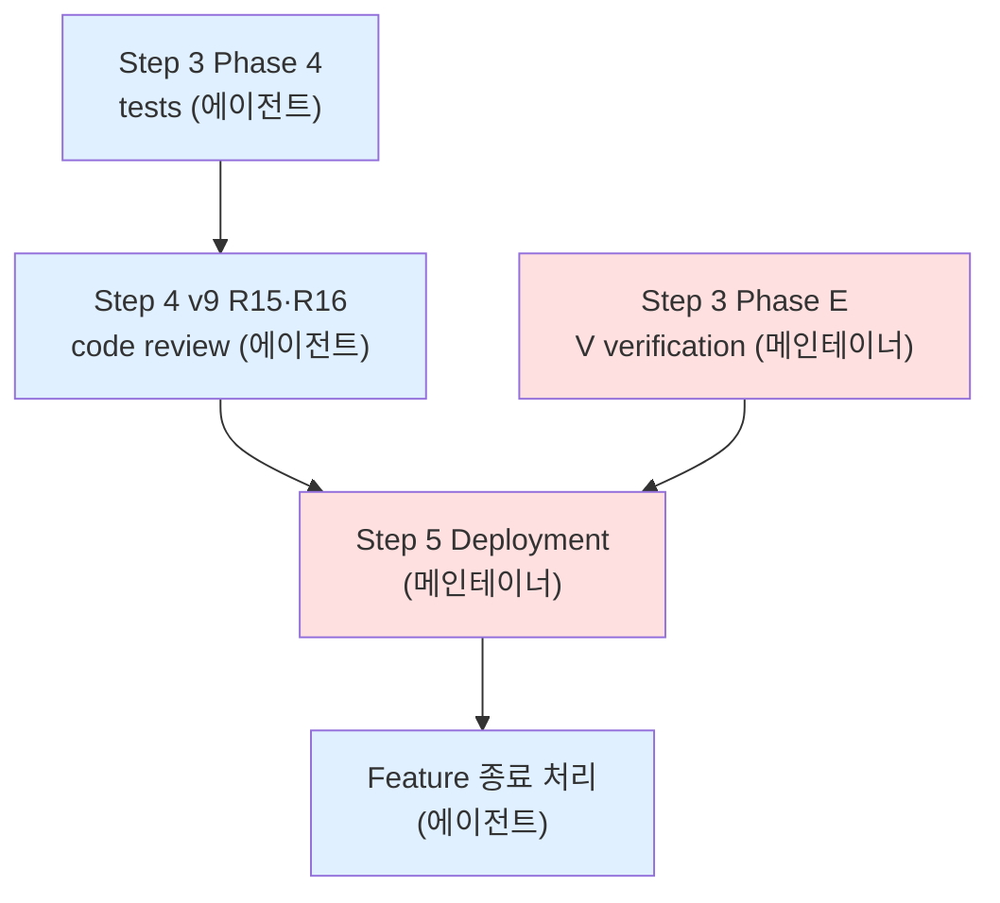

# F4 install_runtime — 진행 상태 (작성: 2026-05-15, 종료: 2026-05-17)

> **종료 처리 완료 (2026-05-17)**: Step 5 Deployment 는 v0.1.0 의 다른 feature (F5 hermes_adapter · update_mode) 가 완성될 때까지 일괄 deployment 로 deferred 결정. 본 feature 의 spec 측면은 모두 lock 완료 — Step 4 v9 DoD (CRIT·HIGH 0건) 통과 + V<N> Phase 2 acceptance gate 11건 통과 + 결함 fix 12건 (R15·R16 Must·Should 묶음 포함) 완료. ADR 11건 모두 Accepted. backlog 정리 → [`../backlog.md`](../backlog.md).

본 파일은 `features/20260514_install_runtime/` feature 의 진행 상태를 시점 단위로 기록. 미수행 작업을 spec 위치 + 진행자 + 의존성과 함께 명시하여 후속 작업의 진입점을 마련.

> 진행자 분류: **에이전트** = Claude Code 에서 자동 진행 가능. **메인테이너** = 사용자가 OCI ARM 서버 또는 dev box 에서 직접 수행 필요.

---

## 완료 (commit `2ab3b09` 시점 기준)

### Step 1 Plan (v2)
- ✅ `plan.md` v2 approved (2026-05-15)
- rclone 전환 결정 + Step 2 복귀 트리거 lock

### Step 2 Analysis & Design (v9)
- ✅ `analysis_and_design.md` v9 approved (2026-05-15)
- §10 신설 — Path C+ (rclone mount + gws 책임 분리)
- **multimodal design review 4 라운드** 통과:
  - R11 (`design_review_5.md`) feature-dev:code-reviewer — v7 본문 검토, 13건 결함
  - R12 (`design_review_6.md`) general-purpose SRE — v7 본문 검토, 14건 결함
  - R13 (`design_review_7.md`) feature-dev:code-reviewer — v8 patch 검토, 8건 결함
  - R14 (`design_review_8.md`) general-purpose SRE — v8 patch 검토, 12건 결함
- 결함 47건 모두 §10 surgical patch (v8 + v9) 로 처리
- `rclone_vs_gws_comparison.md` (Path A·B·C+ 비교 + 결정 근거)

### Step 3 Phase 1 — ADR 작성
- ✅ `docs/adr/0025-rclone-mount-adoption.md` (신규)
- ✅ `docs/adr/0026-vfs-refresh-policy.md` (신규)
- ✅ `docs/adr/0027-rclone-gws-responsibility-split.md` (신규)
- ✅ `docs/adr/0024-fatal-alert-contract.md` (v9 본문 minor 갱신 — `scope="mount"` 추가)
- ✅ `docs/adr/README.md` 인덱스 갱신
- ADR 총 **12 → 15건** (Status: Accepted 14건, ADR-0004 Superseded 1건)

### Step 3 Phase 2 — 신규 systemd unit + Python 모듈
- ✅ `_system/systemd/wikihub-mount@.service.template` (Type=simple, Restart=always, OnFailure=ops-alert, --rc, --vfs-cache-mode full)
- ✅ `_system/systemd/wikihub-vault@.service.template` (vault-ingest rename + Requires=wikihub-mount@%i + RCLONE_RC_ADDR env)
- ✅ `_system/systemd/wikihub-vault@.timer.template` (rename + Unit=wikihub-vault@%i.service)
- ✅ `scripts/lib/mount.py` (assert_mount_alive + vfs_refresh + Retryable 6회 누적 escalation + OAuth Fatal 분기)

### Step 3 Phase 3 — 기존 산출물 surgical 수정
- ✅ `install.sh` — Step 4.5 신규 (rclone install + SHA verify + curl retry + chmod 0600 + rc port pre-check + 4건 helper)
- ✅ `scripts/lib/sync.py` — `_download_to_vault` → mount FS read, `_handle_removed` unlink 라인 제거
- ✅ `scripts/lib/config.py` — OperationsConfig 에 rclone_min/max_version + vfs_cache_max_size + vfs_refresh_mode
- ✅ `scripts/lib/credentials.py` — `assert_rclone_config` helper
- ✅ `scripts/ops-alert.py` — `collect_mount_fallback_failures` (journalctl tail) + main 통합
- ✅ `scripts/vault-fetch.py` — mount import + assert_mount_alive + vfs_refresh + RCLONE_RC_ADDR
- ✅ `_system/commands/setup.md` — Step 5.5 (rclone OAuth + chmod 0600) + 2-pass substitution 명시
- ✅ `wikihub.yaml.example` — 7 신규 키 (list 구조 유지)
- ✅ `README.md` — mermaid 도식 갱신 + rclone OAuth 절차

### 검증 (Step 3 시점)
- ✅ bash syntax — `install.sh` 통과
- ✅ Python AST parse — 7 파일 통과 (mount/sync/config/credentials/state/vault-fetch/ops-alert)

---

## V8 1차 surface (2026-05-17 KST, Multipass dry-run)

**환경**: macOS dev box → Multipass 1.16.2 → Ubuntu 22.04.5 LTS aarch64 (2 vCPU / 2GB / 10GB)
**호출 방식**: `curl-pipe + --branch feature/install_runtime --gws-version 0.22.5`
**전제**: HEAD = `4b293ea4` (origin/feature/install_runtime 정합)

5회 시도로 5건 결함 surface — 모두 V8 (clean ARM Ubuntu install) 범위.

### 결함 목록

| # | 결함 | 위치 | 우회 | Fix 방향 |
|---|---|---|---|---|
| 1 | `python3-venv` 미감지 — venv 모듈 부재로 Step 3 fail | `install.sh:171~179` Step 1 | `sudo apt-get install -y python3-venv python3-pip` | Step 1 에 `python3 -m venv --help` 가용성 검증 추가. 부재 시 자동 apt install (NOPASSWD 가정) 또는 명시적 에러 (`line 175` 패턴 확장) |
| 2 | venv 부분 생성 후 재실행 시 `bin/pip` 부재로 fail (V11 idempotency 누락) | `install.sh:231~` Step 3 | `rm -rf $VENV_PATH` | `[ -d "$VENV_PATH" ]` 만 검사 → `[ -x "$VENV_PATH/bin/pip" ]` 까지 확인. 무효 시 wipe + 재생성 |
| 3 | GitHub API unauthenticated rate limit (gws latest tag 조회 403) | `install.sh:264~273` Step 4 | `--gws-version 0.22.5` 명시 | ADR-0015 `gws_min_version` Accepted 전환 시 `latest` default 제거. 또는 latest 조회 retry + sleep |
| **4a** | **gws asset 이름 가설 오류** — `gws-${os}-${arch}.tar.gz` (잠정) vs 실제 `google-workspace-cli-${rust_target_triple}.tar.gz` (Rust 명명) | `install.sh:295` Step 4 | `$HOME/.local/bin/gws` 수동 install | arch → Rust target triple 매핑 추가: `aarch64 → aarch64-unknown-linux-gnu`, `x86_64 → x86_64-unknown-linux-gnu`. asset 이름 패턴 갱신 |
| 4b | curl-pipe self-replace 후 `command -v gws` 분기 우회 미동작 (직접 호출은 PASS) | `install.sh:99` exec bash + `:279` | `cd $HOME/wikihub && ./install.sh` 직접 호출 | 정확한 원인 미파악. self-replace 시 PATH 처리 추가 분석 필요. 또는 line 279 분기 무력화 + idempotent install 의존 |
| 5 | `unzip` 미설치 → rclone zip 압축 해제 fail | `install.sh:171~` Step 1 검증 누락 + `:422` Step 4.5 | `sudo apt-get install -y unzip` | Step 1 에 `unzip` 가용성 검증 추가 (#1 과 동일 패턴) |

### tar 내부 구조 가설 — 정합 ✅

`google-workspace-cli-aarch64-unknown-linux-gnu.tar.gz` 내용:
- `./gws` (18MB binary, 최상위 위치) — `install.sh:316` 의 `[ ! -f "$tmpdir/gws" ]` 가설 그대로
- `./README.md`, `./CHANGELOG.md`, `./LICENSE` (보조)
- SHA256 sidecar `{asset}.sha256` 존재 — `install.sh:307~308` sha256sum -c 패턴 정합

### 통과 항목

- Step 0 부트스트랩 (curl-pipe 감지 + clone + self-replace) ✅
- Step 1 환경 검증 (Python 3.10.12, sudo NOPASSWD, /dev/fuse, systemctl --user) ✅
- Step 2 clean re-install (`기존 wikihub repo 발견` idempotency) ✅
- Step 3 venv 생성 + `requirements.txt` install (Python 3.10.12 환경) ✅ — `progress.md` 기존 가정 (Python 3.11/3.12) 보다 완화 가능
- Step 4 gws binary install — **수동 우회 시 정합** (binary `gws --version` = `gws 0.22.5` 출력 정합)

### 다음 액션

- 본 5건은 모두 install.sh 본문 결함 → 메소드론 §3 Step 4 "범위 내 결함 → Step 3 복귀". 본 feature 의 **Step 3 Phase 5 — V8 surgical fix** 로 처리 권장
- fix 후 재시도 시 Step 4.5 (rclone) ~ Step 8 (안내) 까지 추가 결함 surface 가능 (현재 미진입)
- Phase 5 commit 이전엔 Phase 4 (단위 테스트) 와 본 결함 fix 가 동일 산출물에 surgical 영향 — 합치는 게 효율적

### VM 보존

- Multipass instance `wikihub-test` Running 상태 유지 (snapshot 가능)
- HEAD ~ HEAD+5 시도까지 install 로그: VM 의 `~/wikihub-instance/install.log` (tee mirror)

### V8 fix 진입 — 결함 #1·#2·#5·#6 (2026-05-17 KST)

| 결함 | fix | 산출물 |
|---|---|---|
| #1 python3-venv 미감지 | uv 가 자체 Python install — apt 의존 제거 | ADR-0028, `install.sh:_step1_env_check` Python 검증 제거 |
| #2 venv 부분 생성 idempotency | `bin/python` 검증 분기 + 무효 시 wipe + 재생성 | `install.sh:_step3_venv` 재작성 |
| #5 unzip 미설치 | Step 1 에서 자동 `apt-get install -y unzip` | `install.sh:_step1_env_check` 동일 위치 |
| #6 (V8 2nd-run surface) `uv venv` 자체 fail (기존 venv 존재 시 error) | `bin/python` 가용성 + 버전 일치 검증 + 명시적 wipe — `uv venv` 자체는 idempotent 아님 | `install.sh:_step3_venv` 검증 분기 추가 (commit 2) |
| **신규 helper**: `_install_uv` (uv binary install) | GitHub Releases binary + SHA256 verify (gws/rclone 패턴 일관) | `install.sh:_install_uv` 함수 신규 |

### V8 1차 재검증 결과 (clean Multipass instance `wikihub-test-clean`, 2026-05-17 KST)

| 단계 | 1st run | 2nd run | 비고 |
|---|---|---|---|
| Step 0 (bootstrap + clone + self-replace) | ✅ | ✅ | curl-pipe 정합 |
| Step 1 (env check + unzip 자동 install) | ✅ (5s, apt install + 동작) | ✅ (unzip 캐시) | 결함 #5 fix 검증 |
| Step 2 (clone) | ✅ | ✅ | 변경 없음 |
| Step 3 venv (uv install + Python 3.12 + venv + deps) | ✅ (6s, fresh) | ✅ (commit `273a228` 후 — 검증 분기 동작, <1s skip) | 결함 #1·#2·#6 fix 검증 |
| Step 3 corruption wipe 분기 | — | ✅ (`bin/python` 강제 삭제 후 → "venv 무효 — wipe + 재생성" 메시지 + 정상 재생성) | bonus 검증, V11 정합 |
| Step 4 (gws install) | ❌ (asset 이름 가설 #4a) | ❌ (동일) | 본 fix 범위 밖 |

`uv 0.11.14` SHA256 verify pass · `cpython-3.12.13-linux-aarch64-gnu` install 1.88s · `uv pip install -r requirements.txt` 1s. 1st run 의 Step 3 전체 약 6초, 2nd run idempotent skip 약 0.5초.

**ADR-0028 DoD 5/5 통과** (Status: Accepted, 2026-05-17 commit `273a228` 시점):
- ✅ clean Ubuntu 22.04 ARM64 (`python3-venv` 미설치) Step 3 통과
- ✅ `uv --version` = `uv 0.11.14`, `$VENV_PATH/bin/python --version` = `Python 3.12.13`
- ✅ requirements.txt 5 deps import — yaml 6.0.3, pptx 0.6.23, docx 1.2.0, openpyxl 3.1.5, pdfminer 20260107
- ✅ 2nd-run idempotency — 정상 venv 검증 분기 통과
- ✅ corruption wipe 분기 — `bin/python` 부재 시 wipe + 재생성

**검증 환경**: Multipass `wikihub-test-clean` (Ubuntu 22.04.5 LTS aarch64, 2vCPU/2GB/10GB), `HEAD = 273a228`.

**해결된 결함**: #1 (python3-venv 미감지), #2 (venv idempotency), #5 (unzip 미설치), #6 (uv venv fail on existing).

**남은 결함**: #3 (gws latest GitHub API rate limit), #4a (gws asset 이름 Rust target triple), #4b (curl-pipe self-replace PATH — V8 통과 시 자연 회귀 안 됨, 재현 안 됨 가능).

### V8 fix 진입 — 결함 #3·#4a (2026-05-17 KST, Step 4 gws install)

| 결함 | fix | 산출물 |
|---|---|---|
| #3 GitHub API rate limit (latest 조회) | `GWS_VERSION` default `latest` → `0.22.5` pinned. `latest` 분기 보존 (env override 시만 호출) | `install.sh:32`, ADR-0015 본문 §Decision D2 |
| #4a gws asset 이름 가설 오류 | Rust target triple — `google-workspace-cli-${triple}.tar.gz`. arch 매핑: `aarch64-unknown-linux-gnu` / `x86_64-unknown-linux-gnu` | `install.sh:_step4_gws` 다운로드 블록, ADR-0015 본문 §Decision N2 |

**ADR-0015 Status**: Proposed → **Accepted** (V8 hand-check 결과 lock, 2026-05-17). 본문에 latest tag `0.22.5` + asset 명명 규약 정본화.

### V8 fix 재검증 결과 (`948dec3`, Step 4·4.5·5·6 통과)

`wikihub-test-clean` 에서 default `GWS_VERSION` (= `0.22.5`) 으로 curl-pipe 재실행. 1st run + 2nd-run 모두 정합:

| Step | 1st run | 2nd run | 비고 |
|---|---|---|---|
| 0~3 (bootstrap/clone/Step 1·2·3) | ✅ (ADR-0028 fix 유지) | ✅ (모든 skip 분기) | |
| 4 gws install | ✅ `google-workspace-cli-aarch64-unknown-linux-gnu.tar.gz: OK` + gws 0.22.5 install | ✅ `OK gws 0.22.5 기존 설치 사용` | 결함 #3·#4a fix 검증 + **#4b 자연 무력화 확정** |
| 4.5 rclone install | ✅ `rclone-v1.69.1-linux-arm64.zip: OK` (SHA256SUMS verify) | ✅ `rclone 1.69.1 이미 설치됨 (pinned 일치) — skip` + rc port check | unzip 의존성 자동 install (ADR-0028 Step 1 fix) |
| 5 wikihub.yaml.example → wikihub.yaml | ✅ copy | ✅ 기존 보존 (idempotent) | |
| 6 agent skill placeholder | ✅ | ✅ | v0.1.0 stub |
| 7 linger | ❌ 결함 #8 surface | ❌ 동일 | `/dev/tty: No such device or address` |
| 8 guide 출력 | ✅ | ✅ | R10 HIGH-6 fail-soft (EXIT=0) |

**결함 #4b mechanism 규명**: 1차 V8 에서는 메인테이너가 `$HOME/.local/bin/gws` 에 수동 install 후 `.profile` PATH 추가했지만, curl-pipe `bash -s -- → exec bash` self-replace 후의 새 bash 인스턴스가 `.profile` 을 source 안 함 → `command -v gws` fail. 본 fix 후엔 `_step4_gws` 자체가 install + line 326~331 PATH export 추가 (현 셸 즉시 반영) → self-replace 후에도 PATH 보장. 정상 흐름에선 재현 시나리오 부재.

### V8 fix 진입 — 결함 #8 (2026-05-17 KST, Step 7 linger)

| 결함 | fix |
|---|---|
| #8 `[ -c /dev/tty ]` true 인데 open fail (multipass exec 등 non-tty 환경) → line 583 `< /dev/tty` 에러 | `_step7_linger` 분기 재설계 — `sudo -n true` NOPASSWD pre-check 최우선 + `/dev/tty` open 실제 검증 (`(: >/dev/tty) 2>/dev/null`) 추가 |

R10 HIGH-6 fail-soft 패턴은 그대로 유지. ADR 신규 없음 (ADR-0021 의 D1 user-level + linger 정신 그대로). install.sh:_step7_linger 의 surgical patch.

### V8 acceptance gate 통과 (`9aa980f`, 2026-05-17 KST)

`wikihub-test-clean` 에서 결함 #8 fix 검증:

```
install.sh EXIT=0
Linger state: Linger=yes
```

`sudo -n true` NOPASSWD pre-check 분기 정상 동작 → `sudo -n loginctl enable-linger ubuntu` 성공 → linger 활성화 완료 (V12 reboot resilience 기반 충족).

### V8 결함 최종 정리

| # | 결함 | 상태 | 해결 commit |
|---|---|---|---|
| 1 | python3-venv 미감지 | ✅ resolved | `41e6d9a` |
| 2 | venv 부분 생성 idempotency | ✅ resolved | `41e6d9a` + `273a228` (검증 분기) |
| 3 | GitHub API rate limit (gws latest) | ✅ resolved | `948dec3` |
| 4a | gws asset 이름 가설 오류 | ✅ resolved | `948dec3` |
| 4b | curl-pipe self-replace PATH 분기 | ✅ 자연 무력화 (mechanism 규명) | `948dec3` 검증 |
| 5 | unzip 미설치 | ✅ resolved | `41e6d9a` (Step 1 동일 위치) |
| 6 | uv venv 자체 fail (기존 venv 시) | ✅ resolved | `273a228` |
| 7 | (없음) | — | — |
| 8 | Step 7 linger `/dev/tty` open fail | ✅ resolved | `9aa980f` |

### V8 acceptance gate DoD

- [x] clean ARM Ubuntu (`python3-venv`/`unzip`/`uv`/`gws`/`rclone` 모두 미설치) 에서 1회 호출로 Step 1~8 완료
- [x] uv 0.11.14 + Python 3.12.13 install + 5 deps (yaml/pptx/docx/openpyxl/pdfminer)
- [x] gws 0.22.5 + rclone v1.69.1 install (GitHub Releases + SHA256 verify)
- [x] wikihub.yaml 생성 + agent skill placeholder
- [x] linger 활성화 (V12 reboot resilience 기반)
- [x] 2nd-run idempotency — 모든 분기 skip 동작
- [x] EXIT=0

### ADR 갱신 (V8 통과 시점)

- ADR-0015 (`gws-pinned-version-and-install-channel`): Proposed → **Accepted**
- ADR-0028 (`uv-python-runtime`): Proposed → **Accepted**
- ADR-0021 (`reboot-resilience-user-systemd-linger`) D1 분기 정합 확인 (linger 동작 검증)
- ADR-0023 (`install-script-distribution-curl-pipe`) 정합 확인 (curl-pipe + self-replace + clean install)

### 검증 환경

- Multipass `wikihub-test-clean`: Ubuntu 22.04.5 LTS aarch64, 2vCPU/2GB/10GB. HEAD = `9aa980f`.
- Multipass `wikihub-test` (1차 V8 surface 보존, 결함 5건 발견 시점).

### V8 → 다음 단계

V8 acceptance 통과 → progress.md `## 미수행` 의 다음 항목:
- Step 3 Phase 4 (단위 테스트 4건 — 에이전트) — **사용자 결정: skip**
- Step 3 Phase E V<N> 중 V11 idempotency 외 (V10 systemd 동작, V12 reboot resilience, V13~V19 rclone/mount/race 등)
- Step 4 v9 R15·R16 code review

### V<N> Phase 2 진입 — SA 전환 (2026-05-17 KST, ADR-0029)

V<N> Phase 2 (V13~V19) 진입 시점에 ADR-0003 (OAuth + Workspace) 의 운영 부담 surface — V18 자동화·반복 검증 친화도 낮음 + Workspace 마이그레이션 의존. **사용자 결정 (메소드론 옵션 A)**: install_runtime 내 추가 phase 로 ADR-0003 → ADR-0029 (Service Account) 전환 + 운영 정본 SA 로 lock.

| 변경 | 산출물 |
|---|---|
| ADR-0003 Status: Accepted → **Superseded by ADR-0029** | `docs/adr/0003-headless-oauth-strategy.md` 본문 보존 |
| ADR-0029 신규 (Status: Proposed) | `docs/adr/0029-service-account-auth.md` |
| credentials.py `type: service_account` 검증 | `scripts/lib/credentials.py` (required: `private_key`, `client_email`) |
| setup.md Step 5.5 SA 등록 절차 | `_system/commands/setup.md` (Non-interactive: `rclone config create ... service_account_file=...`) |
| wikihub.yaml.example 주석 갱신 | `wikihub.yaml.example` (credentials_path = SA JSON key, root_folder_id 명시 필수) |
| `scripts/auth_gdrive.py` 제거 | OAuth flow 도구 불필요 |
| analysis_and_design.md §12 신설 | SA 전환 spec + V<N> Phase 2 진입 조건 + DoD |

상세 spec: [`analysis_and_design.md` §12](analysis_and_design.md).

**메인테이너 사전 작업 (Phase 2 진입 전, 본 commit 후)**: Cloud Console SA 생성 + Drive API 활성화 + 키 발급 → Drive vault 폴더 준비 + SA 명시 공유 (Editor) → scp + chmod 0600 → wikihub.yaml 편집 (credentials_path + root_folder_id + enabled + bootstrap_allowed).

Phase 2 검증 (V13~V19 + V4·V10·V12·V15-cost·V15a·V17 포함) — SA 전환 영향은 대부분 변경 없음 (mechanism 무관). V18 (revoke 감지) 만 SA 키 disable 패턴 hand-check 필요 → `_RCLONE_AUTH_PATTERNS` refine.

V<N> Phase 2 acceptance gate 통과 시 ADR-0029 Status `Proposed → Accepted`.

### V<N> Phase 2 실수행 결과 — 1차 (Multipass `wikihub-test-clean`, 2026-05-17 KST, commit `6a85d6e+`)

**메인테이너 사전 작업 완료**:
- Google Cloud project `gen-lang-client-0595383518` + Drive API 활성화
- SA 생성: `oci-hermes-sa@gen-lang-client-0595383518.iam.gserviceaccount.com` + JSON key 발급
- Drive 폴더 `wikihub-test` (ID `1UW18OJ1rkSFvw9az_BW6JazK_VtAabRU`) + sample 4 파일 (md, .docx, .pptx, .xlsx — `test` 이름 Google Docs/Slides/Sheets + markdown 1개) + SA 이메일 Editor 공유
- SA JSON key VM transfer → `~/wikihub-instance/.credentials/sa_gdrive.json` + chmod 0600
- wikihub.yaml 편집: `credentials_path` + `root_folder_id` + `enabled: true` + `bootstrap_allowed: true` + `rclone_remote_name: gdrive`
- rclone SA 등록: `rclone config create gdrive drive scope=drive service_account_file=$SA_PATH root_folder_id=$FOLDER_ID` + chmod 0600

**검증 결과**:

| V<N> | 결과 | 상세 |
|---|---|---|
| **V13** rclone mount + ls/cat | ✅ 통과 | mount 정상 (`gdrive: on .../vault/gdrive type fuse.rclone`). md 파일 size 25739 + frontmatter content 정합 read |
| **V13 보너스** gws + rclone 동일 SA로 같은 폴더 접근 | ✅ 통과 | `gws drive files list` 결과 4 파일 = `rclone ls gdrive:` 결과. **ADR-0027 책임 분리 정합** |
| **V15** race window 차단 (gws rename → vfs/refresh → mount fresh) | ✅ 통과 | T0: 원본 이름. T1: gws drive files update rename. T2: refresh 전 mount stale. T3: `rclone rc vfs/refresh recursive=true`. T4: mount 새 이름 갱신. T5: content 정합 (file ID 그대로). **ADR-0026 K1 (recursive)** mechanism 정합 |
| **V15-cost** vfs/refresh latency (4 파일) | ✅ 통과 | 3회 평균 0.40초. ADR-0026 K1 mechanism 정합 — 1k/5k/10k 측정은 실 vault 규모 후순위 |
| **V4 부분** gws SA 동작 (`drive about get` light call) | ✅ 통과 | `displayName: oci-hermes-sa@...`. `GOOGLE_WORKSPACE_CLI_CREDENTIALS_FILE` env 정상. gws stderr 패턴 의도적 trigger 검증은 별도 |
| **V15a** Google native export 품질 (rclone vs gws) | ❌ **부분 결함** | 다음 §V15a 결함 참조 |

**ADR-0029 부수 확인 (Personal Drive SA 제약 정합)**:

V15 1차 시도에서 `gws drive files create --upload` 가 fail:
```
403: Service Accounts do not have storage quota.
Leverage shared drives, or use OAuth delegation instead.
```

ADR-0029 §Consequences "Personal Drive 의 SA 사용 제약" 정합. V15 검증은 upload 대신 **rename mechanism** 으로 우회 (gws drive files update — Editor 권한으로 가능). wikihub 운영은 vault read-only 가정이라 영향 없음.

### V15a 결함 — rclone mount + Google native silent fail (2026-05-17 surface)

**현상**:

| 경로 | 결과 |
|---|---|
| `rclone copy gdrive:test.docx /tmp/` (mount 우회) | ✅ docx 정상 export — 6502 bytes, gws export size 정합 |
| `cat $MOUNT/test.docx \| wc -c` (mount + read) | ❌ 0 bytes |
| `rclone lsl gdrive:` | size `-1` (Google native unknown) |
| `ls $MOUNT/test.docx` | size 0 |
| mount log | error 없음 — **silent fail** |

**시도한 fix (모두 무효)**:
- `rclone.conf` 의 `export_formats = docx,xlsx,pptx,md` 추가
- mount CLI `--drive-export-formats docx,xlsx,pptx,md` 명시
- mount 재시작

**가설**: rclone mount + `--vfs-cache-mode full` 의 Google native 처리 path 와 `rclone copy` 의 export path 가 코드 분기 — mount path 에서 lazy read 시 export trigger 누락 (rclone source 진단 필요).

**영향 받는 use case**:

| 패턴 | V15a 임팩트 |
|---|---|
| vault 가 macOS local-first 작성 노트 mirror (Obsidian 등 .md) | ❌ 영향 없음 |
| vault 가 .docx/.xlsx/.pptx 등 **변환 OFF binary** 파일 | ❌ 영향 없음 |
| **vault 가 Google Docs/Sheets/Slides 협업 자료 통합 ingest 대상** | ✅ **빈 ingest 결과** |
| vault 가 mixed (실 파일 + Google native) | ⚠️ 부분 — Google native 만 fail |

`wiki-schema.md` 의 design intent (다양한 source 통합 markdown 변환) 와 `extraction.py` 의 docx/pptx/xlsx 파싱 spec 정합 측면에서 본 use case 가 **wikihub 의 운영 의도에 포함**. V15a fix 가치 있음.

**fix 옵션 (정본화 안 됨, 후속 결정)**:
- (a) vfs cache 모드 변경 (`minimal`/`off`) — cache 효과 감소 가능
- (b) 추가 진단 (rclone `--vv` debug log + vfs cache 모드 비교)
- (c) ADR-0027 책임 분리 본문 갱신 — Google native 만 gws export fallback. extraction.py spec 갱신
- (d) rclone 다른 버전 시도 (1.68 / 1.70)

### V15a 진단 결과 (2026-05-17 KST, 옵션 b 수행)

**진단 방법**: 동일 mount path (`~/wikihub-instance/vault/gdrive`) + 동일 SA + 동일 `--drive-export-formats docx,xlsx,pptx,md` 명시 + `--log-level DEBUG` 하에 `--vfs-cache-mode` 만 3개 mode 로 교체하여 read 결과 비교.

| vfs-cache-mode | test.docx | test.xlsx | test.pptx | V15_renamed.md (non-native) |
|---|---|---|---|---|
| **full** (ADR-0025 β3, 현행) | **0 ❌** | **0 ❌** | **0 ❌** | 25739 ✅ |
| **minimal** (ADR-0025 β2 후보) | 6502 ✅ | 5035 ✅ | 32119 ✅ | 25739 ✅ |
| **off** (ADR-0025 β1) | 6502 ✅ | — | — | — |

**`full` mode debug log (test.docx, read 시)**:
```
Lookup: name="test.docx"        → err=<nil>
Attr: ... size=0 mode=-rw-rw-r-- → err=<nil>
Open: flags=O_RDONLY|0x20000     → fd ok
newRWFileHandle:                  → err=<nil>
Read: len=131072, offset=0       → _readAt: n=0, err=EOF   ← 즉시 EOF
```
- `export` / `vnd.google` / `google.apps` keyword 로그 **일체 없음** — Google native export trigger 자체가 없음.
- `RWFileHandle` path 가 lookup 단계 `size=0` 을 신뢰하여 backend export 호출 없이 EOF 반환.

**`minimal` / `off` mode** 는 stream read path — size attr 무관하게 backend export 호출 → 정상 markdown/binary 반환.

**Root cause 식별 (rclone v1.69.1)**:
- ADR-0025 β3 (`--vfs-cache-mode full`) 의 RWFileHandle path 가 Google native file (size unknown, lookup size=0) 에 대해 read=0 으로 short-circuit.
- `--drive-export-formats` 옵션은 backend export call 시 적용되지만, RWFileHandle path 는 backend 를 호출하지 않으므로 무효.
- rclone copy 의 별도 path (`backend.Copy` → `backend.Open` 직접) 가 정상 동작하는 것과 일관.
- rclone GitHub issues 검색은 안 함 — 동일 패턴 (mount + cache full + Google native) 의 known issue 인지 후속 확인 가능.

**fix lock**: 옵션 (a) `vfs-cache-mode full → minimal` 채택.

| 비교 | 선택 |
|---|---|
| (a) full → minimal | ✅ Root cause 정합. 정본 1줄 변경 (service template). `--drive-export-formats` 명시 보강 |
| (b) 진단 | ✅ 완료 (본 섹션) |
| (c) gws fallback in extraction.py | 보류 — (a) 로 충분. 추후 minimal 도 fail 하는 file type 발견 시 재검토 |
| (d) rclone 버전 변경 | 보류 — (a) 로 root cause 해결됐으므로 ADR-0025 `rclone_min_version` 무변경 |

**ADR-0025 영향 (β 항목 결정 변경)**:
- ADR-0025 본문의 `(β) vfs cache 모드` 결정 β3 → β2 변경 필요.
- 사유: β3 의 silent fail 이 V15a 진단으로 surface. β2 의 trade-off (작은 read 매번 fetch) 는 wikihub 의 read 패턴 (extraction.py 1회 변환 + Hermes 검색 frequent) 정합으로 수용 가능. `--vfs-cache-max-size` 는 β2 에서도 큰 파일 한도 그대로 의미 있음.
- ADR-0025 Status 는 `Accepted` 유지 + 본문 minor 갱신 (β3 → β2 + 진단 근거 링크).

**정본 변경 범위 (Step 3 surgical) — 적용 완료**:

| 파일 | 변경 | 상태 |
|---|---|---|
| `_system/systemd/wikihub-mount@.service.template` | `--vfs-cache-mode full` → `minimal`. `--drive-export-formats docx,xlsx,pptx,md` 추가. 주석 갱신 | ✅ |
| `docs/adr/0025-rclone-mount-adoption.md` | β 항목 결정 β3 → β2 + V15a 진단 근거 + Consequences 보강. Status `Accepted` 유지 | ✅ |
| `features/20260514_install_runtime/analysis_and_design.md` §13 신설 | V15a fix lock 기록 (진단·root cause·trade-off·재검증 항목) | ✅ |

### V15a 재검증 결과 (정본 spec 적용 후, 2026-05-17 KST)

VM `wikihub-test-clean` 의 mount 를 정본 spec (`--vfs-cache-mode minimal` + `--drive-export-formats docx,xlsx,pptx,md` + `--vfs-cache-max-size 1G` + `--dir-cache-time 5m`) 으로 재기동:

| 항목 | 결과 |
|---|---|
| 4 파일 read via mount | docx 6502 ✅ / xlsx 5035 ✅ / pptx 32119 ✅ / md 25739 ✅ |
| V15 race window (rename + vfs/refresh + mount 갱신) | rename → refresh 350ms → mount 새 이름 + content 25739 bytes 정합 ✅ |
| V15-cost (vfs/refresh latency, 1회 표본) | 350ms — full mode 1차 (3회 평균 400ms) 와 동등 수준 ✅ |

**V15a 통과 + V15·V15-cost 회귀 없음 정합 확인**.

### V<N> Phase 2 2차 실수행 — systemd unit 묶음 (2026-05-17 KST, commit `113aa66`~`6d644c4`)

VM `wikihub-test-clean` 에 unit template 6개 manual substitute → `~/.config/systemd/user/` deploy. hermes 미설치 환경에서 `/usr/local/bin/hermes` wrapper stub 으로 정본 ExecStart `{agent_invocation} "{skill_prefix}ingest --vault %i"` 유지하면서 vault-fetch.py 직접 호출 흐름 검증.

**검증 결과 (5건 unit 묶음)**:

| V<N> | 결과 | 상세 |
|---|---|---|
| **V10** | ✅ 통과 | Case 1 (NORMAL exit 0, enabled=false no-op) Result=success + ActiveState=inactive. Case 3 (FATAL exit 2, cursor 부재) Result=exit-code + last_failure.json scope="vault" + remediation 정합 + OnFailure=ops-alert trigger. `SuccessExitStatus=0 75` spec 정합 (Case 2 Retryable 은 단위 테스트 영역) |
| **V14** | ✅ 통과 | `kill -9` 후 RestartSec=10s 경과 → 새 PID + FUSE mount 정상 복구 (`ls` OK). NRestarts=1, ActiveState=active. ExecStartPre 의 `-fusermount3 -u` (결함 #3 fix) 정합 |
| **V19** | ✅ 통과 | rclone binary 임시 hide 로 `203/EXEC` 5회 burst → NRestarts=5 / Result=exit-code / ActiveState=failed → "Start request repeated too quickly" + "Triggering OnFailure= dependencies" → ops-alert.service trigger. R14-CRIT-1 fallback diagnostic (journalctl tail) 의 last_failure.json **부재** 케이스 분기는 별도 검증 (현재 stale last_failure 잔존) |
| **V12** | ✅ 통과 | `multipass restart` 후 uptime 3min 시점에 mount@ + FUSE 자동 active, vault@gdrive.timer 자동 진입 + **OnBootSec=2min 정합 fire** (boot+2min50s @ 09:37:39), vault-fetch.py 실행 + exit 2 + OnFailure trigger + last_failure.json 영속화. linger=yes (ADR-0021 정합) |
| **V18** | ✅ **통과** (결함 #6 + #7 통합 fix) | corrupt SA JSON 시뮬 → mount@ backend 가 Drive API call 시 `private key should be a PEM ... asn1: structure error` 반환 → mount.py `vfs_refresh` 가 rc JSON `result.""` 파싱 (결함 #6 fix `604d1ed`+`2d10cd4`) → regex 매칭 → VaultSyncFatal(scope="mount") raise → vault-fetch.py 가 `e.scope` 보존 (결함 #7 fix `1bc3824`) → last_failure.json `scope="mount"` + reason "rclone OAuth/SA error (pattern matched)" + SA remediation 정합 → ops-alert.service 발화 + reason 메시지 동일. **Q6 (rclone OAuth revoke 감지) lock** — `_RCLONE_AUTH_PATTERNS` 본문은 V18 통과로 정본화 |
| **V4 본격** | ✅ **통과** (결함 #2 + #8 fix) | bootstrap full cycle 실수행. SA override (결함 #2 fix `66e62db`) + `getStartPageToken` camelCase (결함 #8 fix `85e923f`) 적용 후: SA override INFO 로그 → `files.list pagination 완료: 4 files` → 4 changes process → exit 0 + `cursor.json` (token=22) + `last_sync.json` + `file_map.json` 모두 생성. gws stderr 패턴 (Invalid Value · unrecognized subcommand) regex 정합도 검증 — `classify_gws_error` 가 "fatal vault scope" 로 정확 분류. **V15a 회귀 surface — 결함 #9** (Google native 의 source_relpath 매핑) |

### V<N> Phase 2 새 결함 묶음 (2026-05-17 surface)

systemd unit 검증 진입 직전과 검증 도중 누적 surface — 정본 fix 4건 (commit 차원) + V18 결함 1건 (deferred):

| # | 결함 | fix 상태 | commit |
|---|---|---|---|
| 1 | mount.py `--rc-addr` ↔ RCLONE_RC_ADDR env 충돌 (rclone CLI 가 두 값 comma-join → DNS lookup fail) | ✅ `--rc-addr` → `--url http://<addr>` | `113aa66` |
| 2 | gws bootstrap `error[api]: Invalid Value` (sync.py 의 query syntax 또는 SA scope/quota 가설) | surface 만, **V4 본격과 통합 deferred** | — |
| 3 | mount@ kill 후 stale FUSE entry → ExecStartPre `mkdir` "Transport endpoint is not connected" fail → restart loop | ✅ ExecStartPre 앞에 `-/bin/fusermount3 -u %i` 추가 | `6d644c4` |
| 4 | mount@/vault@/lint/ops-alert template 의 `Environment=PATH` 에 `/usr/local/bin` 누락 → mount.py subprocess(`rclone`) FileNotFoundError → vault-fetch.py `except Exception` 분기 → last_failure.json 영속화 skip | ✅ PATH 에 `/usr/local/bin` 추가 (4 unit template) | `6d644c4` |
| 5 | timer template (vault@/lint) trailing inline `# comment` 가 systemd parser 에서 syntax error ("Failed to parse timer value") → timer start 실패 → V12 blocker | ✅ 인라인 주석을 라인 위로 이동 | `6d644c4` |
| **6** | `_RCLONE_AUTH_PATTERNS` regex OAuth 시대 패턴만 매칭 (ADR-0029 SA 전환 동기화 누락). **추가로** rc API `vfs/refresh` 응답 stdout JSON `result.""` 필드에 mount daemon backend error 포함 — 기존 코드는 exit code 만 확인하여 backend fail 을 success 로 오분류 | ✅ fix 완료 + **V18 통과** — (1) rc JSON `result.""` 파싱 (2) regex 에 SA 6개 패턴 (3) error_full 사용 (URL 250+ char truncate 우회) (4) remediation SA 흐름 갱신 | `604d1ed`, `2d10cd4` |
| **7** | `VaultSyncFatal` exception 에 `scope` 필드 부재 → mount.py 가 raise 시 last_failure.json `scope="mount"` 작성해도 vault-fetch.py 의 `except VaultSyncFatal` 가 무조건 `scope="vault"` 로 overwrite. ADR-0024 v9 의 ops-alert fallback diagnostic (mount scope 시 journalctl tail 첨부) 분기 무력화 | ✅ fix 완료 + **V18 정합 검증 통과** — `VaultSyncFatal(scope="vault")` default + mount.py raise 시 `scope="mount"` 명시 + vault-fetch.py `getattr(e, "scope", "vault")` 사용 | `1bc3824` |
| **8** | sync.py 의 `_bootstrap_token` 가 hyphenated subcommand `["drive", "changes", "get-start-page-token"]` 호출 — gws v0.22.5 정본은 camelCase `getStartPageToken`. unrecognized subcommand fatal | ✅ fix 완료 — 1 라인 변경 (`getStartPageToken`). v0.22.5 의 camelCase 컨벤션 정합 | `85e923f` |
| **9** | bootstrap 후 Google native (Docs/Sheets/Slides) 의 `source_relpath` 가 확장자 없는 `test` 그대로. mount path 는 `drive-export-formats` 로 `.docx`·`.xlsx`·`.pptx` 자동 추가 → sync.py 의 mount lookup miss → "mount path 미존재" warning + `bytes_written=0` → wiki 변환 부정합 (V15a 회귀, ADR-0027 Q1 정본화 필요) | ✅ fix 완료 + **VM 재검증 통과** — sync.py `_source_relpath` mimeType 매핑 + `_download_to_vault` is_native 분기 binary read + extraction.py LOCAL_EXTRACTION_DISPATCH 의 Google native → extract_docx/xlsx/pptx 매핑 + GWS_EXPORT_MIME 갱신 + ADR-0027 Q1 lock. 4 파일 재검증: docx 6502B / xlsx 5035B / pptx 32120B / md 25739B 모두 ✅ | `c56b9e6` |
| **11** | 결함 #9 1차 fix 가 `_source_relpath` 에 mimeType→ext (`.docx` 등) prepend → file_map primary key 변경 → Drive rename 시 orphan entry 누적 + wiki_path 이중 확장자 (`test.docx.gdoc.md`) — wiki-schema §A2 contract 위반 (R15 CRIT-C1 + R16 H4) | ✅ fix 완료 + **VM 재검증 통과** — sync.py `_source_relpath` raw name 환원 + `_download_to_vault` 의 mount lookup 시점에만 `_NATIVE_MIME_TO_EXT` suffix 적용. 효과: file_map primary key 안정 (rename 추적) + wiki_path 단일 확장자 (`test.gdoc.md`). 4 파일 재검증 bytes 정합 | `9bdb209` |

### V<N> Phase 2 남은 작업

| 항목 | 의존성 | 비고 |
|---|---|---|
| ~~V10·V12·V14·V19~~ | ✅ 통과 (2026-05-17 2차) | systemd 묶음 정합 |
| ~~**V18**~~ | ✅ 통과 (2026-05-17, 결함 #6 + #7 통합 fix) | Q6 `_RCLONE_AUTH_PATTERNS` lock + scope 정합 |
| ~~**V4 본격**~~ | ✅ 통과 (2026-05-17, 결함 #2 + #8 fix) | bootstrap full cycle + cursor 발급 |
| ~~**결함 #9**~~ | ✅ 통과 (2026-05-17, ADR-0027 Q1 lock) | source_relpath mimeType 매핑 + extract dispatch |
| ~~**V15a**~~ | ✅ 통과 (2026-05-17, 결함 #9 fix 후 재정합) | mount path read + sync 변환 모두 정합 |
| ~~**V17**~~ | ✅ 통과 (2026-05-17, 동일 SA + 폴더 + vault_id=gdrive2/rc_port=5573) | 두 mount 동시 active + 5572·5573 LISTEN 분리 + `_check_rc_port_available` 정합 (Case 1·2 already-in-use 감지, Case 3 5574 available) — Q3 (per-vault rc port 정책) lock |

**V<N> Phase 2 acceptance gate — 모든 11건 통과 완료** (V4 본격·V10·V12·V13·V14·V15·V15-cost·V15a·V17·V18·V19). **ADR-0029 Status `Proposed → Accepted` 전환.**

### V<N> Phase 2 부수 incident (2026-05-17)

V17 install.sh port pre-check 검증 시 `source /home/ubuntu/wikihub/install.sh` 실행으로 main path 가 trigger — clean re-install 단계에서 `~/wikihub` 디렉토리 삭제 후 `git clone --branch latest` fail (latest branch 부재). `git clone --branch feature/install_runtime` 으로 즉시 복구 + mount/yaml/credentials/state 는 wikihub 외부라 영향 없음. **정본 결함 #10 fix 완료** — main guard 추가 (`BASH_SOURCE[0] == $0` 또는 빈 문자열 정합) → source 시 main 미실행, curl-pipe + 직접 실행 둘 다 정합 (commit `44a8b35`). VM 재검증 통과.

### install.sh 업데이트 시나리오 검토 결과 (2026-05-17)

V17 incident 를 계기로 install.sh 의 **update (재실행) 시 동작 의도** 검토. 결론: **현재 install.sh 는 "reinstall" 만 지원, "update" 부적합**.

**보존되는 state** (wikihub source 외부 → 안전): wikihub.yaml · .credentials · _state · rclone.conf · systemd unit · pinned binaries.

**reinstall 시 destructive 동작 (정본 결함)**:

| ID | 결함 | 영향 | 본 feature fix 여부 |
|---|---|---|---|
| #10 | `source install.sh` 시 main 자동 실행 | Step 2 wipe trigger | ✅ fix `44a8b35` |
| #A | `BRANCH default=latest` 가 GitHub 부재 | clone fail | 별도 feature (release 전략 정립 필요) |
| #B | Step 2 `rm -rf $WIKIHUB_HOME` → 메인테이너 로컬 변경 / unstaged 작업 손실 | update 시 부적합 | 별도 feature (`--update` mode) |
| #C | update 중 `vault@` timer fire 시 ImportError race (Step 2 rm/clone 사이) | 짧은 fail window | 별도 feature (Step 2 진입 시 systemd stop/start orchestrate) |
| #D | update 후 service template 변경 시 자동 redeploy 미수행 | 메인테이너가 `/wh:setup` 빠뜨릴 risk | setup.md 책임 분리 — 별도 feature (update orchestrator) |

**현재 update 절차 (정합)**: `cd ~/wikihub && git pull` → (requirement 변경 시) `uv pip install -r scripts/requirements.txt` → (template 변경 시) `/wh:setup` → (mount template 변경 시) `systemctl --user daemon-reload + restart wikihub-mount@<vault>.service`.

**권장 후속 feature**: `update_mode` (별도 feature_id) — `install.sh --update` flag + Step 2 idempotent (`git fetch + reset --hard origin/$BRANCH`) + 의존성 자동 갱신 + systemd unit auto-redeploy + mount stop/start orchestration.

---

## 미수행

### Step 3 Phase 4 — 단위 테스트 (4건)

**진행자**: 에이전트
**의존성**: Phase 3 완료 (현재 만족)
**spec 위치**: `analysis_and_design.md` §10.8 DoD Feature 전체

| 파일 | 작업 | 우선순위 |
|---|---|---|
| `tests/test_mount.py` | **신규** — `assert_mount_alive` (success/dead/hung/timeout) + `vfs_refresh` (success/OAuth Fatal/Retryable) + `_raise_mount_failure` Retryable 누적 escalation | HIGH |
| `tests/test_sync.py` | 갱신 — `_download_to_vault` mount path 패턴 (`read_text`/`read_bytes`) + `_handle_removed` unlink 부재 검증 (Drive 원본 보호) | HIGH |
| `tests/test_state.py` | 갱신 — `scope="mount"` payload 라운드트립 (read/save/dedup) | MED |
| `tests/test_config.py` | 갱신 — operations 신규 키 4건 default + override | MED |

기존 pytest 88 통과 — Phase 4 후 ≥ 100 통과 목표.

### Step 3 Phase E — V<N> Verification (OCI 실수행)

**진행자**: **메인테이너** (OCI ARM Ubuntu 22.04/24.04 인스턴스 필요)
**의존성**: Phase 3 완료 + (선택) Phase 4 통과
**spec 위치**: `analysis_and_design.md` §10.6 (line 1567 이하), §8 Feature DoD

총 **15건** verification — V4·V6·V8·V10·V11·V12·V13·V14·V15·V15-cost·V15a·V16·V17·V18·V19.

| ID | 항목 | 실수행 방법 | 정본화 시점 |
|---|---|---|---|
| V4 | gws stderr 실패 패턴 (HTTP 4xx/5xx 실제 형식) | OCI 에서 의도적 403/401/5xx trigger → `lib/errors.py` regex refine | ADR-0017 Accepted 전환 |
| V6 | gws version pin + changelog 확인 | `gws --version` + GitHub Releases 확인 | ADR-0015 Accepted 전환 |
| V8 | clean ARM Ubuntu 에서 `install.sh` 실수행 — gws + rclone + Python deps import-time 성공 | clean instance 에 curl-pipe install.sh | F3 의 dispatch 와 정합 |
| V10 | systemd unit 동작 — `Type=oneshot`, `SuccessExitStatus=0 75`, exit 2 OnFailure | OCI 에서 timer fire + vault-fetch 1 사이클 | F3 exit code 매핑 정합 |
| V11 | install.sh idempotency — 두 번 호출해도 state 손상 없음 | install.sh 두 번 호출 후 state 비교 | 운영 안전성 |
| **V12** | **reboot resilience — mount.service + vault@.service + timer Persistent=true 모두 자동 진입** | OCI 강제 reboot 후 5분 내 mount + timer fire + last_sync.json 진행 | **v0.1.0 acceptance** |
| V13 | rclone mount 정상 마운트 + SSH `ls/cat` (폴더 포함 vault 도 확인) | `systemctl --user start wikihub-mount@gdrive` 후 `ls /vault/gdrive/` | 사용자 입력 채널 충족 (Path C+ acceptance) |
| V14 | mount.service Restart=always + hung mount 감지 | `kill -9 <rclone pid>` 후 30s 내 재기동 + `tc qdisc add dev eth0 root netem delay 30s` 로 hung 시뮬레이션 (Q12) | 장애 격리 (ADR-0025) |
| **V15** | **race window 차단 — `vfs/refresh` 응답 완료 후 mount read 가 fresh content** | Drive 수정 → 30s wait → vfs/refresh → mount read content 정합 확인 (deterministic 기준) | **ADR-0026 핵심 회귀 방지** |
| **V15-cost** | **`vfs/refresh recursive=true` vault 규모별 latency** (1k/5k/10k 파일) | `time rclone rc vfs/refresh recursive=true` 3회 평균. 10k < 60s 이면 K1 acceptable | ADR-0026 K1 채택 정당성 |
| V15a | Google native export 품질 (rclone vs gws) | Docs/Sheets 동일 파일 두 경로 export → markdown 구조 비교 | Q1 (Google native export) lock |
| V16 | rclone version pin + SHA256 verify + breaking change 감지 | clean ARM Ubuntu 에서 install.sh 실수행 + SHA fail 시뮬레이션 (1byte 변조) | ADR-0025 supply chain 회귀 방지 |
| V17 | per-vault rc port 충돌 case | 2개 vault 동시 mount + port 5572·5573 listen 확인. port 점유 시 install.sh fail-fast | Q3 (rc port 정책) lock |
| **V18** | **rclone OAuth revoke 감지 + ops-alert 발화** | Google Cloud Console 에서 token revoke → 다음 사이클 vfs_refresh → stderr 패턴 매칭 → VaultSyncFatal → ADR-0024 last_failure (scope="mount") → ops-alert | **Q6 lock + `_RCLONE_AUTH_PATTERNS` regex refine** |
| V19 (v9 신규) | layer 2 dependency-failed 통지 (mount permanently failed → mount@ OnFailure 직접 발화 + ops-alert fallback diagnostic) | mount@ StartLimitBurst=5/300s 강제 초과 (rclone 강제 종료 6회) 후 mount@ OnFailure trigger → ops-alert 의 journalctl tail 첨부 확인 | R14-CRIT-1 fallback diagnostic 회귀 방지 |

**V<N> 결과 처리**:
- V4 · V6 통과 → ADR-0015 · ADR-0017 Status `Proposed` → `Accepted`
- V18 결과로 `scripts/lib/mount.py` 의 `_RCLONE_AUTH_PATTERNS` regex refine (필요 시)
- V15-cost 결과 10k 파일에서 60s 초과 시 ADR-0026 K1 → K2 마이그레이션 ADR 신규 발의 검토

### Step 4 v9 Code Review (R15·R16) ✅ 완료 (2026-05-17)

**진행자**: 에이전트 (R15·R16 병렬 spawn)
**산출물**: `code_review_3.md` (R15) + `code_review_4.md` (R16)

| 라운드 | 리뷰어 | 범위 | 결과 |
|---|---|---|---|
| R15 | general-purpose subagent (internal consistency) | Phase 2·3 산출물 + V<N> Phase 2 fix 9건 internal consistency | CRIT 1 + HIGH 4 + MED 7 + LOW 5 |
| R16 | general-purpose subagent (SRE reliability) | 동일 산출물의 supply chain · 장애 격리 · observability · fix-induced regression | CRIT 0 + HIGH 5 + MED 7 + LOW 6 |

**CRIT + HIGH fix 9건 처리** (commit `9bdb209`):
- R15-CRIT-1 + R16-H4 (결함 #11) — `_source_relpath` raw + mount lookup 시점 suffix → wiki_path 단일 확장자 + file_map primary key 안정. VM 재검증 통과
- R15-H1 ADR-0026 desync — `--url` + JSON 파싱 + scope="mount" 본문 갱신
- R15-H2 extraction.py name shadow 정리
- R15-H3 sync.py docstring 갱신 (Q1 lock)
- R15-H4 sync.py `_handle_removed` dead param 제거
- R16-H1 install.sh `RCLONE_MIN_VERSION` dead local 제거
- R16-H2 ADR-0025 Consequences — supply chain release-time compromise 명시 (v0.2.x deferred)
- R16-H3 mount.py regex size cap (100KB) — ReDoS 방어
- R16-H5 mount@ template `fusermount3 -uz` lazy unmount

DoD: CRIT · HIGH 0건 lock ✅. MED/LOW 25건 (R15: 7+5, R16: 7+6) 중:
- **Must 묶음 (9건) — 적용 6 + skip 3** (commit `04f6031`): R15-M2/M3/M6/L1/L2 + R16-M6/L3/L5. skip 사유: R15-M7 trap race 가설 부정확 / R16-M5 이미 enforce 존재 / R15-M4 evidence 부족 v0.2.x deferred
- **Should 묶음 (7건) — 적용** (commit `88c07d0`): R15-M5/L3 + R16-M1/M2/M7/L6 + R16-L3 (Must 묶음에 합쳐짐). v0.1.0 polish — regex narrow, ADR-0021 명확화, ops-alert timeout 상향, sha256 sidecar fallback 제거 (ADR-0028·0015 spec 정합), uv pip install visibility, instance_label 가이드
- **Could (8건)** — v0.2.x deferred 또는 운영 evidence 누적 후 별도 surgical: R15-M4·L4·L5 / R16-M3·M4·L1·L2·L4

VM 회귀 검증: bootstrap full cycle 통과 — 4 파일 정합 (R15-M2/M3/M5 변경이 정상 흐름 영향 없음).

### Step 5 Deployment

**진행자**: **메인테이너** (OCI ARM 서버 SSH 접근 필요)
**의존성**: Step 4 v9 CRIT·HIGH 0건 + 사용자 최종 승인 (`"배포 진행해줘"`)
**spec 위치**: `plan.md` §적용 단계 선언

| 단계 | 작업 |
|---|---|
| (1) origin push | `git push -u origin feature/install_runtime` |
| (2) PR 생성 (선택) | `gh pr create` — main 머지 또는 직접 reset 후 진행 |
| (3) OCI 서버 git pull | 메인테이너 SSH 접속 후 `git pull origin main` |
| (4) install.sh 실수행 | `curl -fsSL <raw URL>/install.sh \| bash` (ADR-0023 curl-pipe 모델) — 운영자 prompts 응답 |
| (5) `/wh:setup` 호출 | rclone OAuth 발급 + chmod 0600 + systemd unit deploy + timer enable (ADR-0022) |
| (6) 첫 ingest prompt | `bootstrap_allowed: true` 인 vault 의 첫 사이클 수행 |
| (7) `HISTORY.md` 항목 추가 | `features/HISTORY.md` 에 배포 이력 entry (목적/로직/생성 ADR/트레이드오프/결론/참조) |

### Feature 종료 처리

**진행자**: 에이전트 (사용자 명시 트리거 — `"feature 종료해줘"`)
**의존성**: Step 5 완료 + ADR-0015 · ADR-0017 Status `Accepted` 전환

| 단계 | 작업 |
|---|---|
| (1) ADR 검증 | docs/adr/0015·0017·0021·0022·0023·0024·0025·0026·0027 Status `Accepted` 확인 |
| (2) HISTORY.md 검증 | 본 feature 의 ADR 9건 참조 확인 |
| (3) archive 이동 | `git mv features/20260514_install_runtime features/archive/20260514_install_runtime` |
| (4) commit + push | `feat: F4 archive` 또는 동등 |

---

## 미결 사항 (Step 3·Step 5 도중 또는 후속 feature 로 lock)

`analysis_and_design.md` §10.5 의 미결 13건 (Q1~Q9 + Q10~Q13 v9):

| ID | 항목 | 처리 시점 |
|---|---|---|
| Q1 | Google native export 메커니즘 (rclone 자동 export vs gws files export) | Step 3 진입 즉시 V15a PoC → Q1 lock |
| Q2 | rclone install 채널 | v9 lock — GitHub Releases binary + SHA256SUMS verify (V16 검증 후 ADR-0025 본문 확정) |
| Q3 | per-vault rc port 할당 정책 | v8 잠정 — yaml `rclone_rc_port` 명시. V17 검증 후 lock |
| Q4 | vfs_refresh 실패 시 fallback | v8 lock — VaultSyncRetryable + 사이클 abort. V14·V15 확정 |
| Q5 | mount@ permanently failed 시 ADR-0021 acceptance invariant 복구 | v9 lock — 2-layer escalation (mount.py Retryable 누적 + mount@ OnFailure). V14·V19 확정 |
| Q6 | rclone OAuth revoke 감지 + ops-alert 경로 | v9 잠정 — `_RCLONE_AUTH_PATTERNS` starting regex. V18 검증 후 lock |
| Q7 | OCI free tier 디스크 가이드 | v9 잠정 — 운영 매뉴얼 + disk-watch v0.2.x 통합 |
| Q8 | gws v0.x breaking change silent stale | v9 deferred to v0.2.x — schema validation feature |
| Q9 | multi-vault 동시 부팅 vfs warming contention | v9 deferred to v0.2.x — multi-vault 운영 feature |
| Q10 | vfs cache directory stale binary 정책 | v9 잠정 — V15-cost 후 측정 보강 |
| Q11 | gws v0.x runtime schema assert | v9 deferred to v0.2.x — `lib/gws.py` 의 response key 검증 |
| Q12 | V14 hung mount 시뮬레이션 환경 (tc qdisc 권한) | v9 — OCI ARM free tier OK, dev box 는 pfctl/docker 우회 |
| Q13 | V15-cost 60s 임계 근거 | v9 잠정 — TimeoutStartSec=15min 의 6.6%. 실 운영 패턴 측정 후 매뉴얼 |

---

## 의존성 도식 (다음 진행 순서)



**병렬 가능**:
- Phase 4 tests (에이전트) ↔ Phase E V<N> (메인테이너)
- Step 4 R15·R16 (에이전트) ↔ Phase E V<N> 의 일부 (메인테이너 — V13·V14·V16·V17 은 R15·R16 통과 전에도 실수행 가능)

**순서 강제**:
- Step 5 진입 = Step 4 통과 + Phase E V12·V13·V15·V18 통과 (v0.1.0 acceptance gate)
- Feature 종료 처리 = Step 5 + HISTORY.md + ADR-0015·0017 Accepted

---

## 운영 환경 가정 (Phase E 진입 시)

`analysis_and_design.md` §10.운영 환경 가정 + plan.md v2 정합:

- OCI ARM Ubuntu 22.04 또는 24.04 (LTS)
- systemd 사용 가능 — user unit + linger (ADR-0021)
- FUSE 사용 가능 (`/dev/fuse` 접근 — 기본 포함)
- Python 3.11 또는 3.12 apt 설치 가능
- 외부 네트워크 — Google API, github.com (rclone Releases), PyPI 도달 가능
- Google Drive OAuth 2회 발급 가능 (gws + rclone, 같은 계정 권장)
- mount path (`<instance_root>/vault/<vault_id>/`) 가 다른 프로세스 미사용

---

## 관련 파일

- `plan.md` — Step 1 정본 (v2)
- `analysis_and_design.md` — Step 2 정본 (v9 approved 2026-05-15)
- `rclone_vs_gws_comparison.md` — Path A·B·C+ 결정 근거
- `design_review_5.md` (R11) ~ `design_review_8.md` (R14) — Step 2 design review 4 라운드
- `../../docs/adr/0024-fatal-alert-contract.md` (v9 본문 minor), `0025`, `0026`, `0027` — Step 3 Phase 1 산출물
- `../../scripts/lib/mount.py` · `../../_system/systemd/wikihub-mount@.service.template` — Step 3 Phase 2 신규
- `../../install.sh` · `../../scripts/lib/sync.py` · ... — Step 3 Phase 3 surgical 수정
