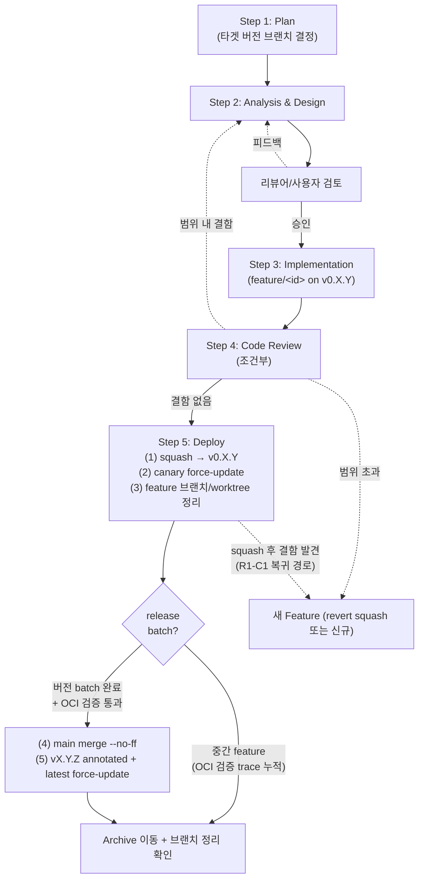

approved: 2026-05-25 (사용자 위임 — "자동으로 step 4까지 진행해" 지시)

# Analysis & Design — branch_strategy_formalize

작성일: 2026-05-25 (KST)
작업자: wikihub maintainer
연계 plan: `plan.md`

> 본 feature 는 메소드론 정본(`CLAUDE.md`, `docs/agent_dev_guide.md`)의 §"브랜치 전략" 누락 분을 보완한다. 코드 변경은 `install.sh:1462` fetch 한 줄(C1 backing fix)로 제한.

---

## 1. 분석

### 1.1 배경

v0.1.7~v0.1.8 진행 중 두 차례 사고:

| 시점 | 사고 | 원인 |
|---|---|---|
| v0.1.7 follow-up | 4f5f206 + 4b90fc0 가 main 에 곧장 push 됨 | 버전 단위 integration 지점 미명시. feature commit 이 main 으로 직행. |
| v0.1.8 도입기 | canary tag 운용이 README/agent_dev_guide 에만 있고 CLAUDE.md(거버넌스 정본) 미반영 | 메소드론과 canary tag 분리 기술. |

**근본 원인**: 현행 `CLAUDE.md` §3 은 "단계(Plan/Design/Implementation/Review/Deployment)" 만 정의, **브랜치 토폴로지**(분기/머지/태깅 시점) 정의 없음. Step 5 가 "`deploy.sh` 실행" 만 명시 (실제로 deploy.sh phantom — §1.5 참조).

### 1.2 현행 진단 (결함 목록)

| ID | 결함 | 위치 | 근거 |
|---|---|---|---|
| F1 | 브랜치 토폴로지 미정의 | `CLAUDE.md` §3 전반 | 5 단계만 정의. main vs feature vs 버전 브랜치 관계 없음. |
| F2 | feature 분기 base 미명시 | `CLAUDE.md` §6 | `git worktree add … feature/[feat_id]` 만 있고 base 불명. |
| F3 | Step 5 의 git 액션 미명시 | `CLAUDE.md` §3 Step 5 | `deploy.sh` 만 언급. squash/merge/tag 절차 없음. |
| F4 | canary tag 절차 분산 | `docs/agent_dev_guide.md` + `README.md` | CLAUDE.md 본문엔 canary 단어 자체가 없음. |
| F5 | version/latest/canary tag 운영 의미 미정리 | `CLAUDE.md` §8 | 형식만 명시. release/promote/검증 의미 없음. |
| F6 | Feature 종료에 브랜치/worktree 정리 누락 | `CLAUDE.md` §3 Feature 종료 처리 | archive 이동만 명시. |
| F7 | hotfix 정의 부재 | 전체 | production critical bug 흐름 미정의. |
| F8 | `_step2_update` 의 `git fetch origin --tags` 에 `--force` 없음 → canary force-update 갱신 안 됨 (git 2.20+) | `install.sh:1462` | reviewer 2 C1. canary lightweight tag force-update 운용과 결합 결함. |
| F9 | "deploy.sh" phantom — 실제로는 존재하지 않거나 ad-hoc | `CLAUDE.md` §1, §3 Step 3/5 활동 표기 | reviewer 1 M1. 현행 표기는 사용자의 mental model 과 어긋남. |

### 1.3 영향받는 정본 파일 + 코드

| 파일 | 현행 라인 | 갱신 성격 |
|---|---|---|
| `CLAUDE.md` §1 | 라인 9-17 | "deploy.sh" 표기 정합화 |
| `CLAUDE.md` §3 | 라인 34-198 | mermaid + Step 1/5/종료 갱신 |
| `CLAUDE.md` §6 | 라인 244-258 | 분기 base 명시 + 정리 시점 |
| `CLAUDE.md` §8 | 라인 299-321 | tag 운영 의미 표 추가 |
| `docs/agent_dev_guide.md` | 라인 35-273, 366-419 | CLAUDE.md 와 정합 |
| `README.md` | 라인 133-152 | "버전 브랜치" 표현 + `--branch canary` 표준화 |
| `install.sh` | 라인 1462 | F8 backing fix — `--tags --force` 추가 (1 줄) |

> CLAUDE.md §7, agent_dev_guide §"Feature 디렉토리" 는 본 feature 범위 밖.

### 1.4 ADR 신설 여부

**미생성** — 본 정립은 운영 절차(operational procedure) 결정으로 메소드론 갱신에 해당. 정본은 CLAUDE.md/agent_dev_guide.md 자체.

### 1.5 deploy.sh phantom 확인

```bash
$ ls deploy.sh scripts/deploy.sh 2>&1
ls: deploy.sh: No such file or directory
ls: scripts/deploy.sh: No such file or directory
```

`CLAUDE.md` §3 Step 3 "활동" 과 §3 Step 5 "수행 시 활동" 모두 `deploy.sh` 를 언급하나 실제 파일 부재. 본 feature 에서 표기 정합화 (F9 — 다음 옵션 중 (c) 채택):

- (a) deploy.sh 신설 — 별도 feature scope
- (b) install.sh + git workflow 로 의미 흡수 — 현행 v0.1.x 운영 실태와 일치
- (c) **"deploy.sh" 표기를 "git workflow + install.sh" 로 교체** — 정본만 갱신, 코드 부담 없음 ← **채택**

---

## 2. 설계 (v2 — 리뷰 흡수)

### 2.1 정립 흐름 (canonical diagram)

```
main (production stable, append-only via merge commit)
  │
  ├─[checkout]─► v0.X.Y (integration branch, 1 minor = 1 branch)
  │                │
  │                ├─[checkout]─► feature/<feat_id> (작업 브랜치)
  │                │                  │
  │                │                  ├─ Step 1 ~ Step 4 진행
  │                │                  └─[squash merge]─►
  │                │                                     │
  │                ◄────────────────────────────────────┘
  │                │
  │                ├─ canary tag force-update (메인테이너 수동, squash 직후)
  │                │   git tag -f canary <v0.X.Y HEAD>
  │                │   git push origin canary --force
  │                │
  │                ├─ feature 브랜치 즉시 삭제 + worktree 정리
  │                │   (clean check 후 git worktree remove + git branch -D)
  │                │
  │                │  …다음 feature 반복 (OCI 가 canary update 마다 trace)…
  │                │
  │                └─ release batch — 메인테이너가 OCI 검증 통과 판단
  │                    │
  ├─[merge --no-ff]◄───┘  ← release 시점 (M = merge commit)
  │     │
  │     ├─ git tag -a v0.X.Y M -m "v0.X.Y — <description>"
  │     ├─ git tag -f latest M
  │     ├─ git push origin v0.X.Y latest --force
  │     │
  │     └─ refs 상태: main HEAD = v0.X.Y annotated tag = latest tag = M (3 ref 동일 commit)
  │                   v0.X.Y branch HEAD = M.parents[1] (release 직전 commit, 보존)
  │                   canary tag = v0.X.Y_HEAD (= release 직전 commit, 보존 — 다음 minor 첫 squash 까지)
  │
  └─ (main 직접 commit 금지 — 모든 변경은 버전 브랜치 경유)
```

### 2.2 핵심 규칙 (Q1~Q5 default 흡수 + 리뷰 보강)

| 항목 | 결정 |
|---|---|
| feature 분기 base | **버전 브랜치에서만** (`git fetch origin && git worktree add … -b feature/<id> origin/v0.X.Y`) — M5 권고 흡수. hotfix 도 동일. main 직접 분기 금지. |
| feature → 버전 브랜치 머지 | **squash merge** (`git checkout v0.X.Y && git merge --squash feature/<id> && git commit -m "..."`). `--squash` 가 implicit no-commit 이므로 `--no-commit` 잉여 (R2-M1). |
| feature 브랜치 squash 후 처리 | **즉시 삭제 + worktree 정리** — clean check → `git worktree remove` → `git branch -D` (squash 는 git fully-merged 인식 안 함 → `-D` 강제 필요, R2-M4) |
| squash commit message | `<type>(<feat_id>): <description> (vX.Y.Z)` — type ∈ {feat, fix, refactor, chore, docs}. 기존 패턴(dba0ee1, eb766ef) 정합. |
| canary tag 갱신 | **메인테이너가 squash 직후 즉시 수동 실행** (R1-H1) — `git tag -f canary <sha> && git push origin canary --force`. lightweight tag, force-update. |
| 운영자 canary 호출형 | **`install.sh --branch canary`** 로 표준화 (R2-C2) — `--version canary` 금지 (의미 충돌). install.sh `_step2_update` 의 fetch 는 `--tags --force` 로 보강(F8 fix). |
| canary 사고 시 rollback | `git reflog show canary` 로 직전 sha 확인 → `git tag -f canary <prev_sha> && git push origin canary --force` (R1-H3) |
| 버전 브랜치 → main 머지 | **`git merge --no-ff v0.X.Y` from main** + annotated `v0.X.Y` tag + latest tag force-update. 3 ref(main HEAD, vX.Y.Z tag, latest tag) 동일 commit. |
| release 후 버전 브랜치 처리 | **보존** (hotfix base 후보, R2-H3). 다음 minor (v0.X.Y+1) 시작 시 새 버전 브랜치 분기. |
| release 후 canary tag 처리 | **그대로 유지** (R2-H4 옵션 c) — release 직전 commit 을 가리킨 채 다음 minor 첫 squash 까지. OCI 가 pre-prod trace 보존. |
| hotfix 흐름 (R1-H5) | production critical bug 발견 시 → 현 minor (v0.X.Y) 의 다음 patch (v0.X.Y+1) 가 아닌 **현 minor 의 추가 feature** 로 다룸. patch 자릿수 도입은 별도 feature 결정 (backlog). |
| main 직접 commit 금지 (R1-H4) | **본문 규칙**: main 에 대한 변경은 오직 `merge --no-ff` 로만. force-push 금지. annotated tag 만 add 가능. |

### 2.3 Step 별 갱신 — Before / After

#### A. Step 1 (Plan) 필수 포함 항목

| 항목 | Before | After |
|---|---|---|
| 작업 분류 | (그대로) | (그대로) |
| 적용 단계 선언 | Step 4/5 수행 여부 | (그대로) |
| 예상 영향 범위 | (그대로) | (그대로) |
| 메소드론 적용 여부 | (그대로) | (그대로) |
| **타겟 버전 브랜치** | — | **신설** — feature 가 머지될 버전 브랜치 (예: `v0.1.8`). plan 단계에서 결정. 사후 변경 시 plan.md `## v2` 섹션에 사유 기록 (R1-M2). |

#### B. Step 5 (Deployment) 5 액션 — git 명령 명시

| # | 액션 | 명령 | 예외 처리 |
|---|---|---|---|
| 1 | feature → 버전 브랜치 squash merge | `git checkout v0.X.Y && git merge --squash feature/<id> && git commit -m "<type>(<feat_id>): ... (vX.Y.Z)"` | conflict 시 해결 후 commit, 또는 `git reset --hard HEAD` 회복 (R2-H2) |
| 2 | canary tag force-update + push | `git tag -f canary && git push origin canary --force` | force-push fail 시 GitHub Tag protection 확인 (R2-M2) |
| 3 | feature 브랜치/worktree 정리 | `git -C ../wikihub-feat/<id> status --porcelain \| grep -q . && { echo dirty; exit 1; }`<br/>`git worktree remove ../wikihub-feat/<id>`<br/>`git branch -D feature/<id>` | dirty 시 stash 또는 commit 후 재시도 (R2-H1) |
| 4 | (release 시점) 버전 브랜치 → main `merge --no-ff` | `git checkout main && git merge --no-ff v0.X.Y` | conflict 시 해결 후 commit. main 직접 push 가능 환경 가정 — PR 사용 시 별도 흐름 (R2-H2) |
| 5 | annotated version tag + latest tag force-update + push | `git tag -a v0.X.Y -m "v0.X.Y — <description>" <merge_commit>`<br/>`git tag -f latest <merge_commit>`<br/>`git push origin main v0.X.Y latest --force` (latest 만 force, annotated tag 는 미가능) | annotated tag 는 immutable — force 금지 (R2-M3) |

> 액션 (1)~(3) 은 모든 feature 마다 반복. 액션 (4)~(5) 는 release 시점에만 1 회.

#### C. Feature 종료 처리

| 단계 | Before | After |
|---|---|---|
| 1. ADR 검증 | (그대로) | (그대로) |
| 2. HISTORY.md 검증 | (그대로) | (그대로) |
| 3. Archive 이동 | `git mv features/[id] features/archive/[id]` | (그대로) |
| **4. feature 브랜치/worktree 정리 확인** | — | **신설** — Step 5 액션 (3) 에서 이미 정리됐어야 함. 미정리 시 본 단계에서 강제. |

#### D. §6 Git Worktree

| 항목 | Before | After |
|---|---|---|
| 분기 base | `feature/[feat_id]` (base 불명시) | **`feature/<id>` from `origin/v0.X.Y`** (R2-M5). 예: `git fetch origin && git worktree add ../wikihub-feat/[date]_[id] -b feature/[id] origin/v0.X.Y` |
| 제거 시점 | "작업 완료 후" | **squash merge 직후** (Step 5 의 액션 3) |
| Agent tool `isolation: "worktree"` (R1-H6) | "임시 worktree 자동 생성" | **임시 review/탐색용 worktree** — 본 메소드론의 "버전 브랜치에서 분기" 규칙은 영구 feature 브랜치 에만 적용. 임시 worktree 는 HEAD 기준 분기 — 규칙 외. |

#### E. §8 버전 관리 — tag 운영 의미 표 (신설)

| Tag | 성격 | 가리키는 commit | 운영 의미 | 비고 |
|---|---|---|---|---|
| `vX.Y.Z` | **annotated**, immutable | main 의 merge commit (M) | release 영구 record | `git tag -a v0.X.Y -m "..."`. force-push 금지. |
| `latest` | lightweight, **force-move** | 가장 최근 release commit | production default | `git tag -f latest M && git push --force` |
| `canary` | lightweight, **force-update** | 버전 브랜치 HEAD (release 직전 candidate 포함) | pre-production 검증 trace | `git tag -f canary <sha> && git push --force`. **fetch 시 `--force` 필요** (git 2.20+). 운영자 호출형 = `install.sh --branch canary`. |

### 2.4 mermaid 다이어그램 갱신

CLAUDE.md §3 와 agent_dev_guide.md §5 단계 의 mermaid 둘 다 동일 흐름:



> R1-C1 복귀: squash 후 결함 발견 시 feature 브랜치는 이미 삭제됨. (a) 새 feature 발급해 fix 진행, (b) squash commit `git revert` 후 새 feature 진행 (history 보존 우선 시).

### 2.5 연계 룰/스킬 정합성

| 연계 대상 | 정합 확인 | 조치 |
|---|---|---|
| ADR-0030 (`_resolve_ref` chain) | path 2 (`--branch`) 가 canary 받아도 fetch force 없으면 stale (F8) | install.sh:1462 `--tags --force` 보강 (본 feature 범위) |
| ADR-0034/0036/0038 | 본 feature 와 무관 | 변경 없음 |
| `_system/commands/*` | 본 feature 미변경 | — |
| `features/backlog.md` | hotfix patch 자릿수, helper script 등 범위 외 항목 등록 | §3 참조 |

---

## 3. 개정 범위 요약

| 파일 | 변경 라인 수 (추정) | 변경 성격 |
|---|---|---|
| `CLAUDE.md` | +80 / -20 | §1/§3/§6/§8 갱신 |
| `docs/agent_dev_guide.md` | +60 / -15 | 동일 갱신 |
| `README.md` | +5 / -3 | "버전 브랜치" 정합 + `--branch canary` 표준화 |
| `install.sh` | +1 / -1 | F8 fix — `--tags --force` |
| `features/backlog.md` | +10 / -0 | 범위 외 항목 4 건 등록 |

**총합: +156 / -39**

---

## 4. 범위 외 — backlog 등록 사항

| ID | 항목 | 출처 |
|---|---|---|
| BL-1 | promote_canary.sh / release.sh helper script (5 액션 누락 방지) | R2-L5 |
| BL-2 | GitHub Tag protection rule 정립 (canary 보호 금지, vX.Y.Z 보호) | R2-M2 |
| BL-3 | patch 자릿수 도입 결정 (v0.X.Y.Z 토폴로지) | plan.md Q2 default 보류 |
| BL-4 | squash commit 다중 feat_id naming 컨벤션 | R2 범위 외 5 |

---

## 5. 미결 사항

본 plan.md §6 Q1~Q5 모두 default 흡수. 잔여 미결 없음.

리뷰 흡수 결정 (이번 v2):
- R1-C1 (복귀 경로) → mermaid 점선 + §2.4 본문 명시
- R1-H1~H6 → 모두 흡수
- R1-M1 (deploy.sh phantom) → F9 신설, (c) 옵션 채택
- R1-M2~M5 → 흡수
- R1-L1~L5 → 무시 또는 footnote
- R1-R1~R3 (범위 외) → BL 등록
- R2-C1 (install.sh fetch) → F8 신설, install.sh 한 줄 보강을 **본 feature 범위에 포함**
- R2-C2 (canary 운영자 호출형) → `--branch canary` 표준화
- R2-H1~H4 → 모두 흡수
- R2-M1~M5 → 흡수 또는 footnote
- R2-L1~L5 → 무시 또는 backlog
- R2 범위 외 1~5 → BL 등록

---

## 6. Definition of Done

- [ ] `CLAUDE.md` §1 의 "deploy.sh" 표기 → "git workflow + install.sh" 로 갱신 (F9)
- [ ] `CLAUDE.md` §3 mermaid 가 §2.4 와 정합
- [ ] `CLAUDE.md` §3 Step 1 필수 항목에 "타겟 버전 브랜치" 추가
- [ ] `CLAUDE.md` §3 Step 5 본문에 §2.3-B 5 액션 git 명령 포함
- [ ] `CLAUDE.md` §3 Feature 종료 처리에 브랜치/worktree 정리 확인 단계 추가
- [ ] `CLAUDE.md` §3 본문에 "main 직접 commit 금지" 규칙 명시 (R1-H4)
- [ ] `CLAUDE.md` §3 본문에 hotfix 흐름 1 단락 (R1-H5)
- [ ] `CLAUDE.md` §6 의 분기 base = `origin/v0.X.Y` 명시 + Agent tool 임시 worktree 구분
- [ ] `CLAUDE.md` §8 에 tag 운영 의미 표 (§2.3-E) 신설
- [ ] `docs/agent_dev_guide.md` 동일 갱신 (CLAUDE.md 와 정합)
- [ ] `README.md` 검증 채널 절 — `install.sh --branch canary` 표준 호출형 명시
- [ ] `install.sh:1462` 의 fetch 에 `--force` 추가 (F8 backing fix)
- [ ] `features/backlog.md` BL-1~BL-4 등록
- [ ] ADR 미생성 (분석 결과)
- [ ] HISTORY.md 미변경 (Step 5 생략 결정 per plan.md)
- [ ] Step 4 멀티 리뷰어 통과
- [ ] Feature 종료 시 archive 이동 + feature 브랜치/worktree 정리
- [ ] 본 feature 는 v0.1.8 에 squash merge (Q1 default)
- [ ] **V 검증 (OCI test 환경)** — `install.sh --update --branch canary` 1회 실행 → `_resolve_ref` path 2 가 canary lightweight tag 정확히 식별 → `git reset --hard` 성공 (R2-M1, 별도 OCI batch 시점) 

---

## 7. 버전 이력

### v1 — 2026-05-25 (초안)

5 결함(F1~F5) 도출, Q1~Q5 default 적용, mermaid + Step 1/5/종료/Worktree/§8 갱신 초안.

### v2 — 2026-05-25 (Step 2 멀티 리뷰어 흡수)

Reviewer 1 (메소드론 정합) + Reviewer 2 (git 액션 + 토폴로지) 의 C/H/M 항목 흡수:
- F6~F9 결함 추가 (R1-H4/H5/M1, R2-C1)
- §2.2 핵심 규칙 12 행으로 확장 (rollback, hotfix, main commit 금지 등)
- §2.3-B 5 액션을 git 명령 + 예외 처리 표로 격상
- §2.4 mermaid 에 R1-C1 복귀 점선 추가
- §2.5 ADR-0030 정합 확인 + F8 backing fix 본 feature 범위 포함
- §4 BL-1~BL-4 backlog 등록 사항 별도 절 신설
- 본 feature 범위 확장: install.sh 1 줄 (F8 fix)

### v3 — 2026-05-25 (Step 4 code review 흡수)

Code review 1 (DoD + 정합) + Code review 2 (적용 가능성 + 운영 안전성) 의 결함 흡수:
- **R1-C1**: README.md 의 "deploy.sh" 잔존 2 곳 정정 (line 216, 218 → install.sh + git workflow)
- **R1-H1 / R2-L1**: agent_dev_guide.md:423 "Workflow 단계별 매핑" 표의 deploy.sh 정정
- **R1-H2**: agent_dev_guide.md:501 "Step 5 에서 main 으로 머지" → "Step 5 액션 (1)~(3) 에서 버전 브랜치로 squash merge, release batch 시점에만 main merge --no-ff" 정정
- **R1-H3**: install.sh:1462 주석 표현 "(git 2.20+ requirement)" → "git 2.20+ 부터 tag fetch 가 force 없이는 clobber 거부" 명료화
- **R1-M3**: README.md mermaid 에 Release 분기 노드 추가
- **R2-H1**: AGENTS.md vs agent_dev_guide.md 의 액션 (2) 명령 동기화 — `&&` 3-chain 분리 → 별 줄 (push branch / tag move / push tag) + "silent divergent 방지" 주석
- **R2-H2**: clean check 의 `grep -q . && exit 1` 제거 — `git worktree remove` 자체가 dirty 시 거부하므로 사람이 status 출력 확인 + git 자동 차단에 의존하는 단순 흐름
- **R2-M2**: AGENTS.md/guide §6 의 `git fetch origin` 옆에 "필수 — stale base 면 다른 feature squash 와 충돌" 코멘트 1 줄
- **R2-M3**: 액션 (4) main checkout 전 `git status` clean 확인 1 줄 추가
- **R2-M1**: DoD 에 V 검증 항목 1 줄 추가 (OCI test 환경에서 `install.sh --update --branch canary` 검증) — 별도 OCI batch 시점에 수행
- **자기-적용성 모순 명문화**: plan.md `## v2` 섹션 추가 — 본 feature 는 메소드론 정립 자체이므로 정립 이전 흐름으로 진행, squash 시점 흡수
- backlog 에 O2 (정본 분리 모델 재검토), O3 (`--force-with-lease` 첫 push 동작), O4 (patch 자릿수 + hotfix 결합) 추가 권고

R1-M1 (design 미명시 — 사실은 명시) / R1-M2 (`git tag -f canary` 인자) — 본문 흐름상 HEAD 가 명시적이므로 무시 / R1-L1~L3 cosmetic 무시.

C1 + H1~H3 (R1) + H1, H2 (R2) 모두 해결 — 통과 권고 충족.
